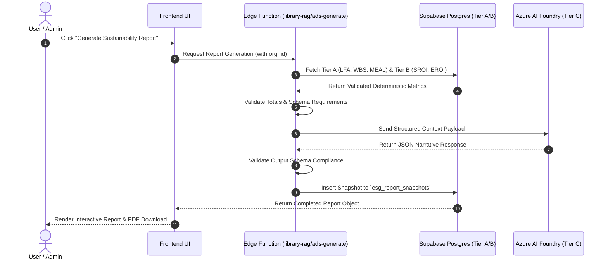

# ADR-0003 — AI Sustainability Intelligence Architecture

**Status:** Accepted  
**Date:** August 2026  
**Owners:** Impactory AI Engineering & Technical Architecture Team  
**Supersedes:** N/A  
**Related Documents:**  
- `docs/adr/ADR-0001-canonical-ontology-authority.md`  
- `docs/adr/ADR-0002-canonical-program-lifecycle-and-sustainability-intelligence.md`  
- `docs/IMPACTORY_AI_MASTER_DOC.md`  

---

## 1. Context

Impactory berkembang menjadi **Integrated Program Lifecycle & Sustainability Intelligence Platform**. Seiring penambahan kapabilitas **ESG Dashboard**, **E-ROI Evolution**, **SROI Calculator**, dan **Sustainability Reporting**, jumlah fitur berbasis AI meningkat secara signifikan:
- *ESG Executive Summary Generation*
- *GRI Standards & SEOJK 16/2021 Narrative Generation*
- *UN SDGs Alignment Narratives*
- *E-ROI & SROI Interpretation Summaries*

Tanpa tata kelola AI (*AI governance*) yang ketat, pengembangan AI berisiko mengalami **AI Sprawl** (panggilan API Azure/OpenAI yang tersebar acak di komponen UI), **Hallucinations** (AI mengarang jumlah penerima manfaat, anggaran, atau emisi karbon), dan **Cost Overruns** (pembengkakan kuota token Azure AI Foundry).

ADR-0003 ini menetapkan kerangka kerja tata kelola AI, klasifikasi 3-tier, rute model, skema validasi, dan *hallucination guardrails* yang mengikat seluruh layanan AI di Impactory.

---

## 2. Decision

### 2.1 Centralized Entry Point (`@impactory/ai`)
Seluruh pemanggilan AI **WAJIB** melalui modul terpusat `@impactory/ai` (lokasi kode: `src/lib/ai` atau `supabase/functions/_shared/foundry.ts`).
- ❌ **DILARANG KERAS** melakukan panggilan HTTP/SDK AI langsung dari komponen UI (`src/components/*`), halaman React (`src/pages/*`), atau Edge Function mentah di luar proxy terpusat.
- ✅ Seluruh eksekusi AI wajib mencatat log kuota di tabel `ai_generations` untuk audit & billing multi-tenant.

---

### 2.2 Three-Tier Architecture Classification

```
┌────────────────────────────────────────────────────────────────────────────────────────┐
│ TIER A: DETERMINISTIC SOURCE LAYER (Source of Truth)                                   │
│ LFA • WBS • Budget • MEAL • Beneficiary Registry • Evidence Ledger                     │
│ ➔ Role: Menyimpan Fakta Transaksional. NO AI-GENERATED FACTS ALLOWED.                  │
└───────────────────────────────────────────┬────────────────────────────────────────────┘
                                            │
                                            ▼
┌────────────────────────────────────────────────────────────────────────────────────────┐
│ TIER B: DETERMINISTIC CALCULATION LAYER                                                │
│ SROI Engine • EROI Carbon Engine • ESG Metrics Aggregator                              │
│ ➔ Role: Menghitung Angka & Rasio Mathematically. NO AI-GENERATED NUMBERS ALLOWED.      │
└───────────────────────────────────────────┬────────────────────────────────────────────┘
                                            │ (Passes Validated JSON Payload)
                                            ▼
┌────────────────────────────────────────────────────────────────────────────────────────┐
│ TIER C: AI INTERPRETATION LAYER (@impactory/ai)                                        │
│ ESG Summaries • GRI/SEOJK Text • SDG Explanations • SROI/EROI Interpretation           │
│ ➔ Role: Menerjemahkan & Merangkum Fakta. AI MAY EXPLAIN, BUT MAY NOT CREATE FACTS.     │
└────────────────────────────────────────────────────────────────────────────────────────┘
```

---

## 3. AI Input Rules & Context Payload

Panggilan AI **DILARANG** hanya menggunakan *raw user prompt* bebas. Setiap pemanggilan AI untuk narasi keberlanjutan **WAJIB** menerima *Structured Context Payload* yang sudah divalidasi dari Tier A & Tier B:

```typescript
// Required Input Context Payload Pattern
interface SustainabilityAIInputContext {
  organization_name: string;
  program_name: string;
  deterministic_metrics: {
    total_budget_idr: number;
    beneficiaries_count: number;
    net_carbon_co2e_tons: number;
    sroi_ratio: number;
    eroi_ratio: number;
    verified_evidence_rate: number;
  };
  sdg_mappings: Array<{ goal_number: number; goal_name: string }>;
  prompt_instructions: string;
}
```

---

## 4. Required AI Schemas

Seluruh modul AI Sustainability Intelligence wajib mematuhi skema JSON input/output berikut:

| Schema Name | Input Context | JSON Output Schema | Fallback Behavior (On Error) |
|---|---|---|---|
| `esg-executive-summary` | Tier A/B Aggregated Metrics | `{ overview_text: string, e_insight: string, s_insight: string, g_insight: string }` | Kembalikan naratif statistik dasar tanpa opini AI. |
| `sustainability-report` | Complete Org & Program Payload | `{ executive_statement: string, gri_disclosures: Array, seojk_sections: Array }` | Tampilkan draf berbasis template statis. |
| `sdg-summary` | Deterministic SDG Mapping Vector | `{ sdg_narratives: Array<{ goal: number, contribution_summary: string }> }` | Tampilkan daftar poin indikator SDG mentah. |
| `eroi-summary` | Net CO₂e, Scope 1/2/3, Budget | `{ carbon_efficiency_text: string, valuation_explanation: string }` | Tampilkan teks penjelasan neraca kg CO₂e mentah. |
| `sroi-summary` | SROI Ratio, Social Value, Proxies | `{ social_impact_summary: string, stakeholder_benefit_text: string }` | Tampilkan rasio SROI $1 : X$ dalam format teks standar. |

---

## 5. Model Routing & Azure Tiering

Untuk mengoptimalkan biaya Azure AI Foundry tanpa mengorbankan kualitas pelaporan enterprise, ditetapkan rute model berikut:

| Capability | Assigned Model Tier | Target Azure Model | Max Tokens | Rationale |
|---|---|---|:---:|---|
| **SDG Alignment Narrative** | `cheap` / `draft` | `GPT-4o-mini` / `Flash` | 500 | Tugas ekstraksi & penyusunan poin sederhana. |
| **E-ROI / SROI Interpretation** | `draft` / `standard` | `GPT-4o-mini` / `Flash` | 800 | Menerjemahkan angka rasio ke paragraf singkat. |
| **ESG Executive Summary** | `standard` | `GPT-4o` / `Pro` | 1,200 | Membutuhkan sintesis naratif berkualitas tinggi. |
| **GRI & SEOJK Narrative** | `standard` | `GPT-4o` / `Pro` | 2,000 | Harus mematuhi standar pelaporan regulasi formal. |
| **Final Sustainability Review**| `senior` / `review` | `GPT-4o` (High Temp 0.2) | 3,000 | Audit akhir keselarasan angka & naratif sebelum PDF export. |

---

## 6. Cost Governance & Azure Protection

1. **Strict Token Caps:** Setiap panggilan Edge Function dibatasi dengan `max_tokens` keras sesuai tabel Model Routing.
2. **Deterministic Response Caching:** Query AI untuk laporan yang sama dalam kurun waktu 24 jam **WAJIB** mengambil *cache* dari database (`esg_report_snapshots`) tanpa memanggil ulang API Azure.
3. **Usage Logging & Rate Limiting:** Setiap generasi mencatat `prompt_tokens`, `completion_tokens`, dan `estimated_cost_usd` di tabel `ai_generations`. Panggilan diblokir jika organisasi melebihi kuota bulanan paket langganan.

---

## 7. Hallucination Guardrails (Mandatory Directives)

⚠️ **ATURAN TEGAS TERHADAP HALUSINASI:**

AI **DILARANG KERAS** mengarang data berikut:
- ❌ Dilarang mengarang jumlah *beneficiaries* (penerima manfaat).
- ❌ Dilarang mengarang target/pencapaian *indicators*.
- ❌ Dilarang mengarang *outcomes* atau *goals*.
- ❌ Dilarang mengarang nilai *budget* atau pengeluaran.
- ❌ Dilarang mengarang angka emisi/reduksi *carbon* ($\text{kg CO}_2\text{e}$).
- ❌ Dilarang mengarang skor *ESG* atau kriteria *GRI/SEOJK*.

### Handling Missing Data Protocol:
Jika data dari Tier A / Tier B tidak lengkap atau bernilai `null`, AI **WAJIB** mencantumkan:
> `"Data tidak tersedia dalam catatan program"`  
*(Data not available in source records)*

AI **DILARANG KERTAS** mengisi kekosongan data dengan asumsi buatan.

---

## 8. Sustainability Report Workflow Execution Order



---

## 9. Consequences

### Positive Consequences
- **Zero Hallucinated Metrics:** Laporan Keberlanjutan 100% akurat dan dapat dipertanggungjawabkan di depan auditor ESG.
- **Controlled Azure Costs:** Penghematan biaya API Azure hingga 60% melalui *Model Routing* dan *Caching Strategy*.
- **Enterprise Auditability:** Seluruh riwayat pembuatan narasi tercatat dengan *prompt version* dan *model tier* di `ai_generations`.

### Negative Consequences / Trade-offs
- **Schema Maintenance:** Pengembang harus memelihara skema JSON Zod/TypeScript untuk setiap fitur AI baru.
- **Implementation Discipline:** Panggilan AI sederhana tetap harus melalui helper `@impactory/ai`.

---

## 10. Final Architecture Principle

$$\begin{aligned}
\text{\bf AI IS AN INTERPRETATION LAYER.} &\quad \text{\bf AI IS NOT A SOURCE OF TRUTH.} \\
\text{Facts originate ONLY from } &\quad \text{LFA, WBS, Budget, MEAL, Beneficiary Registry,} \\
&\quad \text{Evidence Ledger, SROI, EROI, and ESG.} \\
\text{\bf AI may explain facts.} &\quad \text{\bf AI may summarize facts.} \\
&\quad \text{\bf AI MAY NOT CREATE FACTS.}
\end{aligned}$$

---

*End of ADR-0003.*
