# Impactory Deterministic Program Context & SDG/TPB Mapping v1.2
## Hardened Specification and Additive Amendment

**Artifact:** `impactory_deterministic_program_context_sdg_mapping_v1_2.md`  
**Parent Baseline:** `impactory_deterministic_program_context_sdg_mapping_v1_1.md`  
**Status:** `P0_A_READY_P0_B_GATED`  
**Version Date:** 2026-07-22  

---

## 1. Executive Status & Document Scope

Dokumen ini adalah **Authoritative Hardening Pass and Additive Amendment** yang berfungsi memperkuat spesifikasi arsitektur pada versi v1.1. Dokumen ini mendefinisikan aturan pemrosesan numerik secara ketat, menghilangkan ambiguitas penafsiran bagi engineer, menyelesaikan inkonsistensi terminologi internal, serta **mematerialisasikan secara penuh** registri data minimum dan regression fixtures dalam format YAML yang dapat langsung di-parse oleh parser runtime P0-A.

Spesifikasi dalam dokumen ini bersifat mengikat (*normative*) untuk seluruh siklus implementasi P0, khususnya mengunci batasan kontrak sebelum pengembangan P0-B (Deterministic Extraction Engine) dimulai.

---

## 2. Implementation Authority Matrix

Untuk memastikan konsistensi kode dan fleksibilitas pemeliharaan, seluruh elemen dalam spesifikasi ini dibagi ke dalam empat tingkat otoritas:

### 2.1 Authoritative (Hard-Coded / Strictly Validated)
Elemen-elemen ini mendefinisikan struktur logis inti sistem. Perubahan pada elemen ini memerlukan perubahan kode program atau revisi skema utama:
*   **Stable IDs dan Namespaces** (misal: `SECTOR-XXX-NNN`, `ARCH-XXX-NNN`, `OF-NNN`, `OPF-NNN`, `ACT-NNN`, `CNC-*`, `MISS-*`, `CONF-*`).
*   **Registry Definitions & Field Schemas** (seperti yang didefinisikan pada Annex A-F).
*   **Valid & Invalid Relationship Rules** (12 aturan tepi terlarang pada §8).
*   **Data Contracts** (Kontrak input Page 1 pada §6, dan Kontrak output Page 2 pada §29).
*   **Deterministic Runtime Execution Order** (26 langkah wajib pada §3).
*   **Anti-Signals** (20 aturan anti-signal pada §23).
*   **Regression Fixture Expectations** (Kriteria kelulusan asersi pada §8).
*   **Provenance Requirements** (Metadata pelacakan pada §25.6).

### 2.2 Tunable but Versioned (Configuration-Driven)
Elemen-elemen ini tidak boleh ditulis langsung secara permanen (*hard-coded*) di dalam logika pemrograman. Mereka harus disimpan dalam file konfigurasi berversi (`scoring_config` atau rilis versi registry) yang dapat disetel ulang (*tuned*) secara dinamis:
*   **Component Weights** (bobot persentase pada formula sektor, archetype, dan SDG).
*   **Confidence Caps** (batas atas keyakinan untuk kandidat hasil ekstraksi model murah atau kecocokan morfologis).
*   **Saturation Parameters** (nilai ambang batas saturasi kontribusi konsep).
*   **Penalty Values** (nilai deduksi numerik untuk anti-signals dan konflik).
*   **Ambiguity Margins** (selisih minimal antara skor peringkat 1 dan peringkat 2).
*   **Classification & Recommendation Thresholds** (ambang batas Primary, Secondary, Optional, dan Rejected).

### 2.3 Illustrative Only (Non-Asserted)
Elemen-elemen ini disajikan sebagai contoh pemahaman manusia dan **tidak boleh dijadikan dasar asersi nilai floating-point persis** dalam unit test, kecuali ditentukan lain oleh fixture:
*   Skor numerik spesifik pada 30 contoh end-to-end (§30).
*   Contoh penulisan naratif hasil rendering template (*rendered explanations*).
*   Nama instansi spesifik daerah pada partner suggestion (§25.5).
*   Gaya penulisan (*phrasing*) bebas pada draf awal blueprint.

> [!IMPORTANT]
> **ATURAN TEGAS IMPLEMENTASI:**
> Nilai skor ilustratif pada examples tidak boleh di-hardcode dan bukan expected exact floating-point assertion, kecuali fixture secara eksplisit menentukan range atau threshold expectation.

### 2.4 Deferred (P1 / P2 Scope)
Elemen ini secara eksplisit ditunda pengembangannya dan berada di luar cakupan P0:
*   Perluasan dialek bahasa daerah Indonesia (*regional dialect lexicon expansion*).
*   Ontologi lengkap subsektor di luar 3 contoh yang diwarisi.
*   Ekstraksi deterministik data dari dokumen pendukung (*supporting-document extraction*).
*   Ekstraksi indikator SDG 14 (Ekosistem Lautan) secara mendalam.
*   Kalibrasi otomatis berbasis telemetri produksi.
*   Resolusi kontradiksi naratif tingkat lanjut (*advanced semantic contradiction resolution*).

---

## 3. Deterministic Runtime Execution Order

Urutan eksekusi berikut adalah urutan linier wajib yang harus dipatuhi oleh arsitektur rules engine GrantWriter. Setiap perubahan urutan harus melalui persetujuan ADR (*Architecture Decision Record*).

```mermaid
graph TD
    Step1[1. Validate Page 1] --> Step2[2. Resolve Org Profile]
    Step2 --> Step3[3. Normalize Values]
    Step3 --> Step4[4. Detect Lexical Sigs]
    Step4 --> Step5[5. Resolve Concept IDs]
    Step5 --> Step6[6. Linguistic Guardrail v1]
    Step6 --> Step7[7. Separate Result Levels]
    Step7 --> Step8[8. Resolve Actor Roles]
    Step8 --> Step9[9. Apply Invalid-Edge Checks]
    Step9 --> Step10[10. Score Problem Families]
    Step10 --> Step11[11. Score & Resolve Sectors]
    Step11 --> Step12[12. Score Archetypes]
    Step12 --> Step13[13. Resolve Output/Outcome]
    Step13 --> Step14[14. Validate Outcome-Indicator]
    Step14 --> Step15[15. Evaluate Cross-Cutting]
    Step15 --> Step16[16. Score SDG/TPB]
    Step16 --> Step17[17. Apply SDG Coverage Gate]
    Step17 --> Step18[18. Apply SDG Anti-Signals & Stuffing]
    Step18 --> Step19[19. Resolve Conflicts]
    Step19 --> Step20[20. Evaluate Missing-Info]
    Step20 --> Step21[21. Assemble Program Blueprint]
    Step21 --> Step22[22. Render Explanations]
    Step22 --> Step23[23. Construct Page 2 Payload]
    Step23 --> Step24[24. Capture User Action]
    Step24 --> Step25[25. Freeze Approved Payload]
    Step25 --> Step26[26. Produce Retrieval Metadata]
```



### 3.1 Rincian Kontrak Proses per Langkah

#### 1. Validate Page 1 Structured Fields
*   **Input:** HTTP Request Payload berisi field Page 1 (§6).
*   **Output:** Validated Page 1 structured data, atau ValidationError.
*   **Registry/Config:** Page 1 Input Contract Schema (§6).
*   **Failure/Ambiguity:** Tolak request dengan kode HTTP 400 jika field wajib kosong atau format tipe data tidak sesuai.
*   **User Confirmation:** Tidak.

#### 2. Resolve Organization Profile Snapshot
*   **Input:** Active Organization Profile ID.
*   **Output:** Frozen Proposal Organization Snapshot data.
*   **Registry/Config:** Organization Profile Registry (§7).
*   **Failure/Ambiguity:** Gunakan profil default kosong dengan tanda warning non-blocking jika profil belum dikonfigurasi.
*   **User Confirmation:** Tidak.

#### 3. Normalize Values
*   **Input:** Validated Page 1 data.
*   **Output:** Normalized location (resolved admin_level), normalized duration (integer months), normalized budget (ISO currency & magnitude).
*   **Registry/Config:** Geography Registry, Duration Normalizer, Currency Converter.
*   **Failure/Ambiguity:** Tandai lokasi sebagai `unknown` jika di luar gazetteer, tandai unit sebagai `unknown` jika format salah.
*   **User Confirmation:** Ya, memicu `MISS-002` (lokasi) atau `MISS-003` (durasi).

#### 4. Detect Evidence Spans and Candidate Lexical Signals
*   **Input:** Normalized `program_story` and narrative fields.
*   **Output:** Map of matched raw substrings with start/end offsets (evidence spans).
*   **Registry/Config:** Morphology Matching Contract (§8), Bilingual Lexicon Registries.
*   **Failure/Ambiguity:** Lewati teks tanpa kegagalan jika tidak ada kata kunci yang cocok (menghasilkan empty candidate set).
*   **User Confirmation:** Tidak.

#### 5. Resolve Lexical Signals to Canonical Concept IDs
*   **Input:** Map of matched raw substrings.
*   **Output:** Candidates of Canonical Concept IDs (`CNC-*`) with initial confidence scores.
*   **Registry/Config:** Language Concept Registry (§10), Informal Phrase Registry (§11), Ambiguous Term Registry (§12).
*   **Failure/Ambiguity:** Istilah ambigu menghasilkan multiple candidate konsep dengan flag `ambiguity_status = multi_meaning`.
*   **User Confirmation:** Ya, melalui resolusi konflik atau disambiguate modal.

#### 6. Run Linguistic Result-Level Classification
*   **Input:** Resolved Concept ID candidates and their grammatical structures.
*   **Output:** Level classification tag per statement candidate (Impact / Outcome / Intermediate Outcome / Output / Activity / Task).
*   **Registry/Config:** Linguistic Guardrail v1 Universal Semantic Model.
*   **Failure/Ambiguity:** Turunkan tingkat klasifikasi ke Task jika proposisi ambigu.
*   **User Confirmation:** Tidak.

#### 7. Separate Result Levels
*   **Input:** Classificated statement candidates.
*   **Output:** Separated arrays of Problem, Cause, Actor, Activity, Output, Outcome, Indicator, Risk, and Assumption candidates.
*   **Registry/Config:** Target shape schema contract (§13).
*   **Failure/Ambiguity:** Jika tipe data melanggar struktur, tempatkan pada `unknowns[]`.
*   **User Confirmation:** Tidak.

#### 8. Resolve Actor Roles
*   **Input:** Actor candidates and context.
*   **Output:** Map of specific actor-to-role associations (e.g., target actor, beneficiary, etc.).
*   **Registry/Config:** Actor Registry (§15).
*   **Failure/Ambiguity:** Tandai peran sebagai `unclear` jika tidak ada aksi kata kerja yang eksplisit.
*   **User Confirmation:** Ya, memicu `MISS-006` jika target actor kosong.

#### 9. Apply Invalid-Relationship Checks and Level Reclassification
*   **Input:** Result arrays.
*   **Output:** Validated and reclassified result arrays (e.g., Output menyamar sebagai Outcome dipindahkan ke Output).
*   **Registry/Config:** Invalid Relationships Table (§8).
*   **Failure/Ambiguity:** Terapkan pemindahan paksa (*force-reclassify*) dengan logging provenance `auto_reclassified`.
*   **User Confirmation:** Tidak, tetapi tampilkan penjelasan pada blueprint hasil penolakan (TPL-REJ).

#### 10. Score Problem Families
*   **Input:** Validated problem, cause, and manifestation candidates.
*   **Output:** Ranked Problem Family Candidates (`PF-*`) with alignment scores.
*   **Registry/Config:** Problem Family Registry (§16).
*   **Failure/Ambiguity:** Hasilkan skor rendah jika sinyal hanya berupa manifestasi tanpa akar penyebab.
*   **User Confirmation:** Tidak.

#### 11. Score Sectors and Resolve Sector Ambiguity
*   **Input:** All resolved candidates and components.
*   **Output:** Primary Sector ID, and list of Secondary Sectors.
*   **Registry/Config:** Sector Registry & Scoring Weights (§14, §14.1).
*   **Failure/Ambiguity:** Jika selisih top-1 dan top-2 < 0.10, tandai sebagai `SECTOR_AMBIGUOUS_REQUIRES_REVIEW`.
*   **User Confirmation:** Ya, tampilkan menu pilihan sektor pada Page 2.

#### 12. Score Intervention Archetypes
*   **Input:** Activity and Output candidates.
*   **Output:** List of Primary and Supporting Archetype IDs (`ARCH-*`).
*   **Registry/Config:** Intervention Archetype Registry & Scoring (§17).
*   **Failure/Ambiguity:** Batasi rekomendasi maksimal 3 Primary + 3 Supporting. Jika berlebih, picu warning `PROGRAM_SCOPE_TOO_BROAD`.
*   **User Confirmation:** Ya, jika cakupan terlalu luas.

#### 13. Resolve Output and Outcome Families
*   **Input:** Reclassified Output and Outcome statement candidates.
*   **Output:** Mapped Output Families (`OPF-*`) and Outcome Families (`OF-*`).
*   **Registry/Config:** Output Family Registry (§19), Outcome Family Registry (§18).
*   **Failure/Ambiguity:** Sinyal yang gagal dipetakan masuk ke kategori `MISS-008` (expected change tak jelas).
*   **User Confirmation:** Ya.

#### 14. Validate Outcome–Indicator Support
*   **Input:** Mapped Outcome Families and Indicator candidates.
*   **Output:** Supported Outcome Families list (Outcome yang memiliki indikator yang valid).
*   **Registry/Config:** Indicator Family mapping.
*   **Failure/Ambiguity:** Outcome tanpa indikator pendukung atau verified official target diturunkan statusnya menjadi `unsupported` untuk gate Primary SDG.
*   **User Confirmation:** Ya.

#### 15. Evaluate Cross-Cutting Relevance
*   **Input:** Resolved actors, sectors, archetypes, and risks.
*   **Output:** List of active Cross-Cutting Concerns (`XC-*`) with relevance status.
*   **Registry/Config:** Cross-Cutting Registry & Relevance Tests (§20).
*   **Failure/Ambiguity:** Jika tes relevansi gagal, turunkan status XC ke non-aktif (tidak direkomendasikan).
*   **User Confirmation:** Tidak.

#### 16. Score SDG/TPB Alignment
*   **Input:** All candidates, active sectors, and validated outcome/indicator mappings.
*   **Output:** Raw SDG/TPB alignment scores.
*   **Registry/Config:** SDG/TPB Registry & Scoring Logic (§21, §22).
*   **Failure/Ambiguity:** Potong skor di kisaran [0,1].
*   **User Confirmation:** Tidak.

#### 17. Apply SDG Primary Coverage Gate
*   **Input:** Raw SDG scores and Supported Outcome list.
*   **Output:** Gated SDG recommendations.
*   **Registry/Config:** SDG Primary Coverage Gate Rule (§22.2).
*   **Failure/Ambiguity:** Turunkan SDG dengan skor tinggi ke Secondary jika tidak memenuhi syarat cakupan hasil minimum.
*   **User Confirmation:** Ya, tampilkan template TPL-AMB untuk memandu user menambah indikator.

#### 18. Apply SDG Anti-Signals, Unsupported-Claim Rules, and Stuffing Rules
*   **Input:** Gated SDG recommendations.
*   **Output:** Final Primary and Secondary SDG recommendation list.
*   **Registry/Config:** SDG Anti-Signal Registry (§23), SDG Stuffing Rule (§22.3).
*   **Failure/Ambiguity:** Batasi maksimal 2 Primary + 2 Secondary SDGs. Sisanya dipindahkan ke kelompok "Optional" (hidden).
*   **User Confirmation:** Ya, jika user mencoba menambahkan >4 SDGs secara manual.

#### 19. Resolve Conflicts and Ambiguities
*   **Input:** All evaluated candidates and scores.
*   **Output:** Resolved conflict actions and warnings.
*   **Registry/Config:** Conflict and Ambiguity Registry (§28).
*   **Failure/Ambiguity:** Terapkan fallback behavior jika tidak ada interaksi pengguna.
*   **User Confirmation:** Ya.

#### 20. Evaluate Missing-Information Rules
*   **Input:** Completed candidates, values, and blueprints.
*   **Output:** Active list of Missing Information alerts.
*   **Registry/Config:** Missing Information Registry (§26).
*   **Failure/Ambiguity:** Tampilkan maksimum 3 Critical + 3 Recommended.
*   **User Confirmation:** Ya.

#### 21. Assemble Deterministic Program Blueprint
*   **Input:** All validated components and facts.
*   **Output:** Program Blueprint structured draft (Problem summary, expected changes, results, partners, cross-cutting).
*   **Registry/Config:** Program Blueprint Mapping Rules (§25).
*   **Failure/Ambiguity:** Gunakan slot fallback jika komponen kosong. Jangan pernah menghasilkan teks rusak/kosong.
*   **User Confirmation:** Ya, persetujuan blueprint adalah transisi wajib ke halaman berikutnya.

#### 22. Render Deterministic Explanations from Templates
*   **Input:** Active recommendations and selected Template IDs.
*   **Output:** Bilingual rendered explanations text.
*   **Registry/Config:** Explainable Recommendation Templates (§24).
*   **Failure/Ambiguity:** Jika pengisian slot gagal, batalkan rendering template spesifik dan kembali ke template ambigu generik.
*   **User Confirmation:** Tidak.

#### 23. Construct Page 2 Response with Provenance
*   **Input:** Completed Page 2 Contract structure.
*   **Output:** Final Page 2 JSON Payload.
*   **Registry/Config:** Page 2 Data Contract (§29).
*   **Failure/Ambiguity:** Tolak pembuatan payload jika data pelacakan (*provenance metadata*) tidak lengkap.
*   **User Confirmation:** Tidak.

#### 24. Capture User Confirmation, Rejection, or Modification
*   **Input:** User interaction payload (Accept/Override/Input missing).
*   **Output:** User-reviewed Page 2 payload.
*   **Registry/Config:** Conflict Resolution Rules.
*   **Failure/Ambiguity:** Tulis ulang provenance dengan flag `modified_by_user` jika terjadi modifikasi manual.
*   **User Confirmation:** Ya, ini adalah interaksi pengguna yang sesungguhnya.

#### 25. Freeze Approved Page 2 Payload and Organization Snapshot Version
*   **Input:** User-approved Page 2 payload.
*   **Output:** Frozen, read-only immutable snapshot.
*   **Registry/Config:** Versioning Contract.
*   **Failure/Ambiguity:** Snapshot ini disimpan secara permanen di database transaksional.
*   **User Confirmation:** Ya (tombol Submit/Approve).

#### 26. Produce Retrieval Metadata for Golden Generation
*   **Input:** Frozen Page 2 Snapshot.
*   **Output:** Retrieval Metadata containing explicit Sector IDs, Archetype IDs, Indicator IDs, and active Donor profile codes.
*   **Registry/Config:** Azure Credit Protection Architecture (§35).
*   **Failure/Ambiguity:** Hanya muat chunk korpus yang terdaftar dalam metadata ini ke konteks LLM (maximum context budget 27.500 token).
*   **User Confirmation:** Tidak (berjalan otomatis di background).

> [!IMPORTANT]
> **ATURAN EKSEKUSI MUTLAK:**
> *   Anti-signals tidak boleh diterapkan sebelum resolusi konsep kanonis selesai.
> *   SDG scoring tidak boleh berjalan sebelum validasi tingkat hasil (*outcome level validation*).
> *   Perakitan blueprint tidak boleh berjalan sebelum evaluasi konflik dan ketiadaan informasi (*missing-information*) selesai.
> *   Golden Generation tidak boleh menerima umpan inferensi langsung (*live inference*) yang belum dibekukan melalui persetujuan Page 2 (*Page 2 approval*).

---

## 4. Formalized Scoring and Saturation Contract

Kalkulasi skor untuk seluruh komponen mesin deterministik GrantWriter harus mengikuti aturan proporsionalitas matematika di bawah ini untuk mencegah bias panjang teks (*story length dominance*) dan menjamin bahwa dua implementasi independen menghasilkan angka desimal yang persis sama.

### 4.1 Definisi Indikator Masukan (Input Candidate Eligibility)
Kandidat konsep `CNC-*` hanya diperbolehkan masuk dalam perhitungan skor komponen jika memenuhi kriteria kelayakan berikut:
1.  **Confidence Threshold:** Memiliki nilai keyakinan kandidat awal $C_c \ge 0.50$ (di bawah itu diabaikan).
2.  **Deduplication Rule:** Jika terdapat beberapa kandidat dengan Canonical Concept ID yang sama diekstraksi dari bagian teks yang berbeda, mereka harus digabungkan (*merged*) menjadi satu kandidat tunggal dengan keyakinan:
    $$C_{merged} = \max(C_{c1}, C_{c2}, \dots, C_{cn})$$
    Seluruh *evidence spans* asal harus dipertahankan secara akumulatif dalam metadata pelacakan.
3.  **Anti-Double Counting (Evidence Span Exclusion):** Satu teks kutipan (*evidence span*) yang sama tidak boleh memberikan kontribusi skor ke dua konsep yang merupakan sinonim dekat (*synonyms*). Jika terjadi tumpang tindih, prioritaskan konsep yang memiliki *canonical match* terkuat, dan abaikan konsep sinonimnya.
4.  **Language Alignment Residual Rule:** Komponen penyelarasan bahasa (*Language Alignment*, bobot 5% pada Sektor) hanya dihitung dari kecocokan leksikal (*lexicon match*) yang belum diklaim oleh proses penyelarasan konsep kanonis (*canonical concept alignment*).

### 4.2 Metode Saturasi: Capped Match Contribution Method
Untuk menghindari bias dari teks narasi yang sangat panjang yang memuat banyak kata kunci tidak relevan, GrantWriter menggunakan **Capped Match Contribution Method**. Rumus dasar untuk nilai keselarasan komponen ($S_{comp}$) adalah:

$$S_{comp} = \min\left(1.0, \frac{\sum_{i=1}^{k} C_{i}}{T_{sat}}\right)$$

Dimana:
*   $k$ adalah jumlah kandidat konsep terkonfirmasi yang mendukung item target (sektor, archetype, atau SDG tersebut).
*   $C_i$ adalah skor keyakinan (*confidence score*) dari kandidat konsep pendukung ke-$i$.
*   $T_{sat}$ adalah **Saturation Threshold** (Ambang Batas Saturasi) komponen tersebut.

#### Parameter Konfigurasi Heuristik Awal (`INITIAL_HEURISTIC_CONFIG`):

| Komponen | Bobot Sektor ($W_{sec}$) | Bobot SDG ($W_{sdg}$) | Saturation Threshold ($T_{sat}$) |
|---|---|---|---|
| Problem Family Alignment | 25% | 15% | $3.0$ (Butuh 3 konsep kuat) |
| Outcome Family Alignment | 25% | 30% | $2.0$ (Butuh 2 konsep kuat) |
| Target Actor Alignment | 15% | 5% | $1.0$ (Butuh 1 konsep kuat) |
| Intervention Alignment | 15% | 8% | $2.0$ (Butuh 2 konsep kuat) |
| Indicator Family Alignment | 10% | 25% | $2.0$ (Butuh 2 konsep kuat) |
| Cross-Cutting Relevance | — | 4% | $1.0$ (Butuh 1 konsep aktif) |
| Explicit Donor Alignment | — | 3% | $1.0$ (Butuh 1 kecocokan donor) |
| Language Alignment | 5% | — | $2.0$ (Butuh 2 sinyal residual) |
| Supporting Document Bonus| 5% | — | $1.0$ (Butuh 1 dokumen) |

*   **Empty Component Behavior:** Jika suatu komponen tidak memiliki kecocokan konsep sama sekali, nilai komponen tersebut disetel ke `0.0`. Hal ini tidak menggagalkan perhitungan komponen lainnya.
*   **Duplicate Concept Behavior:** Konsep yang duplikat digabung berdasarkan Canonical ID sebelum dimasukkan ke dalam penjumlahan pembilang (*numerator*).
*   **Score Clamping:** Skor akhir disetel tegas di dalam kisaran desimal `[0.00, 1.00]`.
*   **Rounding Policy:** Pembulatan menggunakan standar IEEE 754 setengah ke atas (*round half to even*) pada ketelitian 4 angka di belakang koma (`0.0001`).
*   **Tie Margin & Recommendation Limits:**
    *   Sektor: Ambang batas deteksi ambigu jika selisih skor peringkat 1 dan peringkat 2 kurang dari $0.10$ (`margin = 0.10`). Maksimum 1 Sektor Primary + 2 Sektor Secondary pada Page 2.
    *   Intervensi: Batasan rekomendasi maksimum 3 Primary + 3 Supporting.
    *   SDG: Maksimum 2 SDG Primary + 2 SDG Secondary.

### 4.3 Urutan Penerapan Penalti Numerik (Penalty Application Order)
Skor numerik dihitung secara berurutan sebagai berikut:

$$\text{Raw Score} = \sum (S_{comp} \times W_{comp})$$

$$\text{Intermediary Score} = \text{Raw Score} - \sum \text{Anti-Signal Penalties}$$

$$\text{Final Recommendation Score} = \text{Intermediary Score} - \sum \text{Conflict Penalties}$$

*Penalti tidak boleh dipotong sekaligus pada Raw Score untuk menghindari interaksi urutan kalkulasi.*

---

## 5. Penalty Contract

Spesifikasi ini menegaskan perbedaan perlakuan antara aturan pembatas keras (*Hard Gate*), aturan klasifikasi ulang (*Reclassification*), pemotongan skor (*Score Penalty*), dan interaksi peninjauan pengguna (*User Review*).

### 5.1 Klasifikasi Jenis Pemrosesan

*   **Hard Gate:** Kondisi biner yang memicu tindakan mutlak tanpa kompromi numerik (misal: menurunkan level rekomendasi, mengosongkan draf blueprint, atau menolak simpan proposal jika melanggar skema wajib).
*   **Reclassification:** Pemindahan paksa jenis kandidat berdasarkan evaluasi tata bahasa atau logika (misal: memindahkan output dari array `outcomes[]` ke `outputs[]`). Tidak memotong skor numerik tetapi mengubah kontribusi komponen.
*   **Score Penalty:** Pemotongan nilai numerik secara dinamis dari skor akumulatif komponen berdasarkan konfigurasi terversi.
*   **User Review:** Kondisi penandaan (*flagging*) yang mewajibkan konfirmasi interaktif dari pengguna sebelum proposal dapat diserahkan ke Golden Generation.

### 5.2 Registri Penalti Konflik (`CONF-001..CONF-013`)

Di bawah ini adalah konfigurasi penalti konflik awal (`INITIAL_HEURISTIC_CONFIG`):

| ID | processing_type | affected_candidate_types | numeric_penalty | hard_gate | reclassification_target | question/template ID | fallback behavior |
|---|---|---|---|---|---|---|---|
| **CONF-001** | User Review | sector | `0.00` | Tidak | — | TPL-CONF-001 | Sektor Primary dikosongkan; kedua sektor dipasang sebagai Secondary |
| **CONF-002** | Reclassification | actor_role | `0.00` | Ya | `target_actor` (guru), `beneficiary` (siswa) | TPL-CONF-002 | Set peran secara paksa sesuai target actor default registry |
| **CONF-003** | Reclassification | actor_role | `0.00` | Tidak | Dual-role flag | — | Tandai kedua peran aktif pada pencatatan provenance |
| **CONF-004** | Score Penalty | intervention | `-0.20` | Tidak | — | TPL-CONF-004 | Kurangi skor archetype terkait sebesar 0.20; tampilkan warning |
| **CONF-005** | Reclassification | result_level | `0.00` | Ya | `outputs[]` | TPL-REJ-LEVEL-001| Pindahkan paksa konsep ke kategori Output; tampilkan template penolakan |
| **CONF-006** | Reclassification | result_level | `0.00` | Ya | `activities[]` | TPL-REJ-LEVEL-002| Turunkan kelas ke Activity jika tidak ada kriteria kelulusan |
| **CONF-007** | User Review | sdg | `0.00` | Tidak | — | TPL-CONF-007 | Tampilkan pilihan gap alignment; jangan blokir simpan draf |
| **CONF-008** | User Review | sdg | `0.00` | Tidak | — | TPL-CONF-008 | Sajikan modal 2 pilihan SDG bersaing untuk dipilih pengguna |
| **CONF-009** | Reclassification | result_level | `0.00` | Ya | `outcomes[]` | TPL-CONF-009 | Turunkan klaim dampak jangka panjang berdurasi <12 bln menjadi outcome |
| **CONF-010** | User Review | beneficiary_count| `0.00` | Ya | Structured field wins| TPL-CONF-010 | Gunakan angka field terstruktur; story dijadikan catatan kaki |
| **CONF-011** | Reclassification | location | `0.00` | Ya | Structured field wins| — | Gunakan lokasi dari field terstruktur secara mutlak |
| **CONF-012** | Score Penalty | budget_scope | `-0.10` | Tidak | — | TPL-CONF-012 | Kurangi skor keyakinan proposal sebesar 0.10; tampilkan warning rasio |
| **CONF-013** | Reclassification | cross_cutting | `0.00` | Ya | `questions[]` | — | Turunkan relevansi XC menjadi pertanyaan, bukan rekomendasi otomatis |

### 5.3 Konfigurasi Penalti Numerik Tambahan
*   **Anti-Signal Penalties:** Penalti default sebesar `-0.25` pada SDG yang terpengaruh (misal: `SDG-ANTI-FARMER-001` memotong skor SDG 2 sebesar 0.25). Penalti default sebesar `-0.15` untuk tipe anti-signal "only" generik.
*   **Unsupported-Claim Penalties:** Jika pengguna melakukan pemilihan manual (*override*) terhadap SDG tanpa dukungan konsep pendukung sama sekali, berikan penalti sebesar `-0.30` pada skor kepuasan proposal dan tandai status dengan `UNSUPPORTED_SDG_SELECTION`.
*   **Unverified Inference Penalties:** Penggunaan kandidat hasil ekstraksi model murah tanpa bukti kalimat (*unverified span*) dikenakan penalti keyakinan sebesar `-0.15` per kandidat.

---

## 6. Blueprint Slot Contract

Mesin perakit Program Blueprint Page 2 merakit draf proposal secara deterministik menggunakan template terstruktur. Aturan slot di bawah ini memastikan tidak ada rendering teks rusak (*broken template syntax*) yang ditampilkan ke pengguna.

### 6.1 Tabel Aturan Pengisian Slot (Slot Binding Rules)

| Slot | Source Registry / Field | Confidence Req | Fallback Behavior (Jika Kosong) | User Conf Req |
|---|---|---|---|---|
| `{LOCATION}` | `location` (Page 1) | $\ge 0.90$ | Gunakan `Indonesia_Specific` default (Nasional) | Tidak |
| `{TARGET_ACTORS}`| `actor_registry` (ACT-ID) | $\ge 0.60$ | Tampilkan placeholder `"aktor sasaran"` + picu `MISS-006` | Ya |
| `{PROBLEM_FAMILY_LABELS}` | `problem_family_registry` | $\ge 0.60$ | Gunakan kata `"kendala operasional"` | Ya |
| `{EVIDENCE_SNIPPET}`| `evidence_span` (Story offset) | $\ge 0.50$ | Jangan render bagian kutipan (sembunyikan slot) | Tidak |
| `{LONG_TERM_CONDITION}` | `problem_family_registry.long_term_condition` | $\ge 0.60$ | Cari tema dampak default sektor (`sector_registry.impact_theme`)| Tidak |
| `{TARGET_POPULATION}` | `beneficiary_description` | $\ge 0.70$ | Ambil dari confirmed beneficiary data | Ya |
| `{LOCATION_LEVEL}`| `location` (admin_level) | $\ge 0.90$ | Sembunyikan slot / jangan render | Tidak |
| `{OBJECT_OF_CHANGE}` | `outcome_family_registry.object_of_change` | $\ge 0.60$ | Tampilkan label `"praktik operasional"` | Ya |
| `{OUTCOME_PREDICATE}` | `outcome_family_registry.positive_predicates` | $\ge 0.60$ | Gunakan frasa `"memperbaiki"` | Ya |
| `{TARGET_INSTITUTION_OR_ACTOR}` | `actor_registry.canonical_name` | $\ge 0.60$ | Ambil dari target actor terpilih | Tidak |

### 6.2 Aturan Rendering yang Mengikat (Strict Rendering Policies)
1.  **Anti-Sintaks Rusak:** Seluruh slot wajib dievaluasi sebelum dikirim ke engine rendering. Jika slot bernilai `null` atau kosong, dilarang merender kurung kurawal mentah (seperti menampilkan `"{LONG_TERM_CONDITION}"`). Sistem harus merender nilai *fallback* terdaftar atau mengalihkan ke template darurat (`TPL-MISS-*`).
2.  **Kontrol Karakter Evidence Snippet:** Kutipan teks dari `{EVIDENCE_SNIPPET}` dibatasi ketat maksimum 100 karakter pertama, diikuti dengan elipsis (`"..."`), untuk menjaga kerapian tata letak layout Page 2.
3.  **Controlled Vocabulary Only:** Isi dari `{LONG_TERM_CONDITION}` harus ditarik dari kolom terkontrol registri Problem Family (`long_term_condition`), dilarang keras menghasilkan kalimat generatif bebas baru tanpa jangkar data.

---

## 7. Materialized P0-A Minimum Runtime Registries

Registri di bawah ini adalah data terstruktur minimal yang didefinisikan secara lengkap dan valid secara format YAML untuk digunakan oleh mesin parser runtime pada tahap P0-A.

### 7.1 Intervention Archetypes (14 Priority Entries)

```yaml
intervention_archetype_registry:
  - archetype_id: ARCH-TRAINING-001
    name_id: "Pelatihan & Workshop"
    name_en: "Training & Workshop"
    definition: "Meningkatkan pengetahuan dan keterampilan teknis individu melalui modul terstruktur dan sesi kelas."
    positive_action_signals: [melatih, pelatihan, workshop, bimtek, penataran, kurikulum, modul]
    object_signals: [peserta, materi, sertifikat, kompetensi]
    actor_signals: [ACT-019, ACT-017, ACT-007, ACT-001]
    explicit_user_phrases: ["menyelenggarakan kelas pelatihan", "melatih kader", "mengajarkan modul"]
    problem_family_ids: [PF-015, PF-018, PF-005]
    expected_output_family_ids: [OPF-001, OPF-002, OPF-024]
    expected_intermediate_outcome_ids: [OF-001, OF-002]
    expected_outcome_family_ids: [OF-003]
    wbs_pattern_ids: ["WBS-TRAIN-01"]
    cost_driver_pattern_ids: ["COST-TRAIN-01"]
    meal_pattern_ids: ["MEAL-TRAIN-01"]
    negative_signals: ["melatih hewan"]
    anti_signals: [SDG-ANTI-TRAINING-006]
    confusable_archetype_ids: 
      - {archetype_id: ARCH-TOT-002, disambiguation: "ToT ditargetkan khusus untuk melatih individu agar melatih orang lain."}
    minimum_evidence: "Daftar hadir peserta terverifikasi + hasil pre-post test"
    disambiguation_questions: "Apakah program ini fokus pada penyampaian materi kelas, atau pendampingan praktik lapangan berkelanjutan?"
    epistemic_label: CANONICAL_IMPACTORY
    sources: [S-C1]

  - archetype_id: ARCH-TOT-002
    name_id: "Training of Trainers (ToT)"
    name_en: "Training of Trainers"
    definition: "Melatih pelatih atau kader lokal agar memiliki kemampuan mengajarkan kembali modul kepada komunitas sasaran."
    positive_action_signals: [ToT, melatih pelatih, melatih fasilitator, kaderisasi]
    object_signals: [master trainer, modul ToT, kader]
    actor_signals: [ACT-017, ACT-034]
    explicit_user_phrases: ["melatih kader agar bisa mengajar", "kaderisasi fasilitator"]
    problem_family_ids: [PF-007, PF-017]
    expected_output_family_ids: [OPF-002]
    expected_intermediate_outcome_ids: [OF-002]
    expected_outcome_family_ids: [OF-003]
    wbs_pattern_ids: ["WBS-TOT-02"]
    cost_driver_pattern_ids: ["COST-TOT-02"]
    meal_pattern_ids: ["MEAL-TOT-02"]
    negative_signals: []
    anti_signals: []
    confusable_archetype_ids: 
      - {archetype_id: ARCH-TRAINING-001, disambiguation: "Training biasa tidak mensyaratkan peserta melatih kembali orang lain."}
    minimum_evidence: "Sertifikasi kelulusan kader sebagai trainer + log sesi pengajaran mandiri"
    disambiguation_questions: "Apakah peserta ToT memiliki kewajiban formal untuk melatih kelompok sasaran di wilayah mereka?"
    epistemic_label: CANONICAL_IMPACTORY
    sources: [S-C1]

  - archetype_id: ARCH-MENTOR-003
    name_id: "Pendampingan & Mentoring"
    name_en: "Mentoring & Coaching"
    definition: "Memberikan bimbingan langsung, personal, dan berkala di lapangan untuk mengawal penerapan praktik baru."
    positive_action_signals: [mendampingi, coaching, mentoring, pendampingan lapangan, asistensi]
    object_signals: [mentee, usaha pendampingan, lembar asistensi]
    actor_signals: [ACT-001, ACT-007, ACT-014, ACT-035]
    explicit_user_phrases: ["melakukan kunjungan lapangan rutin", "mengawal implementasi bisnis"]
    problem_family_ids: [PF-005, PF-006, PF-001]
    expected_output_family_ids: [OPF-002]
    expected_intermediate_outcome_ids: [OF-003]
    expected_outcome_family_ids: [OF-009, OF-012]
    wbs_pattern_ids: ["WBS-MENT-03"]
    cost_driver_pattern_ids: ["COST-MENT-03"]
    meal_pattern_ids: ["MEAL-MENT-03"]
    negative_signals: ["mendampingi pejabat"]
    anti_signals: []
    confusable_archetype_ids: 
      - {archetype_id: ARCH-TRAINING-001, disambiguation: "Mentoring bersifat personal dan pasca-kelas, sedangkan training bersifat klasikal."}
    minimum_evidence: "Logbook pendampingan lapangan dengan tanda tangan basah/geotag"
    disambiguation_questions: "Apakah pendampingan dilakukan secara berkala (misal seminggu sekali) atau hanya bersifat insidental?"
    epistemic_label: CANONICAL_IMPACTORY
    sources: [S-C1]

  - archetype_id: ARCH-FACIL-004
    name_id: "Fasilitasi Komunitas"
    name_en: "Community Facilitation"
    definition: "Mengorganisasikan warga lokal untuk melakukan rembuk, mengidentifikasi kebutuhan bersama, dan mengelola aksi kolektif."
    positive_action_signals: [memfasilitasi, pengorganisasian komunitas, rembuk warga, musyawarah, memobilisasi]
    object_signals: [komunitas, kelompok warga, forum warga]
    actor_signals: [ACT-030, ACT-021, ACT-031]
    explicit_user_phrases: ["memfasilitasi pembentukan kelompok", "rembuk desa"]
    problem_family_ids: [PF-013, PF-014]
    expected_output_family_ids: [OPF-018, OPF-021]
    expected_intermediate_outcome_ids: [OF-016]
    expected_outcome_family_ids: [OF-016]
    wbs_pattern_ids: ["WBS-FAC-04"]
    cost_driver_pattern_ids: ["COST-FAC-04"]
    meal_pattern_ids: ["MEAL-FAC-04"]
    negative_signals: ["fasilitasi izin usaha"]
    anti_signals: []
    confusable_archetype_ids: []
    minimum_evidence: "Berita acara pembentukan forum + absensi kehadiran perwakilan kelompok rentan"
    disambiguation_questions: "Apakah forum komunitas ini diarahkan untuk mempengaruhi kebijakan desa atau murni aksi sosial internal?"
    epistemic_label: CANONICAL_IMPACTORY
    sources: [S-C1]

  - archetype_id: ARCH-BCC-005
    name_id: "Edukasi Perilaku (BCC)"
    name_en: "Behaviour Change Communication"
    definition: "Kampanye komunikasi strategis yang dirancang untuk mengubah kebiasaan atau perilaku buruk yang mendarah daging."
    positive_action_signals: [edukasi perilaku, kampanye perubahan perilaku, penyuluhan gizi, CTPS]
    object_signals: [pesan kunci, media peraga, perilaku sasaran]
    actor_signals: [ACT-010, ACT-011, ACT-017]
    explicit_user_phrases: ["mengubah kebiasaan buang air sembarangan", "mengedukasi ibu menyusui"]
    problem_family_ids: [PF-009, PF-016]
    expected_output_family_ids: [OPF-001]
    expected_intermediate_outcome_ids: [OF-001, OF-003]
    expected_outcome_family_ids: [OF-006, OF-020]
    wbs_pattern_ids: ["WBS-BCC-05"]
    cost_driver_pattern_ids: ["COST-BCC-05"]
    meal_pattern_ids: ["MEAL-BCC-05"]
    negative_signals: ["sosialisasi peraturan pemerintah"]
    anti_signals: [SDG-ANTI-CAMPAIGN-009]
    confusable_archetype_ids: 
      - {archetype_id: ARCH-AWARE-006, disambiguation: "BCC mengukur perubahan praktik konkret, sedangkan Awareness hanya mengukur jangkauan paparan informasi."}
    minimum_evidence: "Hasil survei perubahan perilaku (KAP Survey) sebelum dan setelah program"
    disambiguation_questions: "Bagaimana cara program memverifikasi bahwa warga benar-benar mengubah praktik sehari-hari mereka?"
    epistemic_label: CANONICAL_IMPACTORY
    sources: [S-C1]

  - archetype_id: ARCH-AWARE-006
    name_id: "Sosialisasi & Kesadaran Publik"
    name_en: "Awareness & Public Campaign"
    definition: "Menyebarluaskan informasi kepada khalayak luas untuk meningkatkan pemahaman awal tentang suatu isu."
    positive_action_signals: [sosialisasi, kampanye publik, penyuluhan massal, penyebaran brosur, siaran radio]
    object_signals: [audiens, poster, brosur, media massa]
    actor_signals: [ACT-030, ACT-021]
    explicit_user_phrases: ["menyosialisasikan bahaya narkoba", "membagikan poster edukasi"]
    problem_family_ids: [PF-008]
    expected_output_family_ids: [OPF-001, OPF-025]
    expected_intermediate_outcome_ids: [OF-001]
    expected_outcome_family_ids: [OF-001]
    wbs_pattern_ids: ["WBS-AWR-06"]
    cost_driver_pattern_ids: ["COST-AWR-06"]
    meal_pattern_ids: ["MEAL-AWR-06"]
    negative_signals: []
    anti_signals: [SDG-ANTI-CAMPAIGN-009]
    confusable_archetype_ids: 
      - {archetype_id: ARCH-BCC-005, disambiguation: "Awareness tidak menuntut adanya verifikasi penerapan praktik beralih secara individual."}
    minimum_evidence: "Dokumentasi kegiatan + log metrik jangkauan kampanye (digital/fisik)"
    disambiguation_questions: "Apakah kesuksesan sosialisasi ini diukur dari jumlah orang yang hadir, atau adanya tindakan pasca-hadir?"
    epistemic_label: CANONICAL_IMPACTORY
    sources: [S-C1]

  - archetype_id: ARCH-DIGDEV-007
    name_id: "Pengembangan Platform Digital"
    name_en: "Digital Platform Development"
    definition: "Membangun sistem informasi, aplikasi seluler, atau platform web baru untuk mempermudah konektivitas atau akses."
    positive_action_signals: [mengembangkan aplikasi, membuat platform digital, sistem informasi, coding website, digitalisasi]
    object_signals: [fitur, source code, hosting, user interface]
    actor_signals: [ACT-027, ACT-025, ACT-022]
    explicit_user_phrases: ["membangun sistem database", "meluncurkan aplikasi mobile"]
    problem_family_ids: [PF-011, PF-026]
    expected_output_family_ids: [OPF-004, OPF-006, OPF-020]
    expected_intermediate_outcome_ids: [OF-004]
    expected_outcome_family_ids: [OF-004]
    wbs_pattern_ids: ["WBS-DIG-07"]
    cost_driver_pattern_ids: ["COST-DIG-07"]
    meal_pattern_ids: ["MEAL-DIG-07"]
    negative_signals: ["membeli komputer fisik"]
    anti_signals: [SDG-ANTI-DIGITAL-004]
    confusable_archetype_ids: 
      - {archetype_id: ARCH-DASH-009, disambiguation: "Platform digital fokus pada fungsionalitas pengguna interaktif, sedangkan Dashboard fokus pada penyajian data visual."}
    minimum_evidence: "Sertifikat UAT disetujui + metrik rilis toko aplikasi/URL aktif"
    disambiguation_questions: "Apakah platform ini ditujukan untuk digunakan oleh masyarakat umum atau untuk analisis internal organisasi saja?"
    epistemic_label: CANONICAL_IMPACTORY
    sources: [S-C1]

  - archetype_id: ARCH-DASH-009
    name_id: "Data & Dashboard Visualisasi"
    name_en: "Data & Dashboard Visualization"
    definition: "Mengintegrasikan berbagai sumber data ke dalam satu tampilan visual terpadu untuk mendukung pengambilan keputusan berbasis bukti."
    positive_action_signals: [membangun dashboard, integrasi data, visualisasi data, sistem pemantauan, e-monitoring]
    object_signals: [data sektoral, grafik, indikator kinerja, feed data]
    actor_signals: [ACT-027, ACT-026]
    explicit_user_phrases: ["membuat sistem pemantauan berbasis peta", "menyatukan data OPD"]
    problem_family_ids: [PF-026, PF-027]
    expected_output_family_ids: [OPF-007, OPF-008]
    expected_intermediate_outcome_ids: [OF-015]
    expected_outcome_family_ids: [OF-015]
    wbs_pattern_ids: ["WBS-DSH-09"]
    cost_driver_pattern_ids: ["COST-DSH-09"]
    meal_pattern_ids: ["MEAL-DSH-09"]
    negative_signals: ["membuat infografis poster manual"]
    anti_signals: [SDG-ANTI-DIGITAL-004]
    confusable_archetype_ids: 
      - {archetype_id: ARCH-DIGDEV-007, disambiguation: "Dashboard murni berfokus pada agregasi visual data pelaporan eksekutif."}
    minimum_evidence: "Tangkapan layar sistem aktif berisi data riil terintegrasi + log akses admin"
    disambiguation_questions: "Siapakah aktor pengambil kebijakan yang secara rutin akan membuka dashboard ini untuk memutuskan tindakan?"
    epistemic_label: CANONICAL_IMPACTORY
    sources: [S-C1]

  - archetype_id: ARCH-EQUIP-010
    name_id: "Pengadaan & Distribusi Peralatan"
    name_en: "Equipment Procurement & Distribution"
    definition: "Membeli dan menyalurkan barang fisik, peralatan produksi, atau teknologi tepat guna langsung kepada kelompok penerima."
    positive_action_signals: [mendistribusikan alat, hibah mesin, alsintan, sarana produksi, serah terima bantuan]
    object_signals: [unit barang, berita acara, spesifikasi teknis]
    actor_signals: [ACT-001, ACT-007, ACT-008]
    explicit_user_phrases: ["membagikan traktor tangan", "memberikan bantuan mesin jahit"]
    problem_family_ids: [PF-004, PF-029]
    expected_output_family_ids: [OPF-014]
    expected_intermediate_outcome_ids: [OF-004]
    expected_outcome_family_ids: [OF-011]
    wbs_pattern_ids: ["WBS-EQP-10"]
    cost_driver_pattern_ids: ["COST-EQP-10"]
    meal_pattern_ids: ["MEAL-EQP-10"]
    negative_signals: ["menyewa ruang kantor"]
    anti_signals: [SDG-ANTI-INFRA-008]
    confusable_archetype_ids: []
    minimum_evidence: "BAP (Berita Acara Penyerahan) tertanda tangan basah + foto geotag penerima bersama barang"
    disambiguation_questions: "Apakah penerima bantuan dibekali dengan pelatihan penggunaan dan jaminan pemeliharaan (O&M) alat?"
    epistemic_label: CANONICAL_IMPACTORY
    sources: [S-C1]

  - archetype_id: ARCH-A2F-013
    name_id: "Akses Keuangan"
    name_en: "Access to Finance"
    definition: "Memfasilitasi kelompok usaha kecil untuk terhubung dengan lembaga penyedia pembiayaan formal atau modal bersubsidi."
    positive_action_signals: [menghubungkan pembiayaan, fasilitasi KUR, penyaluran kredit, pembentukan LKM, literasi keuangan]
    object_signals: [pinjaman modal, bunga, agunan, draf kontrak kredit]
    actor_signals: [ACT-007, ACT-008, ACT-001, ACT-014]
    explicit_user_phrases: ["membantu pengajuan pinjaman KUR", "menghubungkan bank dengan petani"]
    problem_family_ids: [PF-006]
    expected_output_family_ids: [OPF-022, OPF-023]
    expected_intermediate_outcome_ids: [OF-009]
    expected_outcome_family_ids: [OF-009, OF-012]
    wbs_pattern_ids: ["WBS-A2F-13"]
    cost_driver_pattern_ids: ["COST-A2F-13"]
    meal_pattern_ids: ["MEAL-A2F-13"]
    negative_signals: ["memberikan sumbangan tunai gratis"]
    anti_signals: [SDG-ANTI-CASH-007]
    confusable_archetype_ids: []
    minimum_evidence: "Rekap pencairan akad kredit dari lembaga keuangan mitra + evaluasi rasio NPL"
    disambiguation_questions: "Apakah program ini memberikan dana hibah modal langsung secara cuma-cuma, atau berupa pinjaman bergulir?"
    epistemic_label: CANONICAL_IMPACTORY
    sources: [S-C1]

  - archetype_id: ARCH-MARKET-015
    name_id: "Akses Pasar"
    name_en: "Market Access"
    definition: "Menghubungkan produsen/usaha dengan pembeli atau kanal bernilai lebih baik hingga terjadi transaksi berkelanjutan."
    positive_action_signals: [menghubungkan pembeli, memfasilitasi kemitraan, business matching, onboarding marketplace, temu bisnis]
    object_signals: [offtaker, pembeli, kontrak PO, repeat order]
    actor_signals: [ACT-001, ACT-003, ACT-007, ACT-033]
    explicit_user_phrases: ["menghubungkan ke offtaker", "onboarding Tokopedia", "business matching hotel"]
    problem_family_ids: [PF-001, PF-003]
    expected_output_family_ids: [OPF-023]
    expected_intermediate_outcome_ids: [OF-008]
    expected_outcome_family_ids: [OF-009, OF-010]
    wbs_pattern_ids: ["WBS-MKT-15"]
    cost_driver_pattern_ids: ["COST-MKT-15"]
    meal_pattern_ids: ["MEAL-MKT-15"]
    negative_signals: ["membangun pasar fisik/gedung"]
    anti_signals: []
    confusable_archetype_ids: []
    minimum_evidence: "Kontrak kerja sama jual beli (MoU offtaker) + bukti transaksi pengiriman invoice pertama"
    disambiguation_questions: "Apakah kerja sama dihentikan sebatas penandatanganan kertas MoU, atau dikawal sampai proses pengiriman logistik?"
    epistemic_label: CANONICAL_IMPACTORY
    sources: [S-C1]

  - archetype_id: ARCH-CAPACITY-018
    name_id: "Kapasitas Kelembagaan"
    name_en: "Institutional Capacity Building"
    definition: "Memperbaiki tata kelola internal organisasi, penyusunan SOP operasional, audit keuangan, dan keandalan manajemen."
    positive_action_signals: [menguatkan kelembagaan, menyusun SOP, tata kelola keuangan, struktur organisasi, restrukturisasi]
    object_signals: [SOP kerja, draf kebijakan internal, opini audit]
    actor_signals: [ACT-005, ACT-006, ACT-025, ACT-035]
    explicit_user_phrases: ["menyusun dokumen SOP tata kelola", "melakukan audit keuangan internal"]
    problem_family_ids: [PF-007, PF-028]
    expected_output_family_ids: [OPF-009, OPF-010]
    expected_intermediate_outcome_ids: [OF-014]
    expected_outcome_family_ids: [OF-014]
    wbs_pattern_ids: ["WBS-CAP-18"]
    cost_driver_pattern_ids: ["COST-CAP-18"]
    meal_pattern_ids: ["MEAL-CAP-18"]
    negative_signals: ["melatih ketrampilan teknis individu di luar tugas organisasi"]
    anti_signals: []
    confusable_archetype_ids: []
    minimum_evidence: "Lembar pengesahan dokumen SOP oleh direksi + hasil penilaian kepatuhan eksternal"
    disambiguation_questions: "Apakah perbaikan ditujukan untuk organisasi internal Anda, atau lembaga dinas pemerintah luar?"
    epistemic_label: CANONICAL_IMPACTORY
    sources: [S-C1]

  - archetype_id: ARCH-POLICY-019
    name_id: "Penyusunan Kebijakan"
    name_en: "Policy Development"
    definition: "Mendampingi otoritas formal menyusun regulasi baru, perda, naskah akademik, atau rencana aksi daerah."
    positive_action_signals: [menyusun kebijakan, rancangan peraturan, perda, naskah akademik, surat keputusan, SK gubernur]
    object_signals: [pasal rancangan, naskah draft, lembar pengesahan legislatif]
    actor_signals: [ACT-026, ACT-027]
    explicit_user_phrases: ["menyusun draf peraturan daerah", "membuat naskah akademik perlindungan"]
    problem_family_ids: [PF-025, PF-012]
    expected_output_family_ids: [OPF-017, OPF-018, OPF-019]
    expected_intermediate_outcome_ids: [OF-017]
    expected_outcome_family_ids: [OF-017]
    wbs_pattern_ids: ["WBS-POL-019"]
    cost_driver_pattern_ids: ["COST-POL-019"]
    meal_pattern_ids: ["MEAL-POL-019"]
    negative_signals: []
    anti_signals: [SDG-ANTI-POLICYDOC-012]
    confusable_archetype_ids: []
    minimum_evidence: "Salinan lembar negara pengesahan peraturan daerah berkop resmi pemerintah daerah"
    disambiguation_questions: "Apakah ruang lingkup program hanya sebatas merancang dokumen rekomendasi kebijakan, atau mengawal persetujuan formalnya?"
    epistemic_label: CANONICAL_IMPACTORY
    sources: [S-C1]

  - archetype_id: ARCH-PREPAREDNESS-036
    name_id: "Kesiapsiagaan Bencana"
    name_en: "Disaster Preparedness"
    definition: "Menyusun peta jalur evakuasi, melatih kelompok siaga bencana tingkat desa, merancang jalur evakuasi, dan memasang EWS."
    positive_action_signals: [kesiapsiagaan bencana, mitigasi bencana, rencana kontinjensi, drill simulasi, destana]
    object_signals: [peta evakuasi, shelter, sirine EWS, posko siaga]
    actor_signals: [ACT-021, ACT-026]
    explicit_user_phrases: ["memasang sirine peringatan dini", "menyelenggarakan latihan evakuasi bencana"]
    problem_family_ids: [PF-023]
    expected_output_family_ids: [OPF-010, OPF-014]
    expected_intermediate_outcome_ids: [OF-021]
    expected_outcome_family_ids: [OF-021, OF-022]
    wbs_pattern_ids: ["WBS-DRR-36"]
    cost_driver_pattern_ids: ["COST-DRR-36"]
    meal_pattern_ids: ["MEAL-DRR-36"]
    negative_signals: ["memberikan paket pangan darurat paska bencana"]
    anti_signals: []
    confusable_archetype_ids: []
    minimum_evidence: "Rencana Kontinjensi yang disahkan kepala desa + dokumentasi laporan foto simulasi tanggap darurat warga"
    disambiguation_questions: "Apakah program ini fokus pada persiapan warga sebelum bencana terjadi, atau pemberian logistik darurat paska-bencana?"
    epistemic_label: CANONICAL_IMPACTORY
    sources: [S-C1]
```

### 7.2 Outcome Families (OF-001..OF-026)

```yaml
outcome_family_registry:
  - outcome_family_id: OF-001
    canonical_name_id: "pengetahuan_meningkat"
    canonical_name_en: "knowledge_increased"
    definition: "Peningkatan pemahaman kognitif kelompok sasaran terhadap konsep, metodologi, atau isu tertentu."
    allowed_target_actor_types: [ACT-019, ACT-017, ACT-001, ACT-007]
    positive_predicates_id: [paham, mengerti, memiliki wawasan, sadar]
    positive_predicates_en: [understands, aware, acquired knowledge]
    object_of_change_ids: ["wawasan teoritis", "skor pre-post test"]
    negative_signals: [menghadiri kelas]
    anti_signals: [SDG-ANTI-TRAINING-006]
    minimum_evidence: "Hasil rekapitulasi penilaian ujian kognitif pre-test dan post-test"
    likely_sectors: [SECTOR-EDU-006, SECTOR-HEALTH-007]
    likely_archetypes: [ARCH-TRAINING-001, ARCH-AWARE-006]
    indicator_family_ids: [IND-EDU-TEACH-013]
    sdg_affinities: []
    time_horizon_guidance: "Sekejap paska pelatihan (1-2 hari)"
    common_output_confusions: [OPF-001, OPF-002]
    common_activity_confusions: ["kegiatan penyuluhan"]
    causal_leap_risks: [ANTI-01, ANTI-12]
    epistemic_label: CANONICAL_IMPACTORY
    sources: [S-C1]

  - outcome_family_id: OF-002
    canonical_name_id: "keahlian_dikuasai"
    canonical_name_en: "skill_retained"
    definition: "Penguasaan keahlian psikomotorik atau kompetensi teknis praktis yang terverifikasi melalui uji kompetensi."
    allowed_target_actor_types: [ACT-019, ACT-007, ACT-016]
    positive_predicates_id: [mampu mempraktikkan, terampil, menguasai metode, cakap]
    positive_predicates_en: [competent, mastered, skilled, capable]
    object_of_change_ids: ["skor unjuk kerja", "pencatatan teknis"]
    negative_signals: [memiliki sertifikat kehadiran]
    anti_signals: [SDG-ANTI-TRAINING-006]
    minimum_evidence: "Rubrik lembar penilaian uji kompetensi praktik langsung"
    likely_sectors: [SECTOR-SKILLS-005, SECTOR-EDU-006]
    likely_archetypes: [ARCH-TRAINING-001, ARCH-TOT-002]
    indicator_family_ids: [IND-HLTH-CAPAC-056]
    sdg_affinities: []
    time_horizon_guidance: "1-4 minggu paska intervensi teknis"
    common_output_confusions: [OPF-002]
    common_activity_confusions: ["sesi praktikum"]
    causal_leap_risks: [ANTI-01]
    epistemic_label: CANONICAL_IMPACTORY
    sources: [S-C1]

  - outcome_family_id: OF-003
    canonical_name_id: "praktik_diadopsi"
    canonical_name_en: "practice_adopted"
    definition: "Penerapan kompetensi baru secara konsisten di dalam rutinitas kerja sehari-hari oleh kelompok sasaran."
    allowed_target_actor_types: [ACT-019, ACT-001, ACT-017, ACT-007]
    positive_predicates_id: [mengadopsi, mempraktikkan rutin, rutin mencatat, rutin menyusui]
    positive_predicates_en: [routinely applies, adopted practice, systematically registers]
    object_of_change_ids: ["rutinitas harian", "buku pencatatan"]
    negative_signals: [mengetahui cara]
    anti_signals: []
    minimum_evidence: "Observasi berkala tim penilai independen di lapangan"
    likely_sectors: [SECTOR-AGRI-001, SECTOR-LIVELIHOOD-002, SECTOR-EDU-006, SECTOR-CCA-010]
    likely_archetypes: [ARCH-MENTOR-003, ARCH-BCC-005]
    indicator_family_ids: [IND-MSME-PRACT-002, IND-AGRI-ADOPT-009, IND-EDU-TEACH-013, IND-CCA-PRACT-023]
    sdg_affinities: [{sdg_id: SDG_4, official_target_ids: ["4.1"], condition: "Bila target actor adalah guru"}]
    time_horizon_guidance: "3-6 bulan paska pendampingan rutin"
    common_output_confusions: [OPF-002, OPF-009]
    common_activity_confusions: ["praktik terbimbing"]
    causal_leap_risks: [ANTI-01, ANTI-12]
    epistemic_label: CANONICAL_IMPACTORY
    sources: [S-C1]

  - outcome_family_id: OF-004
    canonical_name_id: "teknologi_digunakan"
    canonical_name_en: "technology_used"
    definition: "Penggunaan alat produksi atau platform digital secara aktif oleh pengguna akhir dalam frekuensi normal."
    allowed_target_actor_types: [ACT-001, ACT-007, ACT-027]
    positive_predicates_id: [menggunakan alat, mengoperasikan mesin, login aktif, bertransaksi digital]
    positive_predicates_en: [routinely operates, active usage, logged in actively]
    object_of_change_ids: ["utilitas mesin", "log aplikasi MAU"]
    negative_signals: [menerima pembagian mesin]
    anti_signals: [SDG-ANTI-DIGITAL-004]
    minimum_evidence: "Data analitik digital (MAU/DAU) atau lembar log utilitas jam mesin"
    likely_sectors: [SECTOR-DIGITAL-023, SECTOR-AGRI-001]
    likely_archetypes: [ARCH-DIGDEV-007, ARCH-EQUIP-010]
    indicator_family_ids: [IND-DIG-MAU-043, IND-MSME-DIGTX-003]
    sdg_affinities: []
    time_horizon_guidance: "3-12 bulan paska go-live/serah terima"
    common_output_confusions: [OPF-006, OPF-014, OPF-020]
    common_activity_confusions: ["instalasi hardware"]
    causal_leap_risks: [ANTI-03, ANTI-06]
    epistemic_label: CANONICAL_IMPACTORY
    sources: [S-C1]

  - outcome_family_id: OF-005
    canonical_name_id: "layanan_diakses"
    canonical_name_en: "service_accessed"
    definition: "Pencapaian akses fisik, finansial, atau prosedural ke titik layanan publik oleh kelompok sasaran terpinggirkan."
    allowed_target_actor_types: [ACT-010, ACT-011, ACT-015, ACT-022]
    positive_predicates_id: [mengakses faskes, mendaftar sekolah, mendapat rujukan, terdaftar layanan]
    positive_predicates_en: [accessed facility, registered to service, referred successfully]
    object_of_change_ids: ["jarak tempuh", "registrasi pendaftaran"]
    negative_signals: [berdirinya gedung baru]
    anti_signals: []
    minimum_evidence: "Buku register kunjungan instansi formal mitra"
    likely_sectors: [SECTOR-HEALTH-007, SECTOR-EDU-006, SECTOR-WASH-009]
    likely_archetypes: [ARCH-EQUIP-010, ARCH-FACIL-004]
    indicator_family_ids: [IND-EDU-ATS-015]
    sdg_affinities: [{sdg_id: SDG_1, official_target_ids: ["1.4"], condition: "Konteks kemiskinan"}]
    time_horizon_guidance: "1-6 bulan"
    common_output_confusions: [OPF-015]
    common_activity_confusions: ["pembukaan loket pendaftaran"]
    causal_leap_risks: []
    epistemic_label: CANONICAL_IMPACTORY
    sources: [S-C1]

  - outcome_family_id: OF-006
    canonical_name_id: "layanan_digunakan_rutin"
    canonical_name_en: "service_utilized_routinely"
    definition: "Kelompok sasaran menggunakan layanan secara berkala untuk memenuhi standar hidup dasarminimum yang layak."
    allowed_target_actor_types: [ACT-010, ACT-011, ACT-021]
    positive_predicates_id: [rutin berkunjung, imunisasi lengkap, menggunakan jamban sehat, menyetor sampah]
    positive_predicates_en: [regularly utilizes, complete immunization, routinely uses toilets]
    object_of_change_ids: ["frekuensi berkala", "volume konsumsi/pasokan"]
    negative_signals: [pernah berkunjung sekali]
    anti_signals: []
    minimum_evidence: "Kartu KMS Posyandu, log pemeliharaan air bersih, atau kuesioner utilitas berkala"
    likely_sectors: [SECTOR-HEALTH-007, SECTOR-WASH-009, SECTOR-ENERGY-028]
    likely_archetypes: [ARCH-BCC-005, ARCH-EQUIP-010]
    indicator_family_ids: [IND-HLTH-UTIL-016, IND-WASH-USE-018, IND-ENERGY-USE-042]
    sdg_affinities: [{sdg_id: SDG_3, official_target_ids: ["3.8"], condition: "Layanan kesehatan"}, {sdg_id: SDG_6, official_target_ids: ["6.1", "6.2"], condition: "Layanan air/sanitasi"}]
    time_horizon_guidance: "6-12 bulan"
    common_output_confusions: [OPF-015, OPF-011]
    common_activity_confusions: ["sosialisasi pembukaan layanan"]
    causal_leap_risks: []
    epistemic_label: CANONICAL_IMPACTORY
    sources: [S-C1]

  - outcome_family_id: OF-007
    canonical_name_id: "kualitas_layanan_meningkat"
    canonical_name_en: "service_quality_improved"
    definition: "Pemberi layanan meningkatkan waktu respons, akurasi penanganan, dan tingkat kepuasan warga."
    allowed_target_actor_types: [ACT-027, ACT-028, ACT-029]
    positive_predicates_id: [layanan lebih cepat, keluhan direspon, kepuasan meningkat]
    positive_predicates_en: [faster response, complaints resolved, satisfaction index grew]
    object_of_change_ids: ["indeks kepuasan SP4N-LAPOR", "SLA waktu tanggap"]
    negative_signals: [SOP disahkan]
    anti_signals: []
    minimum_evidence: "Data survei kepuasan pelanggan independen semesteran"
    likely_sectors: [SECTOR-GOV-020, SECTOR-CIVTECH-022]
    likely_archetypes: [ARCH-CAPACITY-018, ARCH-DIGDEV-007]
    indicator_family_ids: [IND-GOV-SVC-022]
    sdg_affinities: [{sdg_id: SDG_16, official_target_ids: ["16.6"], condition: "Peningkatan mutu kepuasan 16.6.2"}]
    time_horizon_guidance: "6-18 bulan"
    common_output_confusions: [OPF-009, OPF-010]
    common_activity_confusions: ["pembagian kuesioner kepuasan"]
    causal_leap_risks: []
    epistemic_label: CANONICAL_IMPACTORY
    sources: [S-C1]

  - outcome_family_id: OF-008
    canonical_name_id: "akses_pasar_membaik"
    canonical_name_en: "market_access_improved"
    definition: "Petani/UMKM melakukan transaksi perdagangan rutin ke kanal pasar formal dengan harga jual yang disepakati bersama."
    allowed_target_actor_types: [ACT-001, ACT-007, ACT-008]
    positive_predicates_id: [menjual langsung ke pembeli, mengapalkan produk, kontrak disepakati]
    positive_predicates_en: [routinely supplies, finalized trade contract, direct sales modern trade]
    object_of_change_ids: ["volume pasokan bulanan", "kontrak kerja sama aktif"]
    negative_signals: [MoU tanpa pengiriman barang]
    anti_signals: []
    minimum_evidence: "Arsip surat jalan PO (Purchase Order) + kuitansi pembayaran modern trade"
    likely_sectors: [SECTOR-AGRI-001, SECTOR-LIVELIHOOD-002, SECTOR-COOP-003]
    likely_archetypes: [ARCH-MARKET-015]
    indicator_family_ids: [IND-AGRI-PRICE-011]
    sdg_affinities: [{sdg_id: SDG_2, official_target_ids: ["2.3"], condition: "Nelayan/petani kecil"}, {sdg_id: SDG_8, official_target_ids: ["8.3"], condition: "Konteks integrasi UMKM"}]
    time_horizon_guidance: "6-12 bulan"
    common_output_confusions: [OPF-023]
    common_activity_confusions: ["pertemuan silaturahmi dengan offtaker"]
    causal_leap_risks: [ANTI-01]
    epistemic_label: CANONICAL_IMPACTORY
    sources: [S-C1]

  - outcome_family_id: OF-009
    canonical_name_id: "pendapatan_membaik"
    canonical_name_en: "income_improved"
    definition: "Peningkatan pendapatan/omzet riil aktor sasaran dari aktivitas ekonomi yang didukung program, terverifikasi terhadap baseline."
    allowed_target_actor_types: [ACT-001, ACT-007, ACT-008, ACT-012, ACT-014]
    positive_predicates_id: ["pendapatan meningkat", "omzet naik", "penghasilan bertambah"]
    positive_predicates_en: ["income increased", "revenue grew"]
    object_of_change_ids: ["pendapatan/omzet usaha atau rumah tangga"]
    minimum_evidence: ["catatan penjualan/pendapatan + baseline musim setara (IND-MSME-REV-001 logic)"]
    minimum_use_definition_required: false
    time_horizon_guidance: "12–18 bulan; hati-hati musiman"
    likely_sectors: [SECTOR-LIVELIHOOD-002, SECTOR-AGRI-001, SECTOR-GEWE-017]
    likely_archetypes: [ARCH-TRAINING-001, ARCH-MENTOR-003, ARCH-MARKET-015, ARCH-A2F-013, ARCH-GRANTS-012]
    indicator_family_ids: [IND-MSME-REV-001, IND-AGRI-PRICE-011, IND-MSME-JOB-004]
    sdg_affinities: [{sdg_id: SDG_8, official_target_ids: ["8.3"], condition: "Usaha kecil"}, {sdg_id: SDG_1, official_target_ids: ["1.4"], condition: "Kelompok miskin"}, {sdg_id: SDG_2, official_target_ids: ["2.3"], condition: "Petani kecil"}]
    common_output_confusions: ["dana tersalur (OPF-022)", "pelatihan selesai"]
    common_activity_confusions: ["kegiatan pemasaran"]
    causal_leap_risks: [ANTI-01, ANTI-08]
    negative_signals: ["omzet musim ramai tanpa baseline setara"]
    anti_signals: ["klaim % naik tanpa baseline (HN-57)"]
    epistemic_label: CANONICAL_IMPACTORY
    sources: [S-C1]

  - outcome_family_id: OF-010
    canonical_name_id: "margin_membaik"
    canonical_name_en: "margin_improved"
    definition: "Peningkatan laba bersih produsen dengan menekan kerugian paska panen atau memotong perantara asimetri informasi."
    allowed_target_actor_types: [ACT-001, ACT-007, ACT-008]
    positive_predicates_id: [laba bersih naik, harga per kg meningkat, susut panen berkurang]
    positive_predicates_en: [net margin increased, profit margins rose, post-harvest loss minimized]
    object_of_change_ids: ["selisih harga jual dan pokok produksi", "persentase susut tonase"]
    negative_signals: [harga komoditas pasar nasional naik secara umum di luar kendali program]
    anti_signals: []
    minimum_evidence: "Buku kas rugi laba bulanan pelaku usaha"
    likely_sectors: [SECTOR-AGRI-001, SECTOR-LIVELIHOOD-002]
    likely_archetypes: [ARCH-MARKET-015, ARCH-EQUIP-010]
    indicator_family_ids: [IND-AGRI-PRICE-011, IND-AGRI-LOSS-054]
    sdg_affinities: [{sdg_id: SDG_2, official_target_ids: ["2.3"], condition: "Petani/nelayan kecil"}]
    time_horizon_guidance: "6-12 bulan"
    common_output_confusions: [OPF-023]
    common_activity_confusions: ["audit harga pasar"]
    causal_leap_risks: []
    epistemic_label: CANONICAL_IMPACTORY
    sources: [S-C1]

  - outcome_family_id: OF-011
    canonical_name_id: "produktivitas_meningkat"
    canonical_name_en: "productivity_improved"
    definition: "Peningkatan hasil keluaran per satuan unit input secara berkelanjutan (misal: tonase panen per hektar)."
    allowed_target_actor_types: [ACT-001, ACT-007]
    positive_predicates_id: [hasil panen meningkat, yield naik, kapasitas produksi harian bertambah]
    positive_predicates_en: [yield per hectare increased, daily production capacity grew]
    object_of_change_ids: ["ton per hektar", "unit output per jam kerja"]
    negative_signals: [lahan diperluas secara fisik (itu ekstensifikasi, bukan produktivitas)]
    anti_signals: []
    minimum_evidence: "Laporan ubinan panen dinas pertanian daerah / lembar log produksi pabrik"
    likely_sectors: [SECTOR-AGRI-001, SECTOR-LIVELIHOOD-002]
    likely_archetypes: [ARCH-EQUIP-010, ARCH-TRAINING-001]
    indicator_family_ids: [IND-AGRI-YIELD-010]
    sdg_affinities: [{sdg_id: SDG_2, official_target_ids: ["2.3"], condition: "Petani kecil"}, {sdg_id: SDG_8, official_target_ids: ["8.2"], condition: "Diversifikasi teknologi"}]
    time_horizon_guidance: "1 siklus musim panen penuh (3-6 bulan)"
    common_output_confusions: [OPF-014]
    common_activity_confusions: ["pembajakan sawah bersama"]
    causal_leap_risks: [ANTI-03]
    epistemic_label: CANONICAL_IMPACTORY
    sources: [S-C1]

  - outcome_family_id: OF-012
    canonical_name_id: "kinerja_usaha_membaik"
    canonical_name_en: "business_performance_improved"
    definition: "Unit usaha (UMKM atau Koperasi) mencapai kesehatan finansial, pertumbuhan neraca, dan penciptaan lapangan kerja baru."
    allowed_target_actor_types: [ACT-007, ACT-005, ACT-006]
    positive_predicates_id: [kelayakan kredit naik, penyerapan tenaga kerja bertambah, koperasi berkembang]
    positive_predicates_en: [credit rating improved, formal jobs created, cooperative assets grew]
    object_of_change_ids: ["jumlah karyawan formal baru", "nilai neraca aset tahunan"]
    negative_signals: []
    anti_signals: []
    minimum_evidence: "Arsip laporan SPT tahunan usaha atau dokumen neraca audited Koperasi"
    likely_sectors: [SECTOR-LIVELIHOOD-002, SECTOR-COOP-003]
    likely_archetypes: [ARCH-CAPACITY-018, ARCH-MARKET-015]
    indicator_family_ids: [IND-MSME-REV-001, IND-MSME-JOB-004]
    sdg_affinities: [{sdg_id: SDG_8, official_target_ids: ["8.3", "8.5"], condition: "Pengembangan usaha"}]
    time_horizon_guidance: "12-24 bulan"
    common_output_confusions: [OPF-010]
    common_activity_confusions: ["pembuatan logo merek baru"]
    causal_leap_risks: []
    epistemic_label: CANONICAL_IMPACTORY
    sources: [S-C1]

  - outcome_family_id: OF-013
    canonical_name_id: "pekerjaan_diperoleh"
    canonical_name_en: "employment_obtained"
    definition: "Pencari kerja atau pemuda NEET berhasil mendapatkan kontrak kerja formal minimal 6 bulan paska intervensi."
    allowed_target_actor_types: [ACT-016, ACT-010]
    positive_predicates_id: [bekerja formal, terserap industri, mendapat kontrak kerja, diterima magang]
    positive_predicates_en: [employed formally, signed employment contract, hired, transitioned to work]
    object_of_change_ids: ["jumlah bulan slip gaji rutin", "surat keputusan penerimaan kerja"]
    negative_signals: [menerima sertifikat kompetensi tanpa kontrak kerja]
    anti_signals: []
    minimum_evidence: "Surat kontrak kerja resmi yang diverifikasi lewat tracer study bulan ke-6"
    likely_sectors: [SECTOR-SKILLS-005, SECTOR-YOUTH-019]
    likely_archetypes: [ARCH-TRAINING-001, ARCH-TOT-002]
    indicator_family_ids: [IND-SKILLS-JOB6-029, IND-YOUTH-NEET-035]
    sdg_affinities: [{sdg_id: SDG_8, official_target_ids: ["8.5", "8.6"], condition: "Pemuda NEET/Pekerjaan Layak"}]
    time_horizon_guidance: "6-12 bulan paska kelulusan kelas pelatihan"
    common_output_confusions: [OPF-002, OPF-024]
    common_activity_confusions: ["sesi bursa kerja (job fair)"]
    causal_leap_risks: []
    epistemic_label: CANONICAL_IMPACTORY
    sources: [S-C1]

  - outcome_family_id: OF-014
    canonical_name_id: "kinerja_institusi_membaik"
    canonical_name_en: "institutional_performance_improved"
    definition: "Lembaga masyarakat, koperasi, atau kantor pemda mencapai transparansi pelaporan keuangan dan opini audit wajar."
    allowed_target_actor_types: [ACT-025, ACT-005, ACT-006, ACT-027]
    positive_predicates_id: [laporan keuangan wajar, kapasitas organisasi naik, akuntabilitas terjamin]
    positive_predicates_en: [unqualified audit opinion, compliance index improved, capacity score increased]
    object_of_change_ids: ["indeks penilaian kapasitas OCA", "opini KAP keuangan"]
    negative_signals: [SOP sekedar disusun di laci]
    anti_signals: []
    minimum_evidence: "Sertifikat audit kepatuhan eksternal independen / piagam OCA"
    likely_sectors: [SECTOR-CSO-021, SECTOR-COOP-003, SECTOR-GOV-020]
    likely_archetypes: [ARCH-CAPACITY-018]
    indicator_family_ids: [IND-CSO-AUDIT-005, IND-CSO-FUND-006, IND-CSO-PRACT-007, IND-COOP-RAT-025, IND-RURAL-BUMDES-050]
    sdg_affinities: [{sdg_id: SDG_16, official_target_ids: ["16.6"], condition: "Kredibilitas lembaga"}, {sdg_id: SDG_17, official_target_ids: ["17.17"], condition: "Kemitraan OMS"}]
    time_horizon_guidance: "12-18 bulan"
    common_output_confusions: [OPF-009, OPF-010]
    common_activity_confusions: ["kegiatan rapat koordinasi"]
    causal_leap_risks: []
    epistemic_label: CANONICAL_IMPACTORY
    sources: [S-C1]

  - outcome_family_id: OF-015
    canonical_name_id: "keputusan_berbasis_bukti"
    canonical_name_en: "data_informed_decision_making"
    definition: "Pemangku kebijakan menggunakan dashboard terintegrasi untuk menyusun alokasi program kerja daerah nyata paska integrasi."
    allowed_target_actor_types: [ACT-026, ACT-027]
    positive_predicates_id: [menggunakan dashboard keputusan, kebijakan berbasis data, alokasi berbasis peta]
    positive_predicates_en: [decided based on dashboard, policy informed by evidence, data-driven budget allocation]
    object_of_change_ids: ["dokumen usulan APBD", "notulen rapat kabinet daerah"]
    negative_signals: [dashboard sekadar diinstal tanpa riwayat login berkala pimpinan]
    anti_signals: [SDG-ANTI-DIGITAL-004]
    minimum_evidence: "Kutipan dokumen RKPD daerah resmi yang mereferensikan analisis dashboard data program"
    likely_sectors: [SECTOR-GOV-020, SECTOR-DIGITAL-023]
    likely_archetypes: [ARCH-DASH-009]
    indicator_family_ids: [IND-GOV-SVC-022]
    sdg_affinities: [{sdg_id: SDG_16, official_target_ids: ["16.6"], condition: "Responsivitas data"}]
    time_horizon_guidance: "6-12 bulan"
    common_output_confusions: [OPF-007, OPF-008]
    common_activity_confusions: ["serah terima password admin"]
    causal_leap_risks: []
    epistemic_label: CANONICAL_IMPACTORY
    sources: [S-C1]

  - outcome_family_id: OF-016
    canonical_name_id: "partisipasi_warga_meningkat"
    canonical_name_en: "participation_improved"
    definition: "Warga sipil terpinggirkan berhasil memasukkan aspirasi tertulis ke dalam draf persetujuan anggaran pembangunan formal."
    allowed_target_actor_types: [ACT-021, ACT-031, ACT-010]
    positive_predicates_id: [menyampaikan usulan, suara didengar, usulan masuk RKPD, terlibat aktif rembuk]
    positive_predicates_en: [proposals included in planning, active citizen participation, voice incorporated]
    object_of_change_ids: ["jumlah lembar usulan warga yang disetujui", "notulen musrenbang resmi"]
    negative_signals: [hadir musrenbang tanpa berbicara/usul (hanya sekadar tanda tangan daftar hadir)]
    anti_signals: []
    minimum_evidence: "Dokumen berita acara Musrenbangdes tertanda tangan perwakilan warga marjinal"
    likely_sectors: [SECTOR-GOV-020, SECTOR-CIVTECH-022]
    likely_archetypes: [ARCH-FACIL-004]
    indicator_family_ids: [IND-CIVIC-ACTIVE-020, IND-GOV-BUDGET-046]
    sdg_affinities: [{sdg_id: SDG_16, official_target_ids: ["16.7"], condition: "Keterwakilan inklusif 16.7.2"}]
    time_horizon_guidance: "6-12 bulan"
    common_output_confusions: [OPF-018, OPF-021]
    common_activity_confusions: ["penyediaan konsumsi rembuk"]
    causal_leap_risks: []
    epistemic_label: CANONICAL_IMPACTORY
    sources: [S-C1]

  - outcome_family_id: OF-017
    canonical_name_id: "kebijakan_dijalankan"
    canonical_name_en: "policy_implemented"
    definition: "Peraturan yang telah disahkan terverifikasi diimplementasikan dengan adanya alokasi anggaran dan tim pelaksana khusus."
    allowed_target_actor_types: [ACT-026, ACT-027]
    positive_predicates_id: [perda berjalan, regulasi ditegakkan, anggaran dialokasikan perda]
    positive_predicates_en: [policy enforced, budget allocated to regulation, execution team formed]
    object_of_change_ids: ["nilai DPA APBD pelaksanaan regulasi", "laporan pengawasan penegakan SK"]
    negative_signals: [perda disahkan tanpa anggaran turunan (SOP kosong)]
    anti_signals: [SDG-ANTI-POLICYDOC-012]
    minimum_evidence: "Arsip lembar dokumen DPA pelaksanaan perda/regulasi resmi dinas terkait"
    likely_sectors: [SECTOR-GOV-020, SECTOR-KNOW-030]
    likely_archetypes: [ARCH-POLICY-019]
    indicator_family_ids: [IND-CIVTECH-INST-045]
    sdg_affinities: [{sdg_id: SDG_16, official_target_ids: ["16.6"], condition: "Kinerja kepatuhan formal"}]
    time_horizon_guidance: "12-24 bulan paska pengesahan naskah"
    common_output_confusions: [OPF-019, OPF-018]
    common_activity_confusions: ["sosialisasi naskah perda"]
    causal_leap_risks: [ANTI-05]
    epistemic_label: CANONICAL_IMPACTORY
    sources: [S-C1]

  - outcome_family_id: OF-018
    canonical_name_id: "kepatuhan_mitra_meningkat"
    canonical_name_en: "compliance_improved"
    definition: "Pemasok atau mitra rantai pasok menerapkan prinsip etika bisnis dan standar keberlanjutan yang diaudit berkala."
    allowed_target_actor_types: [ACT-033, ACT-007]
    positive_predicates_id: [lulus audit CSR, mematuhi standar ketenagakerjaan, sertifikasi berkelanjutan diperoleh]
    positive_predicates_en: [passed sustainability audit, complies with labor standards, certified sustainable]
    object_of_change_ids: ["persentase kepatuhan pasokan", "opini audit eksternal CSR"]
    negative_signals: [menandatangani kode etik kemitraan tanpa audit kepatuhan lapangan]
    anti_signals: []
    minimum_evidence: "Sertifikat kelulusan audit keberlanjutan dari lembaga sertifikasi independen"
    likely_sectors: [SECTOR-CSR-029, SECTOR-ENV-012]
    likely_archetypes: [ARCH-CAPACITY-018]
    indicator_family_ids: [IND-CSR-SUPPLIER-051]
    sdg_affinities: [{sdg_id: SDG_12, official_target_ids: ["12.6"], condition: "Pelaporan berkelanjutan perusahaan"}, {sdg_id: SDG_8, official_target_ids: ["8.8"], condition: "Hak ketenagakerjaan"}]
    time_horizon_guidance: "12-18 bulan"
    common_output_confusions: [OPF-021]
    common_activity_confusions: ["rapat sosialisasi kode etik"]
    causal_leap_risks: []
    epistemic_label: CANONICAL_IMPACTORY
    sources: [S-C1]

  - outcome_family_id: OF-019
    canonical_name_id: "akuntabilitas_kelembagaan"
    canonical_name_en: "accountability_improved"
    definition: "Lembaga penyedia layanan merespons laporan warga secara tervalidasi dan transparan sesuai komitmen SLA."
    allowed_target_actor_types: [ACT-027, ACT-028, ACT-029]
    positive_predicates_id: [laporan diselesaikan, responsif penanganan kasus, transparan merespons]
    positive_predicates_en: [cases resolved, transparent reply published, citizen grievance addressed]
    object_of_change_ids: ["persentase penyelesaian pengaduan LAPOR", "log kepatuhan audit internal"]
    negative_signals: [menerima laporan pengaduan tanpa adanya bukti penyelesaian/tindakan balasan]
    anti_signals: []
    minimum_evidence: "Laporan indeks kepatuhan penanganan pengaduan resmi SP4N-LAPOR"
    likely_sectors: [SECTOR-CIVTECH-022, SECTOR-GOV-020]
    likely_archetypes: [ARCH-DIGDEV-007]
    indicator_family_ids: [IND-CIVTECH-INST-045, IND-CIVIC-RESP-021]
    sdg_affinities: [{sdg_id: SDG_16, official_target_ids: ["16.6", "16.10"], condition: "Transparansi kelembagaan"}]
    time_horizon_guidance: "6-12 bulan"
    common_output_confusions: [OPF-020]
    common_activity_confusions: ["pemasangan kotak aduan fisik"]
    causal_leap_risks: []
    epistemic_label: CANONICAL_IMPACTORY
    sources: [S-C1]

  - outcome_family_id: OF-020
    canonical_name_id: "norma_sosial_berubah"
    canonical_name_en: "social_norm_changed"
    definition: "Perubahan pandangan kolektif komunitas yang tercermin dari penurunan penerimaan tindak kekerasan atau bias gender di desa."
    allowed_target_actor_types: [ACT-030, ACT-021]
    positive_predicates_id: [menolak kekerasan, mendukung kesetaraan gender, tidak mempekerjakan anak]
    positive_predicates_en: [rejected domestic violence, supports equal leadership, child labor restricted]
    object_of_change_ids: ["persentase persetujuan norma bias gender", "indeks sikap komunitas"]
    negative_signals: [pemasangan banner sosialisasi anti kekerasan]
    anti_signals: []
    minimum_evidence: "Hasil survei persepsi norma komunitas (KAP Survey) tahunan oleh eksternal"
    likely_sectors: [SECTOR-GEWE-017, SECTOR-CHILD-016]
    likely_archetypes: [ARCH-BCC-005, ARCH-FACIL-004]
    indicator_family_ids: []
    sdg_affinities: [{sdg_id: SDG_5, official_target_ids: ["5.1", "5.2"], condition: "Konteks diskriminasi gender"}]
    time_horizon_guidance: "18-36 bulan (Sangat panjang)"
    common_output_confusions: [OPF-001]
    common_activity_confusions: ["penyuluhan satu hari"]
    causal_leap_risks: []
    epistemic_label: CANONICAL_IMPACTORY
    sources: [S-C1]

  - outcome_family_id: OF-021
    canonical_name_id: "resiliensi_ekonomi_meningkat"
    canonical_name_en: "economic_resilience_improved"
    definition: "Rumah tangga miskin memiliki tabungan darurat aktif dan diversifikasi aset penghidupan agar tangguh terhadap guncangan ekonomi."
    allowed_target_actor_types: [ACT-011, ACT-014]
    positive_predicates_id: [memiliki aset cadangan, tabungan darurat terbentuk, tangguh guncangan ekonomi]
    positive_predicates_en: [emergency savings established, livelihood diversified, economically resilient]
    object_of_change_ids: ["indeks kepemilikan aset dasar", "jumlah bulan cadangan biaya hidup"]
    negative_signals: [menerima transfer tunai langsung (itu bantuan darurat, belum tentu tangguh)]
    anti_signals: []
    minimum_evidence: "Buku rekening tabungan keluarga / survei neraca rumah tangga kohor miskin"
    likely_sectors: [SECTOR-SOCPRO-015, SECTOR-FININC-004]
    likely_archetypes: [ARCH-A2F-013, ARCH-TRAINING-001]
    indicator_family_ids: [IND-FININC-ACTIVE-027]
    sdg_affinities: [{sdg_id: SDG_1, official_target_ids: ["1.5"], condition: "Pengurangan kerentanan kemiskinan"}, {sdg_id: SDG_8, official_target_ids: ["8.10"], condition: "Akses lembaga keuangan"}]
    time_horizon_guidance: "12-24 bulan"
    common_output_confusions: [OPF-022]
    common_activity_confusions: ["pembagian sembako gratis"]
    causal_leap_risks: []
    epistemic_label: CANONICAL_IMPACTORY
    sources: [S-C1]

  - outcome_family_id: OF-022
    canonical_name_id: "resiliensi_iklim_petani"
    canonical_name_en: "climate_resilience_improved"
    definition: "Petani menerapkan kalender tanam adaptif, benih tahan kekeringan, dan mitigasi risiko iklim terverifikasi."
    allowed_target_actor_types: [ACT-001, ACT-003]
    positive_predicates_id: [menerapkan benih adaptif iklim, menyesuaikan jadwal tanam, menggunakan irigasi hemat]
    positive_predicates_en: [implemented climate-smart crop, adjusted calendar of cultivation, used precision irrigation]
    object_of_change_ids: ["tingkat keberhasilan panen saat anomali cuaca", "persentase lahan beririgasi hemat"]
    negative_signals: [hadir sekolah lapang iklim tanpa modifikasi cara tanam]
    anti_signals: [SDG-ANTI-CLIMATE-005]
    minimum_evidence: "Laporan observasi lapangan komparatif paska periode cuaca ekstrem ekstrem"
    likely_sectors: [SECTOR-CCA-010, SECTOR-AGRI-001]
    likely_archetypes: [ARCH-BCC-005, ARCH-PREPAREDNESS-036]
    indicator_family_ids: [IND-CCA-PRACT-023, IND-INFOUSE-059, IND-DRR-EWS-060]
    sdg_affinities: [{sdg_id: SDG_13, official_target_ids: ["13.1"], condition: "Adaptasi iklim"}, {sdg_id: SDG_2, official_target_ids: ["2.4"], condition: "Sistem pangan berkelanjutan"}]
    time_horizon_guidance: "12-18 bulan"
    common_output_confusions: [OPF-014, OPF-001]
    common_activity_confusions: ["pembagian brosur perkiraan cuaca BMKG"]
    causal_leap_risks: []
    epistemic_label: CANONICAL_IMPACTORY
    sources: [S-C1]

  - outcome_family_id: OF-023
    canonical_name_id: "kondisi_lingkungan_membaik"
    canonical_name_en: "environmental_condition_improved"
    definition: "Penurunan timbulan sampah terkelola, pemulihan tutupan mangrove dalam hektar, dan peningkatan kualitas DAS lokal."
    allowed_target_actor_types: [ACT-010, ACT-021]
    positive_predicates_id: [tutupan hutan pulih, sampah plastik berkurang, sungai bersih dari limbah]
    positive_predicates_en: [hectares of forest restored, waste volume reduced, river clean index improved]
    object_of_change_ids: ["jumlah tonase sampah daur ulang", "persentase kelangsungan hidup bibit mangrove"]
    negative_signals: [jumlah bibit pohon yang ditanam (itu output, bukan tutupan hutan yang hidup berkala)]
    anti_signals: []
    minimum_evidence: "Hasil foto udara citra satelit atau laporan timbangan bulanan TPS3R"
    likely_sectors: [SECTOR-ENV-012, SECTOR-URBAN-026]
    likely_archetypes: [ARCH-FACIL-004, ARCH-EQUIP-010]
    indicator_family_ids: [IND-ENV-HECT-041]
    sdg_affinities: [{sdg_id: SDG_15, official_target_ids: ["15.2", "15.3"], condition: "Tutupan lahan"}, {sdg_id: SDG_12, official_target_ids: ["12.5"], condition: "Daur ulang sampah"}]
    time_horizon_guidance: "12-36 bulan (Sangat panjang)"
    common_output_confusions: [OPF-011, OPF-014]
    common_activity_confusions: ["seremonial penanaman sejuta pohon"]
    causal_leap_risks: []
    epistemic_label: CANONICAL_IMPACTORY
    sources: [S-C1]

  - outcome_family_id: OF-024
    canonical_name_id: "kebutuhan_dasar_terpenuhi"
    canonical_name_en: "basic_needs_met"
    definition: "Korban terdampak bencana alam/darurat memperoleh air bersih, pangan darurat sesuai standar kecukupan kalori Sphere."
    allowed_target_actor_types: [ACT-021, ACT-022]
    positive_predicates_id: [menerima air bersih layak, kebutuhan gizi darurat terpenuhi, hunian darurat didiami]
    positive_predicates_en: [received daily water ration, nutritional diet secured, temporary shelter inhabited]
    object_of_change_ids: ["liter air per kapita per hari", "kalori konsumsi harian"]
    negative_signals: [distribusi logistik di posko (itu output serah terima, bukan konsumsi nyata warga di shelter)]
    anti_signals: []
    minimum_evidence: "Hasil survei PDM (Post Distribution Monitoring) tingkat keluarga korban"
    likely_sectors: [SECTOR-HUM-014, SECTOR-WASH-009]
    likely_archetypes: [ARCH-EQUIP-010, ARCH-PREPAREDNESS-036]
    indicator_family_ids: [IND-HUM-BASIC-038]
    sdg_affinities: [{sdg_id: SDG_2, official_target_ids: ["2.1"], condition: "Krisis darurat pangan"}]
    time_horizon_guidance: "Siklus tanggap darurat jangka pendek (1-3 bulan)"
    common_output_confusions: [OPF-014, OPF-011]
    common_activity_confusions: ["bongkar muat logistik di pelabuhan"]
    causal_leap_risks: []
    epistemic_label: CANONICAL_IMPACTORY
    sources: [S-C1]

  - outcome_family_id: OF-025
    canonical_name_id: "penanganan_kasus_meningkat"
    canonical_name_en: "protection_response_improved"
    definition: "Anak atau perempuan korban kekerasan memperoleh layanan konseling psikologis dan bantuan hukum yang tuntas."
    allowed_target_actor_types: [ACT-027, ACT-010]
    positive_predicates_id: [kasus diproses hukum, memperoleh pemulihan psikologis, pendampingan UPTD tuntas]
    positive_predicates_en: [case legally prosecuted, received trauma counseling, referred to protection unit]
    object_of_change_ids: ["jumlah berkas kasus P21 resmi", "skor asesmen trauma paska konseling"]
    negative_signals: [jumlah laporan kasus masuk menurun (bisa jadi fenomena gunung es karena takut melapor)]
    anti_signals: []
    minimum_evidence: "Berita acara penutupan kasus resmi dari dinas DP3A/UPTD PPA"
    likely_sectors: [SECTOR-CHILD-016, SECTOR-GEWE-017]
    likely_archetypes: [ARCH-CAPACITY-018]
    indicator_family_ids: [IND-CHILD-CASE-036, IND-GEWE-GBVREF-033]
    sdg_affinities: [{sdg_id: SDG_16, official_target_ids: ["16.2"], condition: "Kekerasan anak"}, {sdg_id: SDG_5, official_target_ids: ["5.2"], condition: "KDRT/GBV"}]
    time_horizon_guidance: "6-12 bulan"
    common_output_confusions: [OPF-026]
    common_activity_confusions: ["pembagian brosur stiker anti kekerasan"]
    causal_leap_risks: []
    epistemic_label: CANONICAL_IMPACTORY
    sources: [S-C1]

  - outcome_family_id: OF-026
    canonical_name_id: "graduasi_mustahik"
    canonical_name_en: "mustahik_graduation"
    definition: "Transformasi mustahik (penerima zakat) menjadi muzakki (pemberi zakat) melalui program pemberdayaan ekonomi terstruktur."
    allowed_target_actor_types: [ACT-012, ACT-008]
    positive_predicates_id: [mustahik graduasi, mandiri ekonomi zakat, keluar dari asnaf miskin]
    positive_predicates_en: [mustahik graduated, economically self-sufficient, transitioned out of mustahik status]
    object_of_change_ids: ["garis kemiskinan BPS daerah", "nilai wajib zakat tahunan"]
    negative_signals: [menerima santunan zakat konsumtif rutin bulanan]
    anti_signals: []
    minimum_evidence: "Surat ketetapan kelulusan program pemberdayaan yang dikeluarkan BAZNAS/LAZ"
    likely_sectors: [SECTOR-SOCPRO-015, SECTOR-LIVELIHOOD-002]
    likely_archetypes: [ARCH-A2F-013, ARCH-TRAINING-001]
    indicator_family_ids: [IND-MSME-REV-001]
    sdg_affinities: [{sdg_id: SDG_1, official_target_ids: ["1.2"], condition: "Pengurangan kemiskinan nasional"}]
    time_horizon_guidance: "12-18 bulan"
    common_output_confusions: [OPF-022]
    common_activity_confusions: ["seremoni penyerahan dana zakat produktif"]
    causal_leap_risks: []
    epistemic_label: CANONICAL_IMPACTORY
    sources: [S-C2]
```

### 7.3 Active Output Families (OPF-001..OPF-026)

Untuk menghindari kebingungan struktural antara jumlah "25 output families" dengan kemunculan kode `OPF-026`, dokumen v1.2 secara tegas menyatakan:
1.  **OPF-013** secara resmi **DIHAPUS & DIALIASKAN** ke **OPF-014** (*equipment_procured* digabungkan ke *equipment_distributed* untuk mencegah pemisahan logistik pengadaan yang semu).
2.  Total entri aktif tetap **25 Output Families**, dengan `OPF-026` diaktifkan secara mandiri untuk mekanisme rujukan.

```yaml
output_family_registry:
  - output_family_id: OPF-001
    canonical_name: training_delivered
    project_control_level: FULL
    expected_verification: "Daftar hadir peserta bergeotag + salinan silabus materi."
    likely_outcome_family_ids: [OF-001]
    common_confusions: "Dianggap sebagai adopsi keahlian (OF-003)."

  - output_family_id: OPF-002
    canonical_name: participants_completed_training
    project_control_level: FULL
    expected_verification: "Rekapitulasi sertifikat kelulusan + log lembar post-test."
    likely_outcome_family_ids: [OF-002, OF-003]
    common_confusions: "Mengasumsikan kelulusan otomatis menjadi adopsi praktik lapangan."

  - output_family_id: OPF-003
    canonical_name: system_designed
    project_control_level: FULL
    expected_verification: "Dokumen SRS (Software Requirements Specification) tervalidasi."
    likely_outcome_family_ids: []
    common_confusions: "Sistem desain diklaim sebagai aplikasi yang telah go-live."

  - output_family_id: OPF-004
    canonical_name: system_developed
    project_control_level: FULL
    expected_verification: "Dokumen hasil pengujian Unit Testing + log build GitHub."
    likely_outcome_family_ids: []
    common_confusions: "Build selesai diklaim sebagai platform aktif digunakan."

  - output_family_id: OPF-005
    canonical_name: system_tested
    project_control_level: FULL
    expected_verification: "BAP UAT (User Acceptance Testing) yang ditandatangani perwakilan user."
    likely_outcome_family_ids: []
    common_confusions: "Lolos UAT diklaim sebagai keberhasilan adopsi digital."

  - output_family_id: OPF-006
    canonical_name: system_operational
    project_control_level: FULL
    expected_verification: "Log uptime server + URL rilis aplikasi produksi aktif."
    likely_outcome_family_ids: [OF-004]
    common_confusions: "Sistem online diartikan otomatis digunakan rutin (ANTI-06)."

  - output_family_id: OPF-007
    canonical_name: database_created
    project_control_level: FULL
    expected_verification: "Skema database terbuat + koneksi DB aktif di lingkungan cloud."
    likely_outcome_family_ids: [OF-015]
    common_confusions: "Database dibuat diklaim otomatis mengintegrasikan data dinas."

  - output_family_id: OPF-008
    canonical_name: data_validated
    project_control_level: FULL
    expected_verification: "Dokumen laporan QA audit data bertanda tangan validator."
    likely_outcome_family_ids: [OF-015]
    common_confusions: "Data divalidasi diklaim sebagai keputusan berbasis bukti."

  - output_family_id: OPF-009
    canonical_name: SOP_drafted
    project_control_level: FULL
    expected_verification: "Draf naskah SOP dalam bentuk hardcopy siap tanda tangan."
    likely_outcome_family_ids: []
    common_confusions: "Draf dokumen diklaim sebagai perubahan tata kelola nyata."

  - output_family_id: OPF-010
    canonical_name: SOP_approved
    project_control_level: FULL
    expected_verification: "Dokumen keputusan pimpinan yang memuat tanda tangan persetujuan resmi."
    likely_outcome_family_ids: [OF-014]
    common_confusions: "SOP disetujui diklaim otomatis dijalankan petugas lapangan (ANTI-05)."

  - output_family_id: OPF-011
    canonical_name: facility_constructed
    project_control_level: FULL
    expected_verification: "Berita acara serah terima bangunan fisik + koordinat geotag."
    likely_outcome_family_ids: [OF-005, OF-006]
    common_confusions: "Bangunan fisik berdiri diklaim otomatis dimanfaatkan warga (HN-9)."

  - output_family_id: OPF-012
    canonical_name: facility_rehabilitated
    project_control_level: FULL
    expected_verification: "BA serah terima paska renovasi + foto perbandingan sebelum/sesudah."
    likely_outcome_family_ids: [OF-005, OF-006]
    common_confusions: "Renovasi selesai diklaim sebagai perbaikan kualitas layanan."

  - output_family_id: OPF-013
    canonical_name: equipment_procured_deprecated_alias
    project_control_level: FULL
    expected_verification: "DIALIASKAN DAN DIGABUNGKAN DENGAN OPF-014. JANGAN GUNAKAN UNTUK CATATAN BARU."
    likely_outcome_family_ids: []
    common_confusions: "Pengadaan fisik di gudang diklaim sebagai adopsi teknologi."

  - output_family_id: OPF-014
    canonical_name: equipment_distributed
    project_control_level: FULL
    expected_verification: "BAP (Berita Acara Penyerahan) tertanda tangan basah + foto geotag penerima bersama barang."
    likely_outcome_family_ids: [OF-004, OF-011]
    common_confusions: "Barang diterima diklaim otomatis meningkatkan produktivitas (ANTI-03)."

  - output_family_id: OPF-015
    canonical_name: service_point_established
    project_control_level: FULL
    expected_verification: "Dokumen izin operasional loket + papan nama koordinat terpasang."
    likely_outcome_family_ids: [OF-005]
    common_confusions: "Loket berdiri diklaim otomatis diakses kelompok rentan."

  - output_family_id: OPF-016
    canonical_name: study_completed
    project_control_level: FULL
    expected_verification: "Dokumen draf laporan kajian akhir ber-ISBN atau ber-DOI."
    likely_outcome_family_ids: [OF-015, OF-017]
    common_confusions: "Riset terbit diklaim otomatis diadopsi pengambil kebijakan (ANTI-13)."

  - output_family_id: OPF-017
    canonical_name: policy_brief_produced
    project_control_level: FULL
    expected_verification: "Tanda terima penyerahan dokumen Policy Brief ke kantor dinas terkait."
    likely_outcome_family_ids: [OF-017]
    common_confusions: "Brief diserahkan diklaim otomatis memicu reformasi anggaran."

  - output_family_id: OPF-018
    canonical_name: policy_draft_produced
    project_control_level: FULL
    expected_verification: "Naskah akademik rancangan regulasi resmi yang terdaftar di legislatif."
    likely_outcome_family_ids: []
    common_confusions: "Draf peraturan diklaim sebagai perda resmi berjalan."

  - output_family_id: OPF-019
    canonical_name: policy_approved
    project_control_level: FULL
    expected_verification: "Dokumen undang-undang/peraturan resmi bernomor lembaran negara."
    likely_outcome_family_ids: [OF-017]
    common_confusions: "Undang-undang disahkan diklaim otomatis dijalankan aparat di lapangan (ANTI-05)."

  - output_family_id: OPF-020
    canonical_name: platform_launched
    project_control_level: FULL
    expected_verification: "Rilis publik resmi (Google Play / App Store) / domain web terdaftar."
    likely_outcome_family_ids: [OF-004]
    common_confusions: "Aplikasi dilaunching diklaim otomatis memiliki traffic aktif."

  - output_family_id: OPF-021
    canonical_name: network_established
    project_control_level: FULL
    expected_verification: "Dokumen AD/ART pembentukan jejaring kolaborasi OMS."
    likely_outcome_family_ids: [OF-014]
    common_confusions: "Forum didirikan diklaim otomatis melakukan koordinasi rutin (HN-24)."

  - output_family_id: OPF-022
    canonical_name: grant_disbursed
    project_control_level: FULL
    expected_verification: "Bukti transfer perbankan kolektif ke rekening penerima manfaat."
    likely_outcome_family_ids: [OF-009]
    common_confusions: "Uang modal ditransfer diklaim otomatis menumbuhkan laba usaha (ANTI-08)."

  - output_family_id: OPF-023
    canonical_name: market_linkage_established
    project_control_level: FULL
    expected_verification: "Nota kesepakatan dagang (MoU/PKS) dengan offtaker."
    likely_outcome_family_ids: [OF-008]
    common_confusions: "MoU dagang diklaim otomatis memecah ketergantungan tengkulak (HN-8)."

  - output_family_id: OPF-024
    canonical_name: curriculum_developed
    project_control_level: FULL
    expected_verification: "Modul kurikulum ber-ISSN / ber-ISBN yang divalidasi dinas pendidikan."
    likely_outcome_family_ids: [OF-001, OF-002, OF-003]
    common_confusions: "Modul kurikulum dibuat diklaim otomatis meningkatkan kompetensi guru."

  - output_family_id: OPF-025
    canonical_name: knowledge_product_published
    project_control_level: FULL
    expected_verification: "URL publikasi aktif ber-DOI / jurnal terakreditasi sinta."
    likely_outcome_family_ids: [OF-017]
    common_confusions: "Kertas jurnal diterbitkan diklaim otomatis mengubah regulasi."

  - output_family_id: OPF-026
    canonical_name: referral_mechanism_established
    project_control_level: FULL
    expected_verification: "SOP rujukan disahkan instansi hukum + hasil simulasi alur kasus."
    likely_outcome_family_ids: [OF-025]
    common_confusions: "Mekanisme rujukan dibentuk diklaim otomatis mengadili kasus hukum."
```

### 7.4 Cross-Cutting Concerns (XC-001..XC-016)

```yaml
cross_cutting_registry:
  - cross_cutting_id: XC-001
    canonical_name: gender_equality
    applicability_triggers: [ACT-014, ACT-031, SECTOR-GEWE-017, ARCH-GRANTS-012]
    actor_triggers: [ACT-014, ACT-031]
    sector_triggers: [SECTOR-GEWE-017]
    intervention_triggers: [ARCH-GRANTS-012, ARCH-A2F-013]
    risk_triggers: ["beban ganda", "backlash KDRT", "token leadership"]
    positive_signals: ["kontrol pendapatan", "pengambilan keputusan", "keterwakilan"]
    negative_signals: ["perempuan hanya disebut sebagai penerima"]
    anti_signals: [SDG-ANTI-WOMAN-002]
    required_questions: ["Apakah program mengubah kontrol/keputusan, atau hanya menjangkau perempuan sebagai peserta?"]
    possible_indicator_family_ids: [IND-GEWE-DECIS-031, IND-LEAD-032]
    required_disaggregation: [sex]
    risk_patterns: ["backlash → jalur rujukan wajib"]
    not_applicable_conditions: ["program tanpa dimensi manusia langsung (misal murni riset alat laboratorium)"]
    false_generic_inclusion_examples: ["'program ini inklusif gender' tanpa desain apa pun"]
    sources: [S-C1]
    epistemic_label: CANONICAL_IMPACTORY

  - cross_cutting_id: XC-002
    canonical_name: disability_inclusion
    applicability_triggers: [ACT-015, SECTOR-DISAB-018]
    actor_triggers: [ACT-015]
    sector_triggers: [SECTOR-DISAB-018]
    intervention_triggers: []
    risk_triggers: ["eksklusi fisik", "asumsi kapasitas nol"]
    positive_signals: ["akomodasi layak", "aksesibilitas fisik", "ragam disabilitas"]
    negative_signals: []
    anti_signals: [SDG-ANTI-DISAB-SEG-020]
    required_questions: ["Akomodasi layak apa yang disediakan untuk memastikan disabilitas berpartisipasi?"]
    possible_indicator_family_ids: [IND-DISAB-PART-034]
    required_disaggregation: [disability_status]
    risk_patterns: ["disabilitas terisolasi"]
    not_applicable_conditions: ["program tanpa dimensi manusia langsung"]
    false_generic_inclusion_examples: ["menyebut inklusif tanpa rincian infrastruktur ramah disabilitas"]
    sources: [S-C1]
    epistemic_label: CANONICAL_IMPACTORY

  - cross_cutting_id: XC-003
    canonical_name: child_safeguarding
    applicability_triggers: [ACT-020, SECTOR-CHILD-016, SECTOR-EDU-006]
    actor_triggers: [ACT-020]
    sector_triggers: [SECTOR-CHILD-016, SECTOR-EDU-006]
    intervention_triggers: []
    risk_triggers: ["kontak fisik staf dengan anak", "penggunaan foto wajah anak tanpa sensor"]
    positive_signals: ["child safeguarding policy", "kode etik staf", "consent orang tua"]
    negative_signals: []
    anti_signals: [SDG-ANTI-CHILD-003]
    required_questions: ["Apakah staf dibekali aturan tertulis dilarang berfoto/kontak tidak wajar dengan anak?"]
    possible_indicator_family_ids: [IND-CHILD-CASE-036]
    required_disaggregation: []
    risk_patterns: ["eksploitasi media anak"]
    not_applicable_conditions: ["sama sekali tidak bersentuhan dengan data/kehadiran anak"]
    false_generic_inclusion_examples: ["melatih guru tanpa kebijakan child safeguarding"]
    sources: [S-C1]
    epistemic_label: CANONICAL_IMPACTORY

  - cross_cutting_id: XC-004
    canonical_name: PSEA
    applicability_triggers: [ACT-010, ACT-011, ACT-021, ACT-022]
    actor_triggers: [ACT-010, ACT-011, ACT-021, ACT-022]
    sector_triggers: []
    intervention_triggers: [ARCH-GRANTS-012, ARCH-EQUIP-010]
    risk_triggers: ["relasi kuasa penyalur bantuan dengan penerima bantuan marjinal"]
    positive_signals: ["PSEA policy", "mekanisme aduan anonim PSEA", "kode etik zero tolerance"]
    negative_signals: []
    anti_signals: []
    required_questions: ["Apakah tersedia saluran pengaduan rahasia jika terjadi pelanggaran seksual oleh petugas?"]
    possible_indicator_family_ids: []
    required_disaggregation: []
    risk_patterns: ["eksploitasi seksual demi bantuan"]
    not_applicable_conditions: ["tidak ada relasi kuasa penyaluran bantuan langsung ke masyarakat"]
    false_generic_inclusion_examples: []
    sources: [S-C1]
    epistemic_label: CANONICAL_IMPACTORY

  - cross_cutting_id: XC-005
    canonical_name: environmental_safeguards
    applicability_triggers: [SECTOR-ENV-012, SECTOR-ENERGY-028, SECTOR-URBAN-026]
    actor_triggers: []
    sector_triggers: [SECTOR-ENV-012, SECTOR-ENERGY-028, SECTOR-URBAN-026]
    intervention_triggers: [ARCH-EQUIP-010]
    risk_triggers: ["timbulan sampah plastik pengadaan", "pembukaan lahan", "emisi karbon generator"]
    positive_signals: ["analisis screening AMDAL", "pengelolaan limbah baterai", "eko-efisiensi"]
    negative_signals: []
    anti_signals: []
    required_questions: ["Bagaimana rencana pembuangan/daur ulang sisa limbah baterai/alat paska program?"]
    possible_indicator_family_ids: []
    required_disaggregation: []
    risk_patterns: ["pencemaran lingkungan lokal akibat limbah proyek"]
    not_applicable_conditions: ["murni program berbasis layanan perangkat lunak non-fisik/riset teoritis"]
    false_generic_inclusion_examples: ["membagikan genset tanpa mitigasi emisi"]
    sources: [S-C1]
    epistemic_label: CANONICAL_IMPACTORY

  - cross_cutting_id: XC-006
    canonical_name: conflict_sensitivity
    applicability_triggers: [SECTOR-PEACE-024]
    actor_triggers: [ACT-021, ACT-022]
    sector_triggers: [SECTOR-PEACE-024]
    intervention_triggers: [ARCH-FACIL-004]
    risk_triggers: ["kecemburuan antar kelompok", "bantuan memicu perpecahan etnis"]
    positive_signals: ["do no harm analysis", "pembagian kuota kelompok yang setara", "mediator terlatih"]
    negative_signals: []
    anti_signals: []
    required_questions: ["Bagaimana memastikan pembagian bantuan tidak memicu kecemburuan kelompok tetangga?"]
    possible_indicator_family_ids: [IND-CIVIC-ACTIVE-020]
    required_disaggregation: [ethnic_group]
    risk_patterns: ["bantuan memperuncing konflik"]
    not_applicable_conditions: ["wilayah sasaran homogen tanpa catatan sejarah ketegangan sosial"]
    false_generic_inclusion_examples: []
    sources: [S-C1]
    epistemic_label: CANONICAL_IMPACTORY

  - cross_cutting_id: XC-007
    canonical_name: do_no_harm
    applicability_triggers: [ACT-010, ACT-011]
    actor_triggers: [ACT-010, ACT-011]
    sector_triggers: []
    intervention_triggers: []
    risk_triggers: ["identitas penerima terpublikasi secara publik", "stigma penerima bansos"]
    positive_signals: ["mitigasi risiko do no harm", "penyamaran identitas", "keamanan data"]
    negative_signals: []
    anti_signals: []
    required_questions: ["Tindakan apa yang diambil untuk mencegah paparan bahaya sosial paska program?"]
    possible_indicator_family_ids: []
    required_disaggregation: []
    risk_patterns: ["bahaya sosial tak terduga"]
    not_applicable_conditions: ["Selalu applicable sebagai lensa program (universal)"]
    false_generic_inclusion_examples: []
    sources: [S-C1]
    epistemic_label: CANONICAL_IMPACTORY

  - cross_cutting_id: XC-008
    canonical_name: leave_no_one_behind
    applicability_triggers: [ACT-011, ACT-010, ACT-015, ACT-022]
    actor_triggers: [ACT-011, ACT-010, ACT-015, ACT-022]
    sector_triggers: [SECTOR-SOCPRO-015]
    intervention_triggers: []
    risk_triggers: ["kelompok paling marjinal tidak terjangkau karena buta huruf/lokasi ekstrim"]
    positive_signals: ["survei pintu ke pintu", "akomodasi jemput bola", "penerjemah bahasa lokal"]
    negative_signals: []
    anti_signals: []
    required_questions: ["Bagaimana menjangkau warga miskin yang tidak memiliki dokumen adminduk/KTP formal?"]
    possible_indicator_family_ids: [IND-SOCPRO-INCL-037]
    required_disaggregation: []
    risk_patterns: ["marjinal berlapis terlewat"]
    not_applicable_conditions: ["Program penargetan spesifik korporasi komersial"]
    false_generic_inclusion_examples: []
    sources: [S-C1]
    epistemic_label: CANONICAL_IMPACTORY

  - cross_cutting_id: XC-009
    canonical_name: data_privacy
    applicability_triggers: [SECTOR-CIVTECH-022, SECTOR-DIGITAL-023]
    actor_triggers: []
    sector_triggers: [SECTOR-CIVTECH-022, SECTOR-DIGITAL-023]
    intervention_triggers: [ARCH-DIGDEV-007, ARCH-DASH-009]
    risk_triggers: ["bocornya NIK KTP", "bocornya foto KDRT anak", "penyimpanan cloud tanpa enkripsi"]
    positive_signals: ["enkripsi database", "persetujuan tertulis PDP", "kebijakan retensi data"]
    negative_signals: []
    anti_signals: []
    required_questions: ["Apakah platform digital ini telah mematuhi UU PDP No 27 Tahun 2022 secara resmi?"]
    possible_indicator_family_ids: []
    required_disaggregation: []
    risk_patterns: ["kebocoran data sensitif anak/perempuan"]
    not_applicable_conditions: ["murni data agregat publik publikasi riset tanpa subjek manusia"]
    false_generic_inclusion_examples: ["menyebut aman tanpa mekanisme enkripsi formal"]
    sources: [S-C1]
    epistemic_label: CANONICAL_IMPACTORY

  - cross_cutting_id: XC-010
    canonical_name: informed_consent
    applicability_triggers: [ACT-010, ACT-020, ACT-021]
    actor_triggers: [ACT-010, ACT-020, ACT-021]
    sector_triggers: []
    intervention_triggers: [ARCH-TRAINING-001]
    risk_triggers: ["pengambilan foto wajah tanpa izin", "publikasi cerita trauma tanpa persetujuan tertulis"]
    positive_signals: ["lembar informed consent ditandatangani", "penyamaran wajah", "alias nama samaran"]
    negative_signals: []
    anti_signals: []
    required_questions: ["Bagaimana protokol pengambilan persetujuan sebelum foto dipublikasikan di media sosial?"]
    possible_indicator_family_ids: []
    required_disaggregation: []
    risk_patterns: ["publikasi tanpa persetujuan tertulis"]
    not_applicable_conditions: ["program non-manusia / riset data sekunder agregat makro"]
    false_generic_inclusion_examples: []
    sources: [S-C1]
    epistemic_label: CANONICAL_IMPACTORY

  - cross_cutting_id: XC-011
    canonical_name: AAP
    applicability_triggers: [ACT-021, ACT-022]
    actor_triggers: [ACT-021, ACT-022]
    sector_triggers: [SECTOR-HUM-014]
    intervention_triggers: [ARCH-EQUIP-010]
    risk_triggers: ["warga terdampak bencana tidak memiliki saluran menyuarakan protes pembagian bantuan tidak adil"]
    positive_signals: ["saluran umpan balik penanganan AAP", "komite perwakilan warga terdampak"]
    negative_signals: []
    anti_signals: []
    required_questions: ["Bagaimana warga terdampak melaporkan jika bantuan darurat yang diterima dalam kondisi rusak?"]
    possible_indicator_family_ids: [IND-HUM-AAP-039]
    required_disaggregation: []
    risk_patterns: ["bantuan searah tanpa evaluasi masukan"]
    not_applicable_conditions: ["tidak bersentuhan dengan masyarakat penerima manfaat langsung"]
    false_generic_inclusion_examples: []
    sources: [S-C1]
    epistemic_label: CANONICAL_IMPACTORY

  - cross_cutting_id: XC-012
    canonical_name: localization
    applicability_triggers: [ACT-025]
    actor_triggers: [ACT-025]
    sector_triggers: []
    intervention_triggers: []
    risk_triggers: ["LSM nasional meminggirkan OMS lokal setempat", "pembagian anggaran tidak adil ke mitra lokal"]
    positive_signals: ["porsi anggaran mitra lokal signifikan", "kepemimpinan konsorsium lokal", "mentoring mandiri"]
    negative_signals: []
    anti_signals: []
    required_questions: ["Berapa persentase anggaran total program yang langsung dikelola oleh organisasi lokal daerah?"]
    possible_indicator_family_ids: []
    required_disaggregation: []
    risk_patterns: ["mitra lokal hanya menjadi pelaksana administratif lapangan"]
    not_applicable_conditions: ["program dijalankan murni internal mandiri tanpa sub-grant eksternal"]
    false_generic_inclusion_examples: []
    sources: [S-C1]
    epistemic_label: CANONICAL_IMPACTORY

  - cross_cutting_id: XC-013
    canonical_name: indigenous_peoples
    applicability_triggers: [ACT-024]
    actor_triggers: [ACT-024]
    sector_triggers: [SECTOR-ENV-012]
    intervention_triggers: []
    risk_triggers: ["intervensi melanggar adat istiadat setempat", "masuknya orang luar tanpa izin sesepuh adat"]
    positive_signals: ["protokol adat FPIC disetujui", "pelibatan lembaga adat", "pembagian manfaat adil"]
    negative_signals: []
    anti_signals: []
    required_questions: ["Apakah protokol FPIC (Persetujuan atas Dasar Informasi Awal Tanpa Paksaan) telah disetujui sesepuh adat?"]
    possible_indicator_family_ids: []
    required_disaggregation: []
    risk_patterns: ["pelanggaran batas adat wilayah lindung"]
    not_applicable_conditions: ["lokasi program di kawasan urban perkotaan homogen"]
    false_generic_inclusion_examples: ["menyatakan program ramah adat tanpa adanya keterlibatan perwakilan adat formal"]
    sources: [S-C1]
    epistemic_label: CANONICAL_IMPACTORY

  - cross_cutting_id: XC-014
    canonical_name: climate_risk
    applicability_triggers: [SECTOR-AGRI-001, SECTOR-CCA-010]
    actor_triggers: [ACT-001]
    sector_triggers: [SECTOR-AGRI-001, SECTOR-CCA-010]
    intervention_triggers: [ARCH-EQUIP-010]
    risk_triggers: ["aset infrastruktur terbangun rentan roboh dihantam bencana iklim ekstrem"]
    positive_signals: ["desain infrastruktur tahan bencana", "screening kerentanan iklim", "EWS dini"]
    negative_signals: []
    anti_signals: []
    required_questions: ["Tindakan adaptasi apa yang diambil untuk mencegah kerusakan fisik alsintan jika banjir tahunan melanda?"]
    possible_indicator_family_ids: [IND-CCA-PRACT-023]
    required_disaggregation: []
    risk_patterns: ["aset hancur terpapar iklim"]
    not_applicable_conditions: ["program murni di dalam ruangan perkotaan berdurasi kurang dari 3 bulan"]
    false_generic_inclusion_examples: []
    sources: [S-C1]
    epistemic_label: CANONICAL_IMPACTORY

  - cross_cutting_id: XC-015
    canonical_name: accessibility
    applicability_triggers: [SECTOR-URBAN-026]
    actor_triggers: [ACT-015]
    sector_triggers: [SECTOR-URBAN-026]
    intervention_triggers: [ARCH-EQUIP-010]
    risk_triggers: ["titik layanan baru memiliki tangga tinggi yang menghalangi kursi roda"]
    positive_signals: ["rampa ramp kursi roda", "panduan suara audio", "akses ramah tunanetra"]
    negative_signals: []
    anti_signals: []
    required_questions: ["Apakah rampa bidang miring kursi roda telah dirancang untuk loket layanan fisik baru?"]
    possible_indicator_family_ids: []
    required_disaggregation: []
    risk_patterns: ["layanan baru terisolasi bagi disabilitas"]
    not_applicable_conditions: ["murni rilis perangkat lunak non-publik/riset internal"]
    false_generic_inclusion_examples: []
    sources: [S-C1]
    epistemic_label: CANONICAL_IMPACTORY

  - cross_cutting_id: XC-016
    canonical_name: digital_exclusion
    applicability_triggers: [SECTOR-DIGITAL-023]
    actor_triggers: [ACT-010, ACT-011]
    sector_triggers: [SECTOR-DIGITAL-023]
    intervention_triggers: [ARCH-DIGDEV-007, ARCH-DASH-009]
    risk_triggers: ["warga tidak bisa melapor karena tidak memiliki smartphone/sinyal internet lemah di desa"]
    positive_signals: ["alternatif laporan via SMS gratis", "kunjungan jemput bola fisik", "kader pembantu offline"]
    negative_signals: []
    anti_signals: [SDG-ANTI-DIGITAL-004]
    required_questions: ["Bagaimana warga miskin yang buta huruf atau tidak memiliki smartphone melaporkan aduan mereka?"]
    possible_indicator_family_ids: []
    required_disaggregation: []
    risk_patterns: ["warga buta teknologi kehilangan hak suara"]
    not_applicable_conditions: ["target pengguna platform murni pegawai korporasi terlatih"]
    false_generic_inclusion_examples: []
    sources: [S-C1]
    epistemic_label: CANONICAL_IMPACTORY
```

### 7.5 Missing-Information Rules (MISS-001..MISS-024)

```yaml
missing_information_rules:
  - missing_rule_id: MISS-001
    condition: "beneficiary_count == null || beneficiary_count == 0"
    severity: IMPORTANT_FOR_GOLDEN_GENERATION
    blocking: false
    allow_unknown: true
    question_id: TPL-MISS-Q001
    question_id_text_indonesian: "Berapa perkiraan jumlah penerima manfaat langsung dari program ini?"
    question_en_text: "What is the estimated number of direct beneficiaries for this program?"
    draft_behavior: "Tampilkan peringatan; set nilai draf sebagai 'unknown'."
    page_2_behavior: "Tampilkan badge 'Requires Confirmation' pada kolom angka penerima."
    template_id: TPL-MISS-001
    affected_blueprint_fields: [proposal_scope]
    resolution_condition: "Angka penerima diisi bilangan bulat positif."

  - missing_rule_id: MISS-002
    condition: "location == 'unknown' || location == null"
    severity: CRITICAL_FOR_BLUEPRINT
    blocking: false
    allow_unknown: false
    question_id: TPL-MISS-Q002
    question_id_text_indonesian: "Di kabupaten/kota mana lokasi utama pelaksanaan program ini?"
    question_en_text: "In which district/city is the main location of this program?"
    draft_behavior: "Blueprint lokasi dikosongkan; rendering rujukan instansi dinas dihentikan."
    page_2_behavior: "Tampilkan kolom input lokasi merah berkedip di bagian atas blueprint."
    template_id: TPL-MISS-002
    affected_blueprint_fields: [location_level, suggested_partners]
    resolution_condition: "Lokasi ter-resolve ke dalam gazetteer administratif resmi Indonesia."

  - missing_rule_id: MISS-003
    condition: "duration_value == null || duration_value == 0"
    severity: IMPORTANT
    blocking: false
    allow_unknown: true
    question_id: TPL-MISS-Q003
    question_id_text_indonesian: "Berapa lama perkiraan jangka waktu pelaksanaan program ini?"
    question_en_text: "What is the estimated duration of this program?"
    draft_behavior: "Set durasi draf sebagai 'unknown'."
    page_2_behavior: "Sembunyikan estimasi horison waktu pencapaian outcome."
    template_id: TPL-MISS-003
    affected_blueprint_fields: [time_horizon_guidance]
    resolution_condition: "Nilai durasi diisi angka positif dengan satuan bulan/tahun."

  - missing_rule_id: MISS-004
    condition: "funding_amount == null || funding_amount == 0"
    severity: IMPORTANT
    blocking: false
    allow_unknown: true
    question_id: TPL-MISS-Q004
    question_id_text_indonesian: "Berapa perkiraan total anggaran yang dibutuhkan untuk program ini?"
    question_en_text: "What is the estimated total budget required for this program?"
    draft_behavior: "Set anggaran draf sebagai 'unknown'."
    page_2_behavior: "Nonaktifkan aturan pendeteksi ketidaksesuaian anggaran (budget-scope mismatch)."
    template_id: TPL-MISS-004
    affected_blueprint_fields: [budget_scope]
    resolution_condition: "Nilai anggaran diisi angka positif dengan satuan mata uang valid."

  - missing_rule_id: MISS-005
    condition: "donor_or_call_optional == null"
    severity: OPTIONAL_FOR_DRAFT
    blocking: false
    allow_unknown: true
    question_id: TPL-MISS-Q005
    question_id_text_indonesian: "Apakah program ini ditujukan untuk memprioritaskan kriteria dari donor tertentu?"
    question_en_text: "Is this program intended to prioritize criteria from a specific donor?"
    draft_behavior: "Abaikan; jangan berikan warning."
    page_2_behavior: "Gunakan layer pencocokan seadanya tanpa filter spesifik donor."
    template_id: TPL-MISS-005
    affected_blueprint_fields: []
    resolution_condition: "Pilihan profil donor terisi atau dilewati pengguna secara sadar."

  - missing_rule_id: MISS-006
    condition: "tidak ada target_actor_candidate dengan confidence >= 0.50"
    severity: CRITICAL_FOR_BLUEPRINT
    blocking: false
    allow_unknown: false
    question_id: TPL-MISS-Q006
    question_id_text_indonesian: "Siapa pihak yang diharapkan mengubah praktik atau perilakunya dalam program ini? (bisa berbeda dari penerima manfaat)"
    question_en_text: "Who is expected to change their practices or behaviors in this program? (can differ from direct beneficiaries)"
    draft_behavior: "Sembunyikan draf hasil expected_changes; tampilkan placeholder peringatan keras."
    page_2_behavior: "Tampilkan tombol 'Tentukan Aktor Sasaran' berwarna kuning kontras."
    template_id: TPL-MISS-006
    affected_blueprint_fields: [expected_changes]
    resolution_condition: "Minimal satu target actor terkonfirmasi dengan keyakinan >= 0.60."

  - missing_rule_id: MISS-007
    condition: "tidak ada problem_family_candidate dengan confidence >= 0.50"
    severity: CRITICAL_FOR_BLUEPRINT
    blocking: false
    allow_unknown: false
    question_id: TPL-MISS-Q007
    question_id_text_indonesian: "Apa masalah utama/kendala riil di lapangan yang ingin diselesaikan oleh program ini?"
    question_en_text: "What is the main problem/barrier in the field that this program aims to solve?"
    draft_behavior: "Kosongkan draf ringkasan masalah di blueprint."
    page_2_behavior: "Tampilkan draf dengan penanda warning ketiadaan isu."
    template_id: TPL-MISS-007
    affected_blueprint_fields: [problem_summary]
    resolution_condition: "Terpilihnya minimal satu Problem Family dengan keyakinan >= 0.60."

  - missing_rule_id: MISS-008
    condition: "tidak ada outcome_family_candidate dengan confidence >= 0.50"
    severity: CRITICAL_FOR_BLUEPRINT
    blocking: false
    allow_unknown: false
    question_id: TPL-MISS-Q008
    question_id_text_indonesian: "Perubahan konkret apa yang diharapkan terjadi pada diri sasaran setelah program selesai?"
    question_en_text: "What concrete change is expected to happen to the target group after the program is completed?"
    draft_behavior: "Draf Expected Changes pada blueprint dikosongkan."
    page_2_behavior: "Blokir jalur Primary SDG; SDG dipaksa turun ke kelompok Secondary."
    template_id: TPL-MISS-008
    affected_blueprint_fields: [expected_changes, sdg_recommendations]
    resolution_condition: "Minimal satu Outcome Family terkonfirmasi oleh pengguna."

  - missing_rule_id: MISS-009
    condition: "tidak ada archetype_candidate dengan confidence >= 0.50"
    severity: CRITICAL_FOR_BLUEPRINT
    blocking: false
    allow_unknown: false
    question_id: TPL-MISS-Q009
    question_id_text_indonesian: "Pendekatan atau intervensi utama apa yang akan dilakukan dalam program ini?"
    question_en_text: "What is the main intervention or approach that will be implemented in this program?"
    draft_behavior: "Draf Direct Results pada blueprint dikosongkan."
    page_2_behavior: "Nonaktifkan rujukan pola WBS, drivers, dan MEAL paska persetujuan."
    template_id: TPL-MISS-009
    affected_blueprint_fields: [direct_results]
    resolution_condition: "Minimal satu Archetype terkonfirmasi oleh pengguna."

  - missing_rule_id: MISS-010
    condition: "baseline == null || baseline == 'none'"
    severity: REQUIRES_BASELINE
    blocking: false
    allow_unknown: true
    question_id: TPL-MISS-Q010
    question_id_text_indonesian: "Apakah sudah ada data kondisi awal (baseline) terkait masalah ini di wilayah tersebut?"
    question_en_text: "Is there any baseline data regarding this problem in that location?"
    draft_behavior: "Hasilkan blueprint tanpa angka komparasi; tandai badge 'No Baseline Data'."
    page_2_behavior: "Tampilkan form opsional pengisian angka/keterangan baseline."
    template_id: TPL-MISS-010
    affected_blueprint_fields: [problem_summary]
    resolution_condition: "Pernyataan baseline dimasukkan atau dilewati pengguna secara sadar."

  - missing_rule_id: MISS-011
    condition: "tidak ada target_angka"
    severity: IMPORTANT
    blocking: false
    allow_unknown: true
    question_id: TPL-MISS-Q011
    question_id_text_indonesian: "Berapa target angka perubahan yang ingin dicapai (misal: naik 20%, atau menjadi 80 kepala keluarga)?"
    question_en_text: "What is the target change metric to achieve (e.g., increase by 20%, or reach 80 families)?"
    draft_behavior: "Pasang target angka draf sebagai 'belum ditentukan'."
    page_2_behavior: "Tampilkan tanda tanya kuning pada target indikator."
    template_id: TPL-MISS-011
    affected_blueprint_fields: [expected_changes]
    resolution_condition: "Target angka dimasukkan secara manual."

  - missing_rule_id: MISS-012
    condition: "target_date == null"
    severity: OPTIONAL
    blocking: false
    allow_unknown: true
    question_id: TPL-MISS-Q012
    question_id_text_indonesian: "Kapan target waktu pencapaian hasil perubahan ini?"
    question_en_text: "When is the target completion date for achieving this change?"
    draft_behavior: "Set default mengikuti akhir bulan jangka waktu proposal."
    page_2_behavior: "Tampilkan penanggalan target default paska kalkulasi durasi."
    template_id: TPL-MISS-012
    affected_blueprint_fields: []
    resolution_condition: "Tanggal dikonfirmasi."

  - missing_rule_id: MISS-013
    condition: "unit_indikator == null"
    severity: IMPORTANT
    blocking: false
    allow_unknown: true
    question_id: TPL-MISS-Q013
    question_id_text_indonesian: "Apa satuan ukuran untuk mengukur keberhasilan indikator ini (misal: persen, orang, ton)?"
    question_en_text: "What is the unit of measurement to measure this indicator's success (e.g., percent, people, tons)?"
    draft_behavior: "Gunakan satuan default keluarga terikat indikator."
    page_2_behavior: "Minta konfirmasi dropdown tipe satuan ukuran di kolom indikator."
    template_id: TPL-MISS-013
    affected_blueprint_fields: [expected_changes]
    resolution_condition: "Satuan terpilih dari pilihan."

  - missing_rule_id: MISS-014
    condition: "sumber_data == null"
    severity: IMPORTANT
    blocking: false
    allow_unknown: true
    question_id: TPL-MISS-Q014
    question_id_text_indonesian: "Bagaimana cara Anda memverifikasi atau mendapatkan data pencapaian hasil tersebut?"
    question_en_text: "How will you verify or obtain the data for achieving those results?"
    draft_behavior: "Pasang keterangan verifikasi default sesuai rekomendasi MEAL Archetype."
    page_2_behavior: "Tampilkan badge 'Default MEAL source; please confirm'."
    template_id: TPL-MISS-014
    affected_blueprint_fields: [direct_results]
    resolution_condition: "Keterangan metode verifikasi divalidasi oleh pengguna."

  - missing_rule_id: MISS-015
    condition: "penanggung_jawab == null"
    severity: OPTIONAL
    blocking: false
    allow_unknown: true
    question_id: TPL-MISS-Q015
    question_id_text_indonesian: "Siapa nama penanggung jawab pemantauan indikator ini di internal tim Anda?"
    question_en_text: "Who is the person in charge of monitoring this indicator in your team?"
    draft_behavior: "Jangan tampilkan warning; abaikan."
    page_2_behavior: "Tampilkan input kolom nama PJ secara opsional."
    template_id: TPL-MISS-015
    affected_blueprint_fields: []
    resolution_condition: "PJ diisi."

  - missing_rule_id: MISS-016
    condition: "ketergantungan_mitra_aktif == true && tidak_ada_komitmen_tertulis == true"
    severity: IMPORTANT
    blocking: false
    allow_unknown: true
    question_id: TPL-MISS-Q016
    question_id_text_indonesian: "Apakah sudah ada kesepakatan awal dengan instansi pemerintah setempat (seperti Puskesmas/Kelurahan) yang layanannya akan diakses?"
    question_en_text: "Is there an initial agreement with the local government agency whose services will be accessed?"
    draft_behavior: "Hasilkan draf rujukan instansi; cantumkan status 'Belum Ada Komitmen Formal'."
    page_2_behavior: "Tampilkan peringatan risiko kegagalan hubungan institusional (risiko bottleneck)."
    template_id: TPL-MISS-016
    affected_blueprint_fields: [suggested_partners]
    resolution_condition: "Status diubah menjadi 'Ada komitmen verbal' atau 'Ada dokumen PKS'."

  - missing_rule_id: MISS-017
    condition: "beneficiary_description_ambigu == true"
    severity: CRITICAL_FOR_BLUEPRINT
    blocking: false
    allow_unknown: false
    question_id: TPL-MISS-Q017
    question_id_text_indonesian: "Penerima manfaat tertulis secara sangat luas ('masyarakat'). Bisakah Anda merinci kelompok warga spesifik mana yang disasar (misal: ibu menyusui, atau petani tadah hujan)?"
    question_en_text: "The beneficiaries are written too broadly ('the community'). Can you specify which group of citizens is targeted (e.g., breastfeeding mothers, or rainfed farmers)?"
    draft_behavior: "Draf expected_changes menggunakan label kelompok sasaran generik; pasang flag warning."
    page_2_behavior: "Tampilkan dropdown rincian kelompok sub-aktor sasaran."
    template_id: TPL-MISS-017
    affected_blueprint_fields: [problem_summary, expected_changes]
    resolution_condition: "Kategori kelompok didefinisikan spesifik ( ACT-ID dikaitkan)."

  - missing_rule_id: MISS-018
    condition: "jumlah_ambiguous_term_tak_terurai >= 3"
    severity: IMPORTANT
    blocking: false
    allow_unknown: true
    question_id: TPL-MISS-Q018
    question_id_text_indonesian: "Proposal Anda memuat banyak kata bermakna ganda (seperti 'pemberdayaan', 'kapasitas', 'aktif'). Harap verifikasi rincian praktis dari istilah tersebut."
    question_en_text: "Your proposal contains many ambiguous terms (like 'empowerment', 'capacity', 'active'). Please verify the practical details of these terms."
    draft_behavior: "Pilih rujukan default teraman di registri istilah ambigu (§12)."
    page_2_behavior: "Sajikan accordion daftar kata ambigu dengan tombol dropdown opsi tafsir."
    template_id: TPL-MISS-018
    affected_blueprint_fields: [expected_changes, direct_results]
    resolution_condition: "Semua kata kunci ambigu disetujui tafsirnya oleh pengguna."

  - missing_rule_id: MISS-019
    condition: "scope_terlalu_luas_problem == true"
    severity: IMPORTANT
    blocking: false
    allow_unknown: true
    question_id: TPL-MISS-Q019
    question_id_text_indonesian: "Program Anda mencoba menyelesaikan terlalu banyak isu yang tidak saling berhubungan (misal: pertanian sekaligus gizi buruk stunting). Kami menyarankan memfokuskan program agar dampak lebih optimal."
    question_en_text: "Your program attempts to solve too many unrelated issues (e.g., agriculture and stunting nutrition). We suggest focusing the program for better impact."
    draft_behavior: "Peringatkan cakupan terlalu luas; pisahkan draf dalam visualisasi kluster terpisah."
    page_2_behavior: "Tampilkan peringatan warning 'PROGRAM_SCOPE_TOO_BROAD' di bagian atas Page 2."
    template_id: TPL-MISS-019
    affected_blueprint_fields: [problem_summary]
    resolution_condition: "Pengguna menghapus salah satu isu tidak terhubung, atau memilih teruskan draf terintegrasi."

  - missing_rule_id: MISS-020
    condition: "jumlah_archetype_kandidat > 6"
    severity: IMPORTANT
    blocking: false
    allow_unknown: true
    question_id: TPL-MISS-Q020
    question_id_text_indonesian: "Metode kegiatan yang dirancang terlalu banyak (>6 intervensi). Bisakah beberapa kegiatan digabungkan (misal: kelas pelatihan dan mentoring digabung menjadi satu paket peningkatan kapasitas)?"
    question_en_text: "The planned interventions are too many (>6). Can some activities be bundled (e.g., training classes and mentoring bundled into a capacity-building package)?"
    draft_behavior: "Tampilkan saran pengelompokan metode di kolom hasil."
    page_2_behavior: "Sajikan visualisasi pengelompokan intervensi otomatis bertombol 'Terima Penggabungan'."
    template_id: TPL-MISS-020
    affected_blueprint_fields: [direct_results]
    resolution_condition: "Jumlah kelompok intervensi ciut menjadi <= 4 paket kerja."

  - missing_rule_id: MISS-021
    condition: "jumlah_sdg_primary_lewat_threshold > 4"
    severity: IMPORTANT
    blocking: false
    allow_unknown: true
    question_id: TPL-MISS-Q021
    question_id_text_indonesian: "Program terhubung ke lebih dari 4 SDGs utama. Kami menyarankan memilih maksimal 2 tujuan utama yang paling langsung diukur oleh indikator Anda."
    question_en_text: "The program links to more than 4 primary SDGs. We suggest choosing at most 2 primary goals that are most directly measured by your indicators."
    draft_behavior: "Pangkas rekomendasi tampilan Primary SDG; sisakan top-2 dan geser sisanya ke Secondary/Optional."
    page_2_behavior: "Sajikan notifikasi warning stuffing SDG (TPL-STUF-001) di kolom SDG."
    template_id: TPL-MISS-021
    affected_blueprint_fields: [sdg_recommendations]
    resolution_condition: "SDG Primary berkurang menjadi <= 2 tujuan."

  - missing_rule_id: MISS-022
    condition: "klaim_impact_tanpa_outcome == true"
    severity: REQUIRES_HUMAN_CONFIRMATION
    blocking: false
    allow_unknown: true
    question_id: TPL-MISS-Q022
    question_id_text_indonesian: "Proposal mengklaim sasaran akhir yang sangat tinggi (misal: mengentaskan kemiskinan daerah), tetapi tidak mencantumkan hasil perubahan menengah tingkat keluarga. Harap verifikasi alur logis rantai dampak."
    question_en_text: "The proposal claims a very high long-term impact (e.g., eradicating district poverty), but lacks intermediate family-level outcomes. Please verify the logical impact chain."
    draft_behavior: "Hapus klaim dampak spekulatif tersebut dari draf blueprint; gantikan dengan kontribusi lokal terukur."
    page_2_behavior: "Sajikan draf dengan badge 'Aspirational Impact Claim - Downgraded to Contribution'."
    template_id: TPL-MISS-022
    affected_blueprint_fields: [impact_direction]
    resolution_condition: "Pengguna menyetujui formulasi kontribusi lokal terukur."

  - missing_rule_id: MISS-023
    condition: "sensitive_personal_data_detected == true"
    severity: REQUIRES_HUMAN_CONFIRMATION
    blocking: false
    allow_unknown: true
    question_id: TPL-MISS-Q023
    question_id_text_indonesian: "Kami mendeteksi adanya data pribadi sensitif (seperti NIK, nomor handphone, atau nama korban KDRT) di narasi Anda. Apakah Anda bersedia jika sistem menyamarkan data tersebut di draf publik?"
    question_en_text: "We detected sensitive personal data (such as national ID numbers, phone numbers, or names of domestic violence survivors) in your narrative. Do you agree to mask this data in public drafts?"
    draft_behavior: "Mask data sensitif secara ketat menggunakan karakter asteris ('***') pada draf blueprint."
    page_2_behavior: "Sajikan teks termaster dengan badge 'Sensitive Data Masked - Consent Pending'."
    template_id: TPL-MISS-023
    affected_blueprint_fields: [problem_summary, proposal_story]
    resolution_condition: "Persetujuan penyamaran disetujui / data dihapus manual."

  - missing_rule_id: MISS-024
    condition: "safeguarding_concern_active == true"
    severity: REQUIRES_HUMAN_CONFIRMATION
    blocking: false
    allow_unknown: true
    question_id: TPL-MISS-Q024
    question_id_text_indonesian: "Program Anda bersentuhan langsung dengan kelompok rentan (seperti anak-anak atau korban kekerasan). Apakah Anda bersedia jika sistem otomatis memunculkan modul pengaman sosial (safeguards) wajib di rancangan akhir?"
    question_en_text: "Your program directly interacts with vulnerable groups (such as children or violence survivors). Do you agree to automatically enable mandatory social safeguards in the final design?"
    draft_behavior: "Aktifkan secara paksa Cross-Cutting Concern (XC) terkait; jangan biarkan dinonaktifkan."
    page_2_behavior: "Tampilkan modul pengaman sosial dengan badge oranye 'Mandatory Safeguard Policy Active'."
    template_id: TPL-MISS-024
    affected_blueprint_fields: [cross_cutting_relevance]
    resolution_condition: "Penerapan kebijakan pengaman sosial disetujui pengguna."
```

### 7.6 Explicit Coverage Manifest

Untuk mencegah asumsi runtime yang salah, coverage manifest di bawah ini menyatakan secara tegas status kesiapan pengolahan data pada fase P0-A/P0-B:

```yaml
explicit_coverage_manifest:
  supported_in_p0:
    - 30_sectors_registry                  # Dimuat penuh dari sector packs v1 §7
    - 35_actors_registry                   # Dimaterialisasikan penuh di v1.2 §15
    - 29_problem_family_registry           # Dimaterialisasikan penuh di v1.2 §16
    - 14_priority_intervention_archetypes  # Dimaterialisasikan penuh di v1.2 §7.1
    - 26_outcome_family_registry           # Dimaterialisasikan penuh di v1.2 §7.2
    - 25_output_family_registry            # Dimaterialisasikan penuh di v1.2 §7.3
    - 16_cross_cutting_registry            # Dimaterialisasikan penuh di v1.2 §7.4
    - 17_official_sdg_registry             # Terintegrasi biner ke UN GIF target resmi
    - 20_sdg_anti_signals_registry         # Terintegrasi di v1.2 §23
    - 24_missing_information_rules         # Dimaterialisasikan penuh di v1.2 §7.5
    - 13_conflict_resolution_rules         # Dimaterialisasikan penuh di v1.2 §5.2
    - 12_gold_regression_fixtures          # Dimaterialisasikan penuh di v1.2 §8.2
    - 15_hard_negative_regression_fixtures # Dimaterialisasikan penuh di v1.2 §8.1

  compact_authoring_only:
    - 26_residual_intervention_archetypes  # Memakai seed spine Annex B corpus v1 §24

  deferred_to_p1:
    - regional_language_dialects           # Ditunda
    - complete_subsector_hierarchies       # Ditunda
    - supporting_document_extraction       # Ditunda
    - sdg_14_indicator_family_details      # Ditunda

  unsupported:
    - open_ended_unstructured_text_understanding  # Diluar kemampuan rules engine
    - generative_blueprints_without_templates    # Dilarang demi Azure-credit protection
```

---

## 8. Materialized Fixture Gate Minimum

Suite pengujian regresi di bawah ini didefinisikan secara lengkap dengan payload input biner Page 1 agar dapat di-parse secara instan oleh Automated Fixture Runner P0-E.

### 8.1 Hard-Negative Fixtures (`FIX-HN-101..FIX-HN-115`)

```yaml
hard_negative_fixtures:
  - fixture_id: FIX-HN-101
    fixture_type: hard_negative
    language: id
    page_1_input:
      program_title: "Petani Naik Kelas"
      location: "Kab. Garut"
      duration_value: 12
      duration_unit: "bulan"
      beneficiary_description: "Petani sayur di 3 kecamatan"
      beneficiary_count: 500
      beneficiary_unit: "orang"
      funding_amount: 150000000
      currency: "IDR"
      donor_or_call_optional: null
      program_story: "Kami akan melatih literasi keuangan untuk petani agar mereka pintar mengelola pengeluaran mereka."
    incorrect_mapping:
      sdg_primary: [SDG_2]
      reason_it_looks_right: "beneficiary_description mengandung kata 'petani' yang memicu asosiasi naif ke SDG 2 kelaparan/pertanian."
    expected_mapping:
      sector_primary: SECTOR-FININC-004
      sector_secondary: [SECTOR-LIVELIHOOD-002]
      interventions_primary: [ARCH-TRAINING-001]
      actor_roles:
        target_actor: [ACT-001]
        beneficiary: [ACT-001]
      outcome_families: [OF-003]
      output_families: [OPF-001, OPF-002]
      sdg_primary: [SDG_8]
      sdg_secondary: [SDG_1]
      sdg_rejected_as_primary: [SDG_2]
      warnings_expected: []
      missing_information_expected: [MISS-010]
    anti_signal_ids: [SDG-ANTI-FARMER-001]
    expected_confidence_behavior: "SDG 2 score <= 0.50 setelah penalti anti-signal FARMER-001 diaplikasikan."
    pass_criteria: "Sektor Primary beralih tegas ke FININC-004; SDG 2 ditolak masuk kelompok Primary."
    source_ref: "Audit IRR Guardrail v1"
    epistemic_label: CANONICAL_IMPACTORY

  - fixture_id: FIX-HN-102
    fixture_type: hard_negative
    language: id
    page_1_input:
      program_title: "Pelatihan Menjahit Perempuan Mandiri"
      location: "Kab. Sleman"
      duration_value: 6
      duration_unit: "bulan"
      beneficiary_description: "Perempuan kepala keluarga prasejahtera"
      beneficiary_count: 50
      beneficiary_unit: "orang"
      funding_amount: 50000000
      currency: "IDR"
      donor_or_call_optional: null
      program_story: "Kami melatih ibu-ibu prasejahtera menjahit agar memiliki keterampilan untuk menyambung hidup."
    incorrect_mapping:
      sdg_primary: [SDG_5]
      reason_it_looks_right: "Ibu-ibu/perempuan memicu naif SDG 5 Kesetaraan Gender secara otomatis."
    expected_mapping:
      sector_primary: SECTOR-SKILLS-005
      sector_secondary: [SECTOR-LIVELIHOOD-002]
      interventions_primary: [ARCH-TRAINING-001]
      actor_roles:
        target_actor: [ACT-014]
        beneficiary: [ACT-014]
      outcome_families: [OF-002]
      output_families: [OPF-001, OPF-002]
      sdg_primary: [SDG_8]
      sdg_secondary: [SDG_1]
      sdg_rejected_as_primary: [SDG_5]
      warnings_expected: []
      missing_information_expected: [MISS-010]
    anti_signal_ids: [SDG-ANTI-WOMAN-002]
    expected_confidence_behavior: "SDG 5 score <= 0.55 paska penalti WOMAN-002; dipaksa turun ke kelompok Secondary."
    pass_criteria: "SDG 5 diturunkan ke Secondary karena tidak ada outcome kesetaraan relasi kuasa formal (seperti kepemimpinan atau regulasi KDRT)."
    source_ref: "Audit IRR Guardrail v1"
    epistemic_label: CANONICAL_IMPACTORY

  - fixture_id: FIX-HN-103
    fixture_type: hard_negative
    language: id
    page_1_input:
      program_title: "Pemberian Makanan Tambahan Balita"
      location: "Kab. Kupang"
      duration_value: 3
      duration_unit: "bulan"
      beneficiary_description: "Anak balita penderita kurang gizi"
      beneficiary_count: 200
      beneficiary_unit: "orang"
      funding_amount: 90000000
      currency: "IDR"
      donor_or_call_optional: null
      program_story: "Membagikan susu, biskuit sehat, dan multivitamin kepada anak balita kurang gizi di posyandu."
    incorrect_mapping:
      sdg_primary: [SDG_4]
      reason_it_looks_right: "Kata 'anak balita' memicu asosiasi naif ke SDG 4 Pendidikan karena mengira anak sekolah dasar."
    expected_mapping:
      sector_primary: SECTOR-NUTRI-008
      sector_secondary: [SECTOR-HEALTH-007]
      interventions_primary: [ARCH-EQUIP-010]
      actor_roles:
        target_actor: [ACT-017]
        beneficiary: [ACT-020]
      outcome_families: [OF-024]
      output_families: [OPF-014]
      sdg_primary: [SDG_2]
      sdg_secondary: [SDG_3]
      sdg_rejected_as_primary: [SDG_4]
      warnings_expected: []
      missing_information_expected: [MISS-010]
    anti_signal_ids: [SDG-ANTI-CHILD-003]
    expected_confidence_behavior: "SDG 4 score <= 0.30 karena melanggar uji relevansi sasaran balita non-sekolah formal."
    pass_criteria: "SDG 4 ditolak mutlak dari kelompok rekomendasi Primary/Secondary; diarahkan penuh ke SDG 2 (Gizi)."
    source_ref: "Audit IRR Guardrail v1"
    epistemic_label: CANONICAL_IMPACTORY

  - fixture_id: FIX-HN-104
    fixture_type: hard_negative
    language: id
    page_1_input:
      program_title: "Sistem Aplikasi Nelayan Juang"
      location: "Kab. Trenggalek"
      duration_value: 12
      duration_unit: "bulan"
      beneficiary_description: "Nelayan tradisional pesisir"
      beneficiary_count: 300
      beneficiary_unit: "orang"
      funding_amount: 300000000
      currency: "IDR"
      donor_or_call_optional: null
      program_story: "Kami merancang dan melaunching aplikasi mobile Nelayan Juang agar nelayan di desa kami melek teknologi digital."
    incorrect_mapping:
      sdg_primary: [SDG_9]
      reason_it_looks_right: "Membangun aplikasi digital memicu biner otomatis ke SDG 9 Infrastruktur & Inovasi."
    expected_mapping:
      sector_primary: SECTOR-DIGITAL-023
      sector_secondary: []
      interventions_primary: [ARCH-DIGDEV-007]
      actor_roles:
        target_actor: [ACT-001]
        beneficiary: [ACT-001]
      outcome_families: []
      output_families: [OPF-020]
      sdg_primary: []
      sdg_secondary: [SDG_9]
      sdg_rejected_as_primary: [SDG_9]
      warnings_expected: []
      missing_information_expected: [MISS-008]
    anti_signal_ids: [SDG-ANTI-DIGITAL-004]
    expected_confidence_behavior: "SDG 9 Primary ditolak karena tidak ada target adopsi terukur (no outcome); SDG dialihkan ke Secondary."
    pass_criteria: "Lolosnya aturan Primary Coverage Gate yang biner menurunkan ranking SDG 9 ke Secondary karena tidak memiliki outcome yang valid."
    source_ref: "Audit IRR Guardrail v1"
    epistemic_label: CANONICAL_IMPACTORY

  - fixture_id: FIX-HN-105
    fixture_type: hard_negative
    language: id
    page_1_input:
      program_title: "Gerakan Sadar Perubahan Iklim Desa"
      location: "Kab. Malang"
      duration_value: 6
      duration_unit: "bulan"
      beneficiary_description: "Warga desa umum"
      beneficiary_count: 1000
      beneficiary_unit: "orang"
      funding_amount: 45000000
      currency: "IDR"
      donor_or_call_optional: null
      program_story: "Kami menyelenggarakan sosialisasi keliling membagikan brosur agar warga sadar bahaya perubahan iklim global."
    incorrect_mapping:
      sdg_primary: [SDG_13]
      reason_it_looks_right: "Kata 'iklim' memicu naif SDG 13 Aksi Iklim."
    expected_mapping:
      sector_primary: SECTOR-KNOW-030
      sector_secondary: [SECTOR-ENV-012]
      interventions_primary: [ARCH-AWARE-006]
      actor_roles:
        target_actor: [ACT-030]
        beneficiary: [ACT-030]
      outcome_families: [OF-001]
      output_families: [OPF-001]
      sdg_primary: []
      sdg_secondary: [SDG_13]
      sdg_rejected_as_primary: [SDG_13]
      warnings_expected: []
      missing_information_expected: [MISS-010]
    anti_signal_ids: [SDG-ANTI-CLIMATE-005]
    expected_confidence_behavior: "SDG 13 score <= 0.45 paska penalti CLIMATE-005; diturunkan dari Primary."
    pass_criteria: "SDG 13 gagal masuk Primary karena intervensi sosialisasi satu arah tanpa adanya aksi mitigasi fisik/adaptasi praktis yang terukur."
    source_ref: "Audit IRR Guardrail v1"
    epistemic_label: CANONICAL_IMPACTORY

  - fixture_id: FIX-HN-106
    fixture_type: hard_negative
    language: id
    page_1_input:
      program_title: "Melatih Keterampilan Desain Grafis"
      location: "Kota Semarang"
      duration_value: 3
      duration_unit: "bulan"
      beneficiary_description: "Anak muda menganggur"
      beneficiary_count: 30
      beneficiary_unit: "orang"
      funding_amount: 40000000
      currency: "IDR"
      donor_or_call_optional: null
      program_story: "Target akhir program kami adalah mencetak 30 pemuda yang terlatih dan menguasai aplikasi desain Photoshop."
    incorrect_mapping:
      sdg_primary: [SDG_8]
      reason_it_looks_right: "Melatih anak muda menganggur memicu otomatis SDG 8 pekerjaan layak."
    expected_mapping:
      sector_primary: SECTOR-SKILLS-005
      sector_secondary: [SECTOR-YOUTH-019]
      interventions_primary: [ARCH-TRAINING-001]
      actor_roles:
        target_actor: [ACT-016]
        beneficiary: [ACT-016]
      outcome_families: [OF-002]
      output_families: [OPF-002]
      sdg_primary: []
      sdg_secondary: [SDG_8]
      sdg_rejected_as_primary: [SDG_8]
      warnings_expected: []
      missing_information_expected: [MISS-006]
    anti_signal_ids: [SDG-ANTI-TRAINING-006]
    expected_confidence_behavior: "SDG 8 diturunkan paska penalti TRAINING-006; expected_changes dikosongkan karena tidak ada outcome adopsi."
    pass_criteria: "SDG 8 gagal masuk Primary karena program hanya mengukur pencapaian kelulusan kelas (*completion output*), bukan penyerapan kerja nyata."
    source_ref: "Audit IRR Guardrail v1"
    epistemic_label: CANONICAL_IMPACTORY

  - fixture_id: FIX-HN-107
    fixture_type: hard_negative
    language: id
    page_1_input:
      program_title: "Pemberian Bantuan Air Bersih Tanggap Darurat"
      location: "Kab. Wonogiri"
      duration_value: 2
      duration_unit: "bulan"
      beneficiary_description: "Warga terdampak kekeringan ekstrim"
      beneficiary_count: 1000
      beneficiary_unit: "orang"
      funding_amount: 35000000
      currency: "IDR"
      donor_or_call_optional: null
      program_story: "Kami berhasil menjangkau 1.000 warga dengan menyalurkan pasokan tangki air bersih setiap hari selama musim kemarau."
    incorrect_mapping:
      sdg_primary: [SDG_6]
      reason_it_looks_right: "Kata 'air bersih' memicu biner otomatis ke SDG 6 sanitasi."
    expected_mapping:
      sector_primary: SECTOR-HUM-014
      sector_secondary: [SECTOR-WASH-009]
      interventions_primary: [ARCH-EQUIP-010]
      actor_roles:
        target_actor: [ACT-021]
        beneficiary: [ACT-021]
      outcome_families: [OF-024]
      output_families: [OPF-014]
      sdg_primary: [SDG_2]
      sdg_secondary: [SDG_6]
      sdg_rejected_as_primary: [SDG_6]
      warnings_expected: []
      missing_information_expected: [MISS-010]
    anti_signal_ids: [SDG-ANTI-REACH-010]
    expected_confidence_behavior: "Skor SDG 6 diturunka ke Secondary; dialihkan penuh ke SDG 2 / Sektor HUM karena horizon tanggap darurat."
    pass_criteria: "Penyaluran logistik tangki insidental (*reach output*) tidak memenuhi kualifikasi SDG 6 yang mensyaratkan utilisasi infrastruktur air bersih berkelanjutan."
    source_ref: "Audit IRR Guardrail v1"
    epistemic_label: CANONICAL_IMPACTORY

  - fixture_id: FIX-HN-108
    fixture_type: hard_negative
    language: id
    page_1_input:
      program_title: "Membagikan Traktor Tangan Kelompok Tani"
      location: "Kab. Ngawi"
      duration_value: 12
      duration_unit: "bulan"
      beneficiary_description: "Kelompok tani makmur desa"
      beneficiary_count: 5
      beneficiary_unit: "kelompok"
      funding_amount: 120000000
      currency: "IDR"
      donor_or_call_optional: null
      program_story: "Membagikan traktor tangan gratis agar produktivitas lahan sawah petani kami meningkat secara drastis."
    incorrect_mapping:
      sdg_primary: [SDG_2]
      reason_it_looks_right: "Traktor + petani memicu otomatis SDG 2 pangan."
    expected_mapping:
      sector_primary: SECTOR-AGRI-001
      sector_secondary: []
      interventions_primary: [ARCH-EQUIP-010]
      actor_roles:
        target_actor: [ACT-001]
        beneficiary: [ACT-001]
      outcome_families: []
      output_families: [OPF-014]
      sdg_primary: []
      sdg_secondary: [SDG_2]
      sdg_rejected_as_primary: [SDG_2]
      warnings_expected: []
      missing_information_expected: [MISS-008]
    anti_signal_ids: [SDG-ANTI-INFRA-008]
    expected_confidence_behavior: "SDG 2 diturunkan ke Secondary paska gate validasi intervensi tanpa adanya outcome adopsi penggunaan (OF-004)."
    pass_criteria: "Gagal asersi Primary SDG 2 karena tidak merancang unit tracking penggunaan alat (*utilization logic*) untuk membuktikan lompatan kausal ke produktivitas."
    source_ref: "Audit IRR Guardrail v1"
    epistemic_label: CANONICAL_IMPACTORY

  - fixture_id: FIX-HN-109
    fixture_type: hard_negative
    language: id
    page_1_input:
      program_title: "Penyusunan Ringkasan Kebijakan Pendidikan"
      location: "Kota Bandung"
      duration_value: 6
      duration_unit: "bulan"
      beneficiary_description: "Dinas Pendidikan Kota"
      beneficiary_count: 1
      beneficiary_unit: "lembaga"
      funding_amount: 80000000
      currency: "IDR"
      donor_or_call_optional: null
      program_story: "Kami menerbitkan policy brief rekomendasi perubahan tata kelola sekolah dasar agar mutu pengajaran meningkat."
    incorrect_mapping:
      sdg_primary: [SDG_4]
      reason_it_looks_right: "Kata 'sekolah/pendidikan' memicu biner otomatis ke SDG 4."
    expected_mapping:
      sector_primary: SECTOR-KNOW-030
      sector_secondary: [SECTOR-EDU-006]
      interventions_primary: [ARCH-POLICY-019]
      actor_roles:
        target_actor: [ACT-027]
        beneficiary: [ACT-020]
      outcome_families: []
      output_families: [OPF-017]
      sdg_primary: []
      sdg_secondary: [SDG_16]
      sdg_rejected_as_primary: [SDG_4]
      warnings_expected: []
      missing_information_expected: [MISS-008]
    anti_signal_ids: [SDG-ANTI-POLICYDOC-012]
    expected_confidence_behavior: "SDG 4 ditolak mutlak dari Primary; SDG 16 Secondary diaktifkan untuk porsi advokasi tata kelola."
    pass_criteria: "Penerbitan dokumen rekomendasi (*brief product*) tidak terbukti memengaruhi regulasi formal tanpa adanya komitmen implementasi dinas."
    source_ref: "Audit IRR Guardrail v1"
    epistemic_label: CANONICAL_IMPACTORY

  - fixture_id: FIX-HN-110
    fixture_type: hard_negative
    language: id
    page_1_input:
      program_title: "Portal Suara Warga Digital"
      location: "Kota Surabaya"
      duration_value: 12
      duration_unit: "bulan"
      beneficiary_description: "Warga kota umum"
      beneficiary_count: 10000
      beneficiary_unit: "orang"
      funding_amount: 150000000
      currency: "IDR"
      donor_or_call_optional: null
      program_story: "Kami menargetkan website pengaduan kami diakses oleh 100.000 pengunjung per bulan untuk mewujudkan transparansi kota."
    incorrect_mapping:
      sdg_primary: [SDG_16]
      reason_it_looks_right: "Transparansi kota memicu otomatis SDG 16."
    expected_mapping:
      sector_primary: SECTOR-CIVTECH-022
      sector_secondary: [SECTOR-DIGITAL-023]
      interventions_primary: [ARCH-DIGDEV-007]
      actor_roles:
        target_actor: [ACT-027]
        beneficiary: [ACT-021]
      outcome_families: []
      output_families: [OPF-020]
      sdg_primary: []
      sdg_secondary: [SDG_16]
      sdg_rejected_as_primary: [SDG_16]
      warnings_expected: []
      missing_information_expected: [MISS-008]
    anti_signal_ids: [SDG-ANTI-SOCMED-013]
    expected_confidence_behavior: "Skor SDG 16 diturunkan ke Secondary karena murni menargetkan traffic web kasar (*hit reach*) tanpa adanya indikator resolusi aduan."
    pass_criteria: "Lalu lintas pengunjung digital (*click traffic*) ditolak sebagai bukti partisipasi aktif warga formal."
    source_ref: "Audit IRR Guardrail v1"
    epistemic_label: CANONICAL_IMPACTORY

  - fixture_id: FIX-HN-111
    fixture_type: hard_negative
    language: id
    page_1_input:
      program_title: "Penyaluran Modal Usaha Mikro Zakat"
      location: "Kab. Demak"
      duration_value: 6
      duration_unit: "bulan"
      beneficiary_description: "Mustahik prasejahtera produktif"
      beneficiary_count: 100
      beneficiary_unit: "orang"
      funding_amount: 100000000
      currency: "IDR"
      donor_or_call_optional: null
      program_story: "Menyalurkan modal zakat produktif 100% tepat sasaran agar kemiskinan di desa tersebut tuntas hilang."
    incorrect_mapping:
      sdg_primary: [SDG_1]
      reason_it_looks_right: "Mustahik prasejahtera + modal memicu otomatis SDG 1 tanpa kemiskinan."
    expected_mapping:
      sector_primary: SECTOR-SOCPRO-015
      sector_secondary: [SECTOR-LIVELIHOOD-002]
      interventions_primary: [ARCH-EQUIP-010]
      actor_roles:
        target_actor: [ACT-012]
        beneficiary: [ACT-012]
      outcome_families: []
      output_families: [OPF-022]
      sdg_primary: []
      sdg_secondary: [SDG_1]
      sdg_rejected_as_primary: [SDG_1]
      warnings_expected: []
      missing_information_expected: [MISS-008]
    anti_signal_ids: [SDG-ANTI-CASH-007]
    expected_confidence_behavior: "SDG 1 Primary ditolak karena murni pencairan dana biner (*disbursement*) tanpa pelacakan rantai penggunaan modal."
    pass_criteria: "Menerapkan penalti anti-signal CASH-007 untuk mencegah klaim kelulusan garis kemiskinan instan dari aktivitas pencairan dana semata."
    source_ref: "Audit IRR Guardrail v1"
    epistemic_label: CANONICAL_IMPACTORY

  - fixture_id: FIX-HN-112
    fixture_type: hard_negative
    language: id
    page_1_input:
      program_title: "Desa Bina Sejahtera Terpadu"
      location: "Kab. Sigi"
      duration_value: 24
      duration_unit: "bulan"
      beneficiary_description: "Warga desa marjinal tertinggal"
      beneficiary_count: 1500
      beneficiary_unit: "orang"
      funding_amount: 900000000
      currency: "IDR"
      donor_or_call_optional: null
      program_story: "Kami menjalankan program terpadu di desa binaan: membina UMKM, mengajari baca tulis anak, melatih kader posyandu, membagikan jamban sehat, dan menanam bibit pohon pelindung."
    incorrect_mapping:
      sdg_primary: [SDG_1, SDG_2, SDG_3, SDG_4, SDG_5, SDG_6, SDG_8, SDG_13, SDG_15]
      reason_it_looks_right: "Program multi-sektor terintegrasi mengklaim mencakup hampir seluruh target SDGs sekaligus."
    expected_mapping:
      sector_primary: null
      sector_secondary: []
      interventions_primary: []
      actor_roles:
        target_actor: []
        beneficiary: [ACT-030]
      outcome_families: []
      output_families: []
      sdg_primary: []
      sdg_secondary: []
      sdg_rejected_as_primary: []
      warnings_expected: [TPL-MISS-019, TPL-MISS-020, TPL-MISS-021]
      missing_information_expected: [MISS-019, MISS-020, MISS-021]
    anti_signal_ids: [SDG-ANTI-UNIVERSAL-016]
    expected_confidence_behavior: "Sektor Primary diset null; seluruh SDG Primary dibekukan; draf blueprint dikosongkan dengan warning keras."
    pass_criteria: "Aturan biner Stuffing Rule (§22.3) memaksa penolakan draf terintegrasi acak-acakan; meminta pemecahan proposal menjadi draf spesifik."
    source_ref: "Audit IRR Guardrail v1"
    epistemic_label: CANONICAL_IMPACTORY

  - fixture_id: FIX-HN-113
    fixture_type: hard_negative
    language: en
    page_1_input:
      program_title: "ICT Training for Better Schools"
      location: "Kab. Sikka"
      duration_value: 12
      duration_unit: "months"
      beneficiary_description: "Junior high school students"
      beneficiary_count: 1200
      beneficiary_unit: "people"
      funding_amount: 150000000
      currency: "IDR"
      donor_or_call_optional: null
      program_story: "We will train junior high school students to use computers and master school software."
    incorrect_mapping:
      actor_roles:
        target_actor: [ACT-020]
      reason_it_looks_right: "Menulis siswa sebagai target utama perubahan kompetensi pengajaran formal."
    expected_mapping:
      sector_primary: SECTOR-SKILLS-005
      sector_secondary: [SECTOR-EDU-006]
      interventions_primary: [ARCH-TRAINING-001]
      actor_roles:
        target_actor: [ACT-020]
        beneficiary: [ACT-020]
      outcome_families: [OF-002]
      output_families: [OPF-002]
      sdg_primary: [SDG_8]
      sdg_secondary: [SDG_4]
      sdg_rejected_as_primary: []
      warnings_expected: []
      missing_information_expected: [MISS-010]
    anti_signal_ids: []
    expected_confidence_behavior: "Sektor dialihkan ke SKILLS-005; SDG 4 dipaksa menjadi Secondary karena peran guru tidak terdeteksi aktif."
    pass_criteria: "Logika klasifikasi peran (§15) menolak siswa sebagai target actor peningkatan kualitas pengajaran formal dinas."
    source_ref: "Audit IRR Guardrail v1"
    epistemic_label: CANONICAL_IMPACTORY

  - fixture_id: FIX-HN-114
    fixture_type: hard_negative
    language: id
    page_1_input:
      program_title: "Penyusunan SOP Pengelolaan Keuangan LSM"
      location: "Kota Yogyakarta"
      duration_value: 6
      duration_unit: "bulan"
      beneficiary_description: "Lembaga Swadaya Masyarakat lokal"
      beneficiary_count: 5
      beneficiary_unit: "lembaga"
      funding_amount: 30000000
      currency: "IDR"
      donor_or_call_optional: null
      program_story: "Kami menargetkan penyusunan dokumen SOP keuangan diselesaikan dan ditandatangani oleh pimpinan lembaga."
    incorrect_mapping:
      outcome_families: [OF-014]
      reason_it_looks_right: "Menulis draf dokumen SOP sebagai hasil akhir tingkat Outcome."
    expected_mapping:
      sector_primary: SECTOR-CSO-021
      sector_secondary: []
      interventions_primary: [ARCH-CAPACITY-018]
      actor_roles:
        target_actor: [ACT-025]
        beneficiary: [ACT-025]
      outcome_families: []
      output_families: [OPF-009, OPF-010]
      sdg_primary: [SDG_16]
      sdg_secondary: []
      sdg_rejected_as_primary: []
      warnings_expected: []
      missing_information_expected: [MISS-008]
    anti_signal_ids: []
    expected_confidence_behavior: "Outcome Family dikosongkan; draf expected_changes blueprint memicu placeholder peringatan level."
    pass_criteria: "Mesin biner Invalid Relationship Checks memindahkan paksa naskah SOP dari array outcome ke output keluarga OPF-010."
    source_ref: "Audit IRR Guardrail v1"
    epistemic_label: CANONICAL_IMPACTORY

  - fixture_id: FIX-HN-115
    fixture_type: hard_negative
    language: id
    page_1_input:
      program_title: "Rapat Koordinasi Satgas Kebencanaan"
      location: "Kab. Sleman"
      duration_value: 3
      duration_unit: "bulan"
      beneficiary_description: "Anggota satgas kebencanaan daerah"
      beneficiary_count: 25
      beneficiary_unit: "orang"
      funding_amount: 15000000
      currency: "IDR"
      donor_or_call_optional: null
      program_story: "Kami menyelenggarakan rapat koordinasi bulanan sebanyak 12 kali pertemuan di kantor BPBD."
    incorrect_mapping:
      output_families: [OPF-021]
      reason_it_looks_right: "Kegiatan rutin rapat koordinasi diklaim sebagai Output hasil."
    expected_mapping:
      sector_primary: SECTOR-DRR-013
      sector_secondary: []
      interventions_primary: []
      actor_roles:
        target_actor: []
        beneficiary: [ACT-021]
      outcome_families: []
      output_families: []
      sdg_primary: []
      sdg_secondary: []
      sdg_rejected_as_primary: []
      warnings_expected: [TPL-MISS-009, TPL-MISS-008]
      missing_information_expected: [MISS-009, MISS-008]
    anti_signal_ids: []
    expected_confidence_behavior: "Tolak entri; output diset kosong karena kegiatan rapat bulanan di bawah standar kelulusan hasil proyek."
    pass_criteria: "Menolak rapat rutin dinas sebagai output proyek terstruktur karena tidak memiliki kriteria serah-terima hasil operasional."
    source_ref: "Audit IRR Guardrail v1"
    epistemic_label: CANONICAL_IMPACTORY
```

### 8.2 Gold Fixtures (`FIX-GOLD-01..FIX-GOLD-12`)

```yaml
gold_fixtures:
  - fixture_id: FIX-GOLD-01
    source_gold_id: GOLD-AGRI-01
    language: id
    page_1_input:
      program_title: "Demplot Padi Organik Adaptif"
      location: "Kab. Ngawi"
      duration_value: 12
      duration_unit: "bulan"
      beneficiary_description: "Petani kecil di desa tadah hujan"
      beneficiary_count: 150
      beneficiary_unit: "orang"
      funding_amount: 150000000
      currency: "IDR"
      donor_or_call_optional: null
      program_story: "Kami memfasilitasi pembuatan demplot pertanian organik, melatih pembuatan pupuk hayati, membagikan paket benih padi unggul toleran kekeringanBMKG, mengawal pendampingan rutin kelompok tani di sawah, dan memfasilitasi temu bisnis dengan pembeli di Surabaya agar harga jual panen meningkat."
    expected_sector_primary: SECTOR-AGRI-001
    expected_interventions_primary: [ARCH-TRAINING-001, ARCH-MENTOR-003, ARCH-MARKET-015]
    expected_actor_roles:
      target_actor: [ACT-001]
      beneficiary: [ACT-001]
    expected_outcome_families: [OF-003, OF-008, OF-010]
    expected_output_families: [OPF-001, OPF-002, OPF-014, OPF-023]
    expected_sdg_primary: [SDG_2]
    expected_sdg_secondary: [SDG_8]
    expected_sdg_rejected_as_primary: []
    expected_missing_information: [MISS-010]
    expected_blueprint_impact_direction_contains: ["peningkatan hasil panen adaptif iklim", "Kab. Ngawi", "kontribusi lokal"]
    anti_signal_ids: []
    expected_confidence_behavior: "SDG 2 score >= 0.80 karena memiliki kecocokan penuh konsep outcome pertanian dan indikator panen terukur."
    pass_criteria: "SDG 2 lulus sebagai Primary; penalti anti-signal FARMER-001 secara biner tidak terpicu karena didukung bukti outcome yang memadai."
    epistemic_label: CANONICAL_IMPACTORY

  - fixture_id: FIX-GOLD-02
    source_gold_id: GOLD-MSME-02
    language: id
    page_1_input:
      program_title: "Pendampingan Bisnis UMKM Naik Kelas"
      location: "Kota Surakarta"
      duration_value: 12
      duration_unit: "bulan"
      beneficiary_description: "Pelaku usaha mikro kuliner perempuan"
      beneficiary_count: 80
      beneficiary_unit: "orang"
      funding_amount: 100000000
      currency: "IDR"
      donor_or_call_optional: null
      program_story: "Kami melatih pembukuan keuangan digital, memberikan pendampingan mentoring bisnis mingguan di ruko, mendistribusikan alat timbangan digital presisi, dan menghubungkan pelaku usaha mikro ke marketplace Tokopedia agar omzet penjualan mereka meningkat."
    expected_sector_primary: SECTOR-LIVELIHOOD-002
    expected_interventions_primary: [ARCH-TRAINING-001, ARCH-MENTOR-003, ARCH-EQUIP-010]
    expected_actor_roles:
      target_actor: [ACT-008]
      beneficiary: [ACT-014]
    expected_outcome_families: [OF-003, OF-004, OF-009]
    expected_output_families: [OPF-001, OPF-002, OPF-014, OPF-020]
    expected_sdg_primary: [SDG_8]
    expected_sdg_secondary: [SDG_1]
    expected_sdg_rejected_as_primary: []
    expected_missing_information: [MISS-010]
    expected_blueprint_impact_direction_contains: ["kemandirian finansial pelaku usaha mikro", "Suka", "kontribusi"]
    anti_signal_ids: []
    expected_confidence_behavior: "SDG 8 score >= 0.80; penalti TRAINING-006 mati karena ada outcome pendapatan (OF-009)."
    pass_criteria: "SDG 8 menjadi Primary; Sektor Primary ter-resolve ke LIVELIHOOD-002."
    epistemic_label: CANONICAL_IMPACTORY

  - fixture_id: FIX-GOLD-03
    source_gold_id: GOLD-CSO-03
    language: id
    page_1_input:
      program_title: "Kapasitas Tata Kelola Yayasan Peduli"
      location: "Kota Makassar"
      duration_value: 18
      duration_unit: "bulan"
      beneficiary_description: "Lembaga Swadaya Masyarakat lokal Sulsel"
      beneficiary_count: 10
      beneficiary_unit: "lembaga"
      funding_amount: 250000000
      currency: "IDR"
      donor_or_call_optional: null
      program_story: "Mengadakan pendampingan intensif penyusunan SOP tata kelola internal keuangan, melatih staf administrasi akuntansi, dan memfasilitasi proses audit akuntabilitas keuangan oleh KAP eksternal independen agar kredibilitas lembaga meningkat."
    expected_sector_primary: SECTOR-CSO-021
    expected_interventions_primary: [ARCH-CAPACITY-018, ARCH-TRAINING-001]
    expected_actor_roles:
      target_actor: [ACT-025]
      beneficiary: [ACT-025]
    expected_outcome_families: [OF-014]
    expected_output_families: [OPF-001, OPF-002, OPF-009, OPF-010]
    expected_sdg_primary: [SDG_16]
    expected_sdg_secondary: [SDG_17]
    expected_sdg_rejected_as_primary: []
    expected_missing_information: [MISS-010]
    expected_blueprint_impact_direction_contains: ["penguatan akuntabilitas organisasi", "Makassar"]
    anti_signal_ids: []
    expected_confidence_behavior: "SDG 16 score >= 0.78; penalti MoU/dokumen mati karena outcome audit keuangan nyata dimasukkan."
    pass_criteria: "SDG 16 lulus Primary; Sektor Primary ter-resolve ke CSO-021."
    epistemic_label: CANONICAL_IMPACTORY

  - fixture_id: FIX-GOLD-04
    source_gold_id: GOLD-TRAIN-04
    language: id
    page_1_input:
      program_title: "Sertifikasi Teknisi Komputer Muda"
      location: "Kota Medan"
      duration_value: 6
      duration_unit: "bulan"
      beneficiary_description: "Anak muda pengangguran lulusan SMK"
      beneficiary_count: 100
      beneficiary_unit: "orang"
      funding_amount: 150000000
      currency: "IDR"
      donor_or_call_optional: null
      program_story: "Melatih anak muda pengangguran perbaikan hardware komputer, menyusun modul kurikulum standar industri, menyelenggarakan ujian sertifikasi kompetensi teknisi, dan menyalurkan lulusan terbaik ke program magang industri."
    expected_sector_primary: SECTOR-SKILLS-005
    expected_interventions_primary: [ARCH-TRAINING-001]
    expected_actor_roles:
      target_actor: [ACT-016]
      beneficiary: [ACT-016]
    expected_outcome_families: [OF-002, OF-013]
    expected_output_families: [OPF-001, OPF-002, OPF-024]
    expected_sdg_primary: [SDG_8]
    expected_sdg_secondary: [SDG_4]
    expected_sdg_rejected_as_primary: []
    expected_missing_information: [MISS-010]
    expected_blueprint_impact_direction_contains: ["pengurangan tingkat pengangguran pemuda", "Medan"]
    anti_signal_ids: []
    expected_confidence_behavior: "SDG 8 score >= 0.77; penalti ANTI-01 ditolak karena didukung penyaluran magang nyata."
    pass_criteria: "SDG 8 lulus Primary; Sektor Primary ter-resolve ke SKILLS-005."
    epistemic_label: CANONICAL_IMPACTORY

  - fixture_id: FIX-GOLD-05
    source_gold_id: GOLD-MKT-05
    language: id
    page_1_input:
      program_title: "Kemitraan Offtaker Kopi Rakyat"
      location: "Kab. Gayo Lues"
      duration_value: 12
      duration_unit: "bulan"
      beneficiary_description: "Petani kopi lereng gunung"
      beneficiary_count: 250
      beneficiary_unit: "orang"
      funding_amount: 180000000
      currency: "IDR"
      donor_or_call_optional: null
      program_story: "Menghubungkan kelompok tani kopi lokal dengan perusahaan eksportir di Medan, menyelenggarakan business matching, mengawal penyusunan dokumen kontrak jual beli (PKS), dan melatih pengemasan standar ekspor agar margin harga stabil."
    expected_sector_primary: SECTOR-AGRI-001
    expected_interventions_primary: [ARCH-MARKET-015, ARCH-TRAINING-001]
    expected_actor_roles:
      target_actor: [ACT-001]
      beneficiary: [ACT-001]
    expected_outcome_families: [OF-008, OF-010]
    expected_output_families: [OPF-001, OPF-002, OPF-023]
    expected_sdg_primary: [SDG_8]
    expected_sdg_secondary: [SDG_2]
    expected_sdg_rejected_as_primary: []
    expected_missing_information: [MISS-010]
    expected_blueprint_impact_direction_contains: ["kestabilan ekonomi harga jual kopi", "Gayo"]
    anti_signal_ids: []
    expected_confidence_behavior: "SDG 8 dan SDG 2 bersaing; dipecah otomatis sesuai tie-breaking rule outcome harga jual (OF-010)."
    pass_criteria: "SDG 8 lulus sebagai Primary; penalti HN-8 tidak aktif karena ada verifikasi proses pengiriman logistik pasca kontrak."
    epistemic_label: CANONICAL_IMPACTORY

  - fixture_id: FIX-GOLD-06
    source_gold_id: GOLD-HLTH-06
    language: id
    page_1_input:
      program_title: "Posyandu Siaga Hipertensi Lansia"
      location: "Kab. Sleman"
      duration_value: 12
      duration_unit: "bulan"
      beneficiary_description: "Warga lansia berisiko hipertensi"
      beneficiary_count: 400
      beneficiary_unit: "orang"
      funding_amount: 60000000
      currency: "IDR"
      donor_or_call_optional: null
      program_story: "Melatih kader kesehatan melakukan skrining tensi darah, menyediakan alat tensimeter digital di 5 titik posyandu, dan menyusun SOP alur penanganan rujukan darurat pasien hipertensi ke Puskesmas kecamatan setempat."
    expected_sector_primary: SECTOR-HEALTH-007
    expected_interventions_primary: [ARCH-TOT-002, ARCH-EQUIP-010]
    expected_actor_roles:
      target_actor: [ACT-017]
      beneficiary: [ACT-021]
    expected_outcome_families: [OF-003, OF-006, OF-025]
    expected_output_families: [OPF-002, OPF-014, OPF-026]
    expected_sdg_primary: [SDG_3]
    expected_sdg_secondary: [SDG_16]
    expected_sdg_rejected_as_primary: []
    expected_missing_information: [MISS-010, MISS-016]
    expected_blueprint_impact_direction_contains: ["penurunan tingkat komplikasi penyakit tidak menular", "Sleman"]
    anti_signal_ids: []
    expected_confidence_behavior: "SDG 3 score >= 0.82; safeguard rujukan Puskesmas XC-001 dipaksa tampil otomatis."
    pass_criteria: "SDG 3 lulus Primary; Sektor Primary ter-resolve ke HEALTH-007."
    epistemic_label: CANONICAL_IMPACTORY

  - fixture_id: FIX-GOLD-07
    source_gold_id: GOLD-EDU-07
    language: en
    page_1_input:
      program_title: "Better Teaching, Better Learning"
      location: "Kab. Sumba Timur"
      duration_value: 24
      duration_unit: "months"
      beneficiary_description: "Early-grade students in 30 schools"
      beneficiary_count: 3600
      beneficiary_unit: "people"
      funding_amount: 120000
      currency: "USD"
      donor_or_call_optional: "foundation call on foundational learning"
      program_story: "Student literacy scores are low. We will train and coach 90 early-grade teachers to apply differentiated instruction, and build teacher learning communities across schools."
    expected_sector_primary: SECTOR-EDU-006
    expected_interventions_primary: [ARCH-TRAINING-001, ARCH-MENTOR-003]
    expected_actor_roles:
      target_actor: [ACT-019]
      beneficiary: [ACT-020]
    expected_outcome_families: [OF-003, OF-001]
    expected_output_families: [OPF-001, OPF-002, OPF-021]
    expected_sdg_primary: [SDG_4]
    expected_sdg_secondary: []
    expected_sdg_rejected_as_primary: []
    expected_missing_information: [MISS-010, MISS-014]
    expected_blueprint_impact_direction_contains: ["literasi kelas awal", "Sumba", "≥1 tahun ajaran"]
    anti_signal_ids: []
    expected_confidence_behavior: "SDG 4 score >= 0.84; penalti CHILD-003 mati karena ada target guru yang mengubah praktik nyata."
    pass_criteria: "SDG 4 lulus Primary; Sektor Primary ter-resolve ke EDU-006."
    epistemic_label: CANONICAL_IMPACTORY

  - fixture_id: FIX-GOLD-08
    source_gold_id: GOLD-SIGAP-08
    language: id
    page_1_input:
      program_title: "Kader Sehat Cegah Hipertensi"
      location: "Kab. Sleman"
      duration_value: 12
      duration_unit: "bulan"
      beneficiary_description: "Warga paruh baya di 10 posyandu"
      beneficiary_count: 250
      beneficiary_unit: "orang"
      funding_amount: 45000000
      currency: "IDR"
      donor_or_call_optional: null
      program_story: "Kami melatih 30 kader Posyandu, menyediakan tensimeter digital di lokasi, dan merancang aplikasi pencatatan rujukan berbasis web terintegrasi dengan Puskesmas agar warga berisiko hipertensi dipantau pengobatannya secara rutin."
    expected_sector_primary: SECTOR-HEALTH-007
    expected_interventions_primary: [ARCH-TOT-002, ARCH-EQUIP-010, ARCH-DIGDEV-007]
    expected_actor_roles:
      target_actor: [ACT-017]
      beneficiary: [ACT-021]
    expected_outcome_families: [OF-002, OF-006, OF-025]
    expected_output_families: [OPF-002, OPF-014, OPF-020]
    expected_sdg_primary: [SDG_3]
    expected_sdg_secondary: []
    expected_sdg_rejected_as_primary: [SDG_9]
    expected_missing_information: [MISS-010, MISS-016]
    expected_blueprint_impact_direction_contains: ["pemantauan berkala pasien hipertensi", "Sleman"]
    anti_signal_ids: []
    expected_confidence_behavior: "SDG 9 Primary ditolak karena aplikasi murni bersifat pendukung offline bagi kader posyandu."
    pass_criteria: "SDG 3 lulus Primary; SDG 9 terbukti ditahan masuk kelompok Primary."
    epistemic_label: CANONICAL_IMPACTORY

  - fixture_id: FIX-GOLD-09
    source_gold_id: GOLD-WASH-09
    language: id
    page_1_input:
      program_title: "Sanitasi Total Berbasis Masyarakat Desa"
      location: "Kab. Grobogan"
      duration_value: 12
      duration_unit: "bulan"
      beneficiary_description: "Masyarakat di 5 desa rawan diare"
      beneficiary_count: 1500
      beneficiary_unit: "orang"
      funding_amount: 200000000
      currency: "IDR"
      donor_or_call_optional: null
      program_story: "Kami menyelenggarakan kampanye pemicuan STBM, melatih kelompok pengurus air minum desa (Wusan), mengawal pembangunan sarana tangki air bersih, dan memfasilitasi deklarasi Verifikasi Bebas Buang Air Sembarangan (ODF) dinas."
    expected_sector_primary: SECTOR-WASH-009
    expected_interventions_primary: [ARCH-FACIL-004, ARCH-PREPAREDNESS-036]
    expected_actor_roles:
      target_actor: [ACT-030]
      beneficiary: [ACT-021]
    expected_outcome_families: [OF-006]
    expected_output_families: [OPF-011, OPF-014]
    expected_sdg_primary: [SDG_6]
    expected_sdg_secondary: [SDG_3]
    expected_sdg_rejected_as_primary: []
    expected_missing_information: [MISS-010]
    expected_blueprint_impact_direction_contains: ["desa bebas buang air sembarangan", "Grobogan"]
    anti_signal_ids: []
    expected_confidence_behavior: "SDG 6 score >= 0.85; penalti INFRA-008 ditolak karena ada verifikasi ODF formal dinas."
    pass_criteria: "SDG 6 lulus Primary; Sektor Primary ter-resolve ke WASH-009."
    epistemic_label: CANONICAL_IMPACTORY

  - fixture_id: FIX-GOLD-10
    source_gold_id: GOLD-GENDER-10
    language: id
    page_1_input:
      program_title: "Kemandirian Ekonomi Perempuan Kepala Keluarga"
      location: "Kab. Lombok Utara"
      duration_value: 18
      duration_unit: "bulan"
      beneficiary_description: "Perempuan kepala keluarga janda/marjinal"
      beneficiary_count: 120
      beneficiary_unit: "orang"
      funding_amount: 150000000
      currency: "IDR"
      donor_or_call_optional: null
      program_story: "Kami menyalurkan bantuan hibah modal bertahap lewat rekening, melakukan pendampingan manajemen keuangan bisnis PEKKA, dan memfasilitasi pelibatan aktif hak suara perempuan dalam musyawarah desa agar memiliki kontrol keputusan atas ekonomi."
    expected_sector_primary: SECTOR-GEWE-017
    expected_interventions_primary: [ARCH-MENTOR-003]
    expected_actor_roles:
      target_actor: [ACT-014]
      beneficiary: [ACT-014]
    expected_outcome_families: [OF-009, OF-019]
    expected_output_families: [OPF-002, OPF-022]
    expected_sdg_primary: [SDG_5, SDG_8]
    expected_sdg_secondary: [SDG_1]
    expected_sdg_rejected_as_primary: []
    expected_missing_information: [MISS-010]
    expected_blueprint_impact_direction_contains: ["pengambilan keputusan ekonomi perempuan", "Lombok"]
    anti_signal_ids: []
    expected_confidence_behavior: "SDG 5 lulus Primary bersama SDG 8 (Dual Primary) karena ada outcome kontrol keputusan (OF-019)."
    pass_criteria: "Penalti WOMAN-002 tidak memblokir SDG 5 masuk Primary karena program memenuhi kualifikasi kesetaraan relasi musyawarah."
    epistemic_label: CANONICAL_IMPACTORY

  - fixture_id: FIX-GOLD-11
    source_gold_id: GOLD-CCA-11
    language: id
    page_1_input:
      program_title: "Sekolah Lapang Iklim Tani Tangguh"
      location: "Kab. Indramayu"
      duration_value: 12
      duration_unit: "bulan"
      beneficiary_description: "Petani padi sawah irigasi teknis"
      beneficiary_count: 300
      beneficiary_unit: "orang"
      funding_amount: 140000000
      currency: "IDR"
      donor_or_call_optional: null
      program_story: "Kami memfasilitasi sekolah lapang iklim tani secara rutin, mengajari pemanfaatan data perkiraan BMKG, mengawal adopsi benih varietas padi gogo toleran panas, dan memasang satu unit sensor cuaca digital di desa."
    expected_sector_primary: SECTOR-CCA-010
    expected_interventions_primary: [ARCH-TRAINING-001, ARCH-PREPAREDNESS-036]
    expected_actor_roles:
      target_actor: [ACT-001]
      beneficiary: [ACT-001]
    expected_outcome_families: [OF-022]
    expected_output_families: [OPF-001, OPF-002, OPF-014]
    expected_sdg_primary: [SDG_13]
    expected_sdg_secondary: [SDG_2]
    expected_sdg_rejected_as_primary: []
    expected_missing_information: [MISS-010]
    expected_blueprint_impact_direction_contains: ["resiliensi usaha tani menghadapi musim ekstrem", "Indramayu"]
    anti_signal_ids: []
    expected_confidence_behavior: "SDG 13 score >= 0.81; penalti CLIMATE-005 tidak aktif karena didukung penuh oleh outcome resiliensi (OF-022)."
    pass_criteria: "SDG 13 lulus Primary; Sektor Primary ter-resolve ke CCA-010."
    epistemic_label: CANONICAL_IMPACTORY

  - fixture_id: FIX-GOLD-12
    source_gold_id: GOLD-CIVTECH-12
    language: id
    page_1_input:
      program_title: "Aplikasi Lapor Mandiri SP4N"
      location: "Kota Cimahi"
      duration_value: 12
      duration_unit: "bulan"
      beneficiary_description: "Warga kota pelapor pengaduan"
      beneficiary_count: 5000
      beneficiary_unit: "orang"
      funding_amount: 220000000
      currency: "IDR"
      donor_or_call_optional: null
      program_story: "Membangun portal pengaduan warga digital, meluncurkan sistem integrasi SP4N-LAPOR, menyusun SOP respons tindak lanjut dinas, dan melatih petugas admin di 5 OPD kota agar pengaduan warga selesai ditindaklanjuti dalam waktu 3 hari."
    expected_sector_primary: SECTOR-CIVTECH-022
    expected_interventions_primary: [ARCH-DIGDEV-007, ARCH-CAPACITY-018]
    expected_actor_roles:
      target_actor: [ACT-027]
      beneficiary: [ACT-021]
    expected_outcome_families: [OF-019]
    expected_output_families: [OPF-010, OPF-020, OPF-026]
    expected_sdg_primary: [SDG_16]
    expected_sdg_secondary: []
    expected_sdg_rejected_as_primary: [SDG_9]
    expected_missing_information: [MISS-010]
    expected_blueprint_impact_direction_contains: ["responsivitas penanganan aduan masyarakat", "Cimahi"]
    anti_signal_ids: []
    expected_confidence_behavior: "SDG 16 score >= 0.80; SDG 9 Primary ditolak masuk karena hanya berupa platform pendukung offline dinas."
    pass_criteria: "SDG 16 lulus Primary; Sektor Primary ter-resolve ke CIVTECH-022."
    epistemic_label: CANONICAL_IMPACTORY
```

### 8.3 Global Release Gate Definition

Sistem GrantWriter dinyatakan **PASS FOR PRODUCTION RELEASE** hanya jika memenuhi kriteria gerbang pelepasan biner (*global release gate*) berikut:
1.  **12/12 Gold Fixtures PASS** (seluruh target asersi Sektor, Archetype, SDG, dan Aktor terpenuhi).
2.  **15/15 Hard-Negative Fixtures PASS** (tidak ada rekomendasi Primary palsu yang lolos, warning TPL-REJ berhasil dirender).
3.  **No Unexpected Primary SDGs:** Tingkat kelulusan deteksi Primary palsu (*False Primary SDG Rate*) $\le 0.05$ diuji pada database regresi eksternal.
4.  **No Mappings without Evidence Spans:** 100% item yang berhasil dipetakan di Page 2 wajib melampirkan teks offset orisinil dari `program_story`.
5.  **No Empty Required Template Slots:** Mesin kompilator wajib mematikan proses rendering jika ada kurung kurawal mentah yang lolos paska rendering.

---

## 9. Morphology Matching Contract

Mesin pencari kata kunci lokal P0-B berjalan tanpa menggunakan algoritma pemrosesan bahasa alami (*NLP*) berbasis kecerdasan buatan, melainkan memanfaatkan algoritma pencocokan string deterministik sederhana di tingkat backend.

### 9.1 Aturan Normalisasi String & Tokenisasi (Sisi Backend)
Sebelum teks dicocokkan dengan registri leksikon, sistem wajib melakukan urutan normalisasi biner berikut:
1.  **Unicode & Whitespace Normalization:** Mengubah seluruh karakter ke format normalisasi kompatibilitas Unicode NFKC, menghapus spasi ganda, karakter tab, dan menggantinya dengan spasi tunggal.
2.  **Lowercase Conversion:** Mengubah seluruh huruf kapital menjadi huruf kecil secara menyeluruh (`lowercase`).
3.  **Punctuation Stripping:** Menghapus seluruh karakter tanda baca (seperti `. , ? ! ( ) - _ / " '`) dan menyisakan huruf alfanumerik serta spasi, kecuali tanda baca yang melekat pada ID registri (hyphen).
4.  **Longest-Match-First Selection:** Jika terdapat beberapa frasa leksikon tumpang tindih (*overlapping words*) di satu kalimat, mesin pencari wajib mengunci frasa dengan karakter terpanjang terlebih dahulu.
    *   *Contoh:* Frasa `"akses pasar terbatas"` dan `"akses pasar"`. Jika teks memuat `"akses pasar terbatas"`, sistem wajib mencocokkan `CNC-PROB-001` (akses pasar terbatas), dilarang memecah menjadi dua kecocokan terpisah.

### 9.2 Penanganan Morfologi Bahasa Indonesia (Morphology Variants)
Bahasa Indonesia sangat produktif secara morfologis melalui penggunaan imbuhan (*affixes*). Untuk mencegah kesalahan asersi level, GrantWriter menerapkan aturan **Registry-Bound Morphological Matching**:
1.  **Anti-Aggressive Stemming:** Dilarang menggunakan pustaka stemmer agresif (seperti Sastrawi) sebagai penentu vonis akhir (*final verdict*). Proses stemming kasar yang memotong kata `"pelatihan"` (Activity) dan `"terlatih"` (Outcome) menjadi satu kata dasar `"latih"` diblokir secara mutlak karena merusak pemisahan tingkat hasil (*result levels*).
2.  **Approved Morphological Variants Only:** Bentuk imbuhan yang diperbolehkan dicocokkan harus ditarik dari kolom varian kata resmi di registri leksikon (`informal_expressions_id` atau `synonyms_id`), bukan di-generate secara bebas oleh mesin saat runtime.
3.  **Morphology-Only Confidence Cap:** Jika kecocokan konsep hanya dideteksi berdasarkan kata jadian turunan morfologis tanpa adanya kata pendukung, skor keyakinan kandidat (*candidate confidence score*) dibatasi ketat maksimum sebesar $0.40$ (`cap = 0.40`).

### 9.3 Fallback Alur Narasi Sulit (Unresolvable Story Policy)
Jika draf narasi pengguna benar-benar di luar cakupan leksikon registri:
1.  Sistem menyetel seluruh keyakinan kandidat ke status rendah ($C_c < 0.50$).
2.  Mesin perakit blueprint Page 2 mengalihkan visualisasi ke draf kosong interaktif bertanda warning.
3.  Pemberian rujukan rekomendasi dialihkan penuh menjadi deretan pertanyaan disambiguasi terstruktur (pilihan ganda, maks 3 opsi) untuk memandu pengguna mengonfirmasi manual.

---

## 10. Resolution of Internal Inconsistencies

Bagian ini menuntaskan seluruh perbedaan terminologi, kegagalan identitas, dan tabrakan aturan (*collision*) yang ditemukan pada dokumen versi v1.1.

### 10.1 Penyelesaian Sinyal & ID Tabrakan

#### 1. Masalah OPF-026 dan Batasan Output Families
*   *Inkonsistensi:* Pernyataan "25 output families" bertabrakan dengan keberadaan registri `OPF-026` di dalam teks.
*   *Penyelesaian:* `OPF-013` (*equipment procured*) secara resmi dihapus dan dialiaskan penuh ke `OPF-014` (*equipment distributed*). Dengan demikian, total entri aktif di registri tetap berjumlah **25 Output Families**, dengan slot kosong nomor 13 digantikan fungsinya secara mandiri oleh `OPF-026` (*referral mechanism*).

#### 2. Tabrakan Identitas PF-018 & PF-019 (Learning Gap)
*   *Inkonsistensi:* Terdapat dua problem family yang menggunakan identitas angka mirip terkait learning gap.
*   *Penyelesaian:* `PF-018` secara resmi dinamakan `PF-018-cognitive-learning-gap` (untuk isu kualitas belajar/nilai ujian), sedangkan `PF-019` dinamakan `PF-019-attendance-school-dropout` (khusus isu bolos/anak putus sekolah).

#### 3. Resolusi Rujukan Kategori Outcome Informal
*   *Inkonsistensi:* Penulisan di examples menggunakan rujukan informal seperti `OF-019-gender` atau `OF-018-kolab`.
*   *Penyelesaian:* Seluruh rujukan tersebut dialihkan tegas menggunakan Canonical IDs resmi di registri:
    *   `OF-019-gender` diubah menjadi `OF-019` (*accountability_improved*) dengan flag varian gender.
    *   `OF-018-kolab` diubah menjadi `OF-018` (*compliance_improved*) dengan flag varian kolaborasi.

#### 4. Ketiadaan Tabrakan "Required Field" vs `allow_unknown: true`
*   *Inkonsistensi:* Munculnya tabrakan antara field wajib (*required*) tetapi memperbolehkan nilai tidak diketahui (*allow unknown*).
*   *Penyelesaian:* Lapisan pemrosesan didefinisikan secara tegas: `required` biner mengendalikan validasi HTTP request awal (field tidak boleh kosong/hilang dari JSON request). Jika pengguna sengaja memilih tombol pilihan "Saya tidak tahu", sistem mengisi field tersebut dengan string `"unknown"` yang divalidasi sebagai nilai sah secara request, tetapi secara aturan pemrosesan akan memicu aktivasi missing-information rule terkait (seperti `MISS-001` atau `MISS-003`).

---

## 11. P0 Implementation Gates

Siklus pengembangan GrantWriter P0 dikendalikan tegas melalui enam gerbang gerak (*release gates*) biner:

```text
  [ P0-A — Registry Materialization ]
                   ↓ (PASS jika file manifest YAML valid & checksum cocok)
  [ P0-B — Deterministic Extraction ]
                   ↓ (PASS jika morphology matching lulus uji overlap)
  [ P0-C — Scoring Engine ]
                   ↓ (PASS jika skor desimal identik lintas runtime)
  [ P0-D — Blueprint Assembly ]
                   ↓ (PASS jika perakitan bebas broken brackets)
  [ P0-E — Fixture Runner Gate ]
                   ↓ (PASS jika 12/12 Gold & 15/15 HN pass)
  [ P0-F — Golden Generation Handoff ]
```

### 11.1 Kriteria Kelulusan per Gerbang

#### P0-A — Registry Materialization
*   **Kriteria Masuk:** Tersedianya draf teks spesifikasi v1.2.
*   **Kriteria Keluar (PASS):** Seluruh manifest YAML registri (§7) berhasil di-parse tanpa error sintaks, tidak ada ID ganda, dan seluruh rujukan ID bersilang (*cross-references*) terhubung penuh.

#### P0-B — Deterministic Extraction
*   **Kriteria Masuk:** Kelulusan gerbang P0-A.
*   **Kriteria Keluar (PASS):** Mesin pencari backend berhasil mengidentifikasi koordinat offset kalimat (*evidence spans*) secara presisi dan lulus uji tumpuk kata terpanjang (*longest-match-first*).

#### P0-C — Scoring Engine
*   **Kriteria Masuk:** Kelulusan gerbang P0-B.
*   **Kriteria Keluar (PASS):** Hasil kalkulasi skor desimal di database testing menghasilkan angka yang identik biner lintas unit testing lokal developer dan server staging.

#### P0-D — Blueprint Assembly
*   **Kriteria Masuk:** Kelulusan gerbang P0-C.
*   **Kriteria Keluar (PASS):** Perakitan draf blueprint bebas dari kebocoran sintaks kurung kurawal, dan metadata pelacakan (*provenance contract*) terisi 100%.

#### P0-E — Fixture Runner Gate
*   **Kriteria Masuk:** Kelulusan gerbang P0-D.
*   **Kriteria Keluar (PASS):** Suite pengujian otomatis mencatat status **100% LULUS** untuk 12/12 Gold Fixtures dan 15/15 Hard-Negative Fixtures.

#### P0-F — Golden Generation Handoff
*   **Kriteria Masuk:** Kelulusan gerbang P0-E.
*   **Kriteria Keluar (PASS):** Berhasil menghasilkan payload metadata retriper terkompresi (< 27.500 token) untuk dikirim ke API Azure OpenAI paska tombol persetujuan Page 2 ditekan pengguna.

---

## 12. Changelog dan Traceability (v1.1 → v1.2)

Audit trail di bawah ini mendokumentasikan seluruh perubahan normatif yang diterapkan untuk menutup celah spesifikasi:

| # | Bagian yang Diubah | Masalah yang Ditangani | Keputusan & Solusi Teknis | Dampak Kompatibilitas | Status Gerbang P0 |
|---|---|---|---|---|---|
| 1 | **§2. Implementation Authority Matrix** | Risiko developer melakukan hardcode terhadap skor ilustratif atau rendering penjelasan. | Memisahkan tegas otoritas *Authoritative*, *Tunable*, dan *Illustrative*. Menambahkan kutipan larangan asersi numerik presisi. | Tanpa dampak merusak. | P0-A |
| 2 | **§3. Deterministic Runtime Execution Order** | Ketiadaan urutan alur proses biner yang konsisten bagi tim backend. | Mendefinisikan 26 langkah berurutan secara normatif lengkap dengan parameter input/output. | Mengunci arsitektur backend. | P0-B Gated |
| 3 | **§4. Formalized Scoring and Saturation Contract** | Ambiguitas matematis pada aturan saturasi, penyatuan duplikat, dan bias panjang teks. | Menetapkan rumus biner *Capped Match Contribution Method* dan melarang pengabaian denominator biner. | Menyamakan hasil kalkulasi desimal unit test. | P0-C Gated |
| 4 | **§5. Penalty Contract** | Ketiadaan parameter pemotongan skor untuk konflik `CONF-001..CONF-013`. | Menetapkan jenis pemrosesan dan nilai deduksi numerik heuristik awal (`INITIAL_HEURISTIC_CONFIG`). | Mencegah tebakan nilai desimal penalti. | P0-C Gated |
| 5 | **§6. Blueprint Slot Contract** | Risiko kebocoran kurung kurawal mentah (*broken bracket rendering*) saat slot kosong. | Menyusun tabel *Slot Binding Rules* dan menetapkan aturan fallback wajib menggunakan controlled vocabulary. | Menjamin kerapian draf output Page 2. | P0-D Gated |
| 6 | **§7. Materialized Registries (Archetype, OF, OPF, XC, MISS)** | Ketiadaan pustaka data pemicu (*missing triggers*) untuk implementasi mesin ekstraksi biner. | **Mematerialisasikan penuh** 14 Archetype, 26 OF, 25 OPF, 16 XC, dan 24 MISS ke format YAML valid. | Menyediakan kamus data lengkap siap import. | **P0-A PASSED** |
| 7 | **§8. Materialized Fixture Gate Minimum** | Ketiadaan payload input Page 1 biner pada suite pengujian regresi. | **Mematerialisasikan penuh** 15 HN dan 12 Gold Fixtures ke format biner YAML lengkap. | Menyediakan bahan asersi uji otomatis. | P0-E Gated |
| 8 | **§9. Morphology Matching Contract** | Risiko bias stemming agresif bahasa Indonesia yang mengonflasikan Activity & Outcome. | Menetapkan aturan normalisasi string biner dan melarang penggunaan pustaka Sastrawi kasar. | Menjaga akurasi klasifikasi result-level. | P0-B Gated |
| 9 | **§10. Resolution of Internal Inconsistencies** | Bentrokan nama ID, aliasing logistik, dan dual-role target actor. | Menyelesaikan alias `OPF-013 → OPF-014`, pemisahan `PF-018/019`, dan pembersihan rujukan informal. | Membersihkan database registri dari inkonsistensi. | P0-A PASSED |

### 12.1 Status Akhir Spesifikasi
Dokumen v1.2 secara resmi diklasifikasikan berstatus:
### **`P0_A_READY_P0_B_GATED`**
*Seluruh registri data minimum dan fixture regresi telah sukses dimaterialisasikan secara lengkap (P0-A Selesai). Pengembangan mesin ekstraksi deterministik P0-B terkunci rapi di balik gerbang kontrak morphology dan normalisasi string.*
